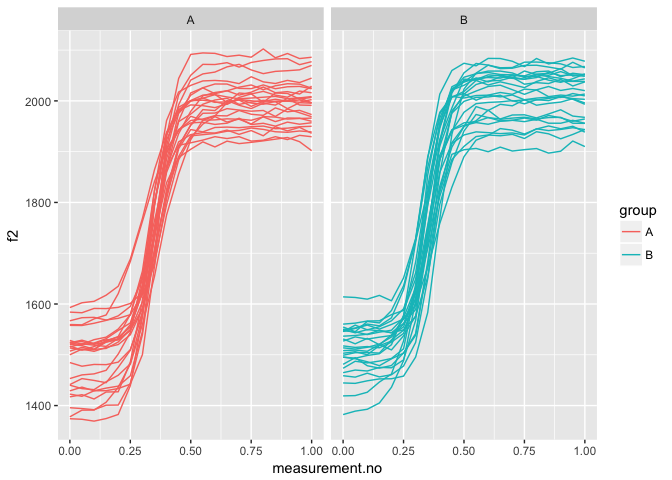

Introduction
------------

This document is a supplement to "Evaluating generalised additive mixed modelling strategies for dynamic speech analysis," relating specifically to the contents of Table 1 in Section 3.1. It presents code that illustrates (i) how the simulated data were generated and (ii) the models whose performance is summarised Table 1.

Preliminaries
-------------

The code below loads the relevant libraries.

``` r
library(ggplot2)
library(mgcv)
library(itsadug)
```

Data generation
---------------

The code in this section can be used to create data for either type I or type II simulations. Set the value of *type* to 1 for type I simulations and to 2 for type II simulations.

``` r
type = 1
```

The data for this set of simulations consist of simulated f2 trajectories loosely modelled after the diphthong /eI/. 50 trajectories are generated. For type I simulations, these are randomly assigned to two groups (A and B). For type II simulations, all group B trajectories are slightly modified (cf. Section 2.1 in the paper and also the Appendix).

The following code sets the parameters that determine the main characteristics of the data set.

``` r
# setting time dimension (these are the points along which the trajectories are generated)
xs_dense = seq(0,1,0.05)

# indices for extracting every second measurement; this is used for downsampling
xs_thin_ind = c(rep(c(T,F), (length(xs_dense)-1)/2), T) 

# expected values & sd for starting and end points of trajectories
if (type==1) {
  f2_start_mean = 1500
  f2_start_sd = 50
  f2_end_1_mean = 2000
  f2_end_1_sd = 50
  f2_end_2_mean = 2000
  f2_end_2_sd = 50
} else { # different values used for type II simulations
  f2_start_mean = 1500
  f2_start_sd = 55
  f2_end_1_mean = 2000
  f2_end_1_sd = 55
  f2_end_2_mean = 1960
  f2_end_2_sd = 55
}

# expected value & sd for transition point
x0_mean = 0.35
x0_sd = 0.025

# expected value & sd for transition slope (higher -> steeper)
k_mean = 25
k_sd = 5

# amount of random noise
noise_sd <- 5

# number of trajectories
n_trajectories <- 50
```

The code below assembles the dense version of the data set.

``` r
# creating matrix that will store the trajectories
ys_m <- matrix(0, nrow=length(xs_dense), ncol=n_trajectories)

# assembling individual trajectories in pairs (one for group A and one for group B)
for (i in 1:(n_trajectories/2)) {
  # sampling start and end values for trajectories A and B
  f2_start_1 <- rnorm(1, f2_start_mean, f2_start_sd)
  f2_start_2 <- rnorm(1, f2_start_mean, f2_start_sd)
  f2_end_1 <- rnorm(1, f2_end_1_mean, f2_end_1_sd)
  f2_end_2 <- rnorm(1, f2_end_2_mean, f2_end_2_sd)
  
  # sampling transition parameters
  x0_1 <- rnorm(1, x0_mean, x0_sd)
  x0_2 <- rnorm(1, x0_mean, x0_sd)
  k_1 <- rnorm(1, k_mean, k_sd)
  k_2 <- rnorm(1, k_mean, k_sd)
  # using logistic function to create trajectories + adding normally distributed random noise
  ys_m[,i] <- ((f2_end_1 - f2_start_1) / (1 + exp(-k_1*(xs_dense-x0_1)))) + f2_start_1 + rnorm(length(xs_dense), 0, noise_sd)
  ys_m[,(i+(n_trajectories/2))] <- ((f2_end_2 - f2_start_2) / (1 + exp(-k_2*(xs_dense-x0_2)))) + f2_start_2 + rnorm(length(xs_dense), 0, noise_sd)
}

# assembling data set
dat_dense <- data.frame(traj=paste("traj_", rep(1:n_trajectories, each=length(xs_dense)), sep=""), #traj ids
                  group=rep(c("A","B"), each=length(xs_dense)*(n_trajectories / 2)),               # group ids
                  measurement.no=xs_dense,                              # measurement number (i.e. time dimension)
                  f2=c(ys_m),                                                                # f2 values
                  stringsAsFactors = F
                 )

# setting up different types of grouping factors
dat_dense$group.factor <- as.factor(dat_dense$group)
dat_dense$group.ordered <- as.ordered(dat_dense$group)
contrasts(dat_dense$group.ordered) <- "contr.treatment"
dat_dense$group.bin <- as.numeric(dat_dense$group.factor) - 1

# trajectory ids must be factors  
dat_dense$traj <- as.factor(dat_dense$traj)

# add dat$start for AR.start (for autoregressive error models)
dat_dense$start <- dat_dense$measurement.no == 0
```

Downsampling to thin version of the data set.

``` r
dat_thin <- dat_dense[rep(xs_thin_ind, n_trajectories),]
```

Here is what the data set looks like.

``` r
ggplot(dat_dense, aes(x=measurement.no, y=f2, group=traj, col=group)) +
  geom_line() +
  facet_grid(~group)
```



Models
------

All the models (and sets of models) from Table 1 are shown below in the same order as in the table.

### 1. No components

``` r
# dense
nocomp_dense <- bam(f2 ~ group.ordered + 
                      s(measurement.no, bs = "tp", k = 10) + 
                      s(measurement.no, by = group.ordered, bs = "tp", k = 10), 
                    data = dat_dense, method = "fREML", discrete = T, nthreads = 1)
summary(nocomp_dense)
```

    ## 
    ## Family: gaussian 
    ## Link function: identity 
    ## 
    ## Formula:
    ## f2 ~ group.ordered + s(measurement.no, bs = "tp", k = 10) + s(measurement.no, 
    ##     by = group.ordered, bs = "tp", k = 10)
    ## 
    ## Parametric coefficients:
    ##                Estimate Std. Error t value Pr(>|t|)    
    ## (Intercept)    1815.978      2.301 789.310  < 2e-16 ***
    ## group.orderedB   13.791      3.254   4.238 2.45e-05 ***
    ## ---
    ## Signif. codes:  0 '***' 0.001 '**' 0.01 '*' 0.05 '.' 0.1 ' ' 1
    ## 
    ## Approximate significance of smooth terms:
    ##                                    edf Ref.df        F p-value    
    ## s(measurement.no)                8.778  8.985 1192.894  <2e-16 ***
    ## s(measurement.no):group.orderedB 1.000  1.000    0.002   0.963    
    ## ---
    ## Signif. codes:  0 '***' 0.001 '**' 0.01 '*' 0.05 '.' 0.1 ' ' 1
    ## 
    ## R-sq.(adj) =  0.945   Deviance explained = 94.5%
    ## fREML = 5663.8  Scale est. = 2779      n = 1050

``` r
# thin
nocomp_thin <- bam(f2 ~ group.ordered + 
                     s(measurement.no, bs = "tp", k = 10) + 
                     s(measurement.no, by = group.ordered, bs = "tp", k = 10), 
                   data = dat_thin, method = "fREML", discrete = T, nthreads = 1)
summary(nocomp_thin)
```

    ## 
    ## Family: gaussian 
    ## Link function: identity 
    ## 
    ## Formula:
    ## f2 ~ group.ordered + s(measurement.no, bs = "tp", k = 10) + s(measurement.no, 
    ##     by = group.ordered, bs = "tp", k = 10)
    ## 
    ## Parametric coefficients:
    ##                Estimate Std. Error t value Pr(>|t|)    
    ## (Intercept)    1812.584      3.204 565.659  < 2e-16 ***
    ## group.orderedB   13.779      4.532   3.041  0.00248 ** 
    ## ---
    ## Signif. codes:  0 '***' 0.001 '**' 0.01 '*' 0.05 '.' 0.1 ' ' 1
    ## 
    ## Approximate significance of smooth terms:
    ##                                    edf Ref.df       F p-value    
    ## s(measurement.no)                8.654  8.967 629.529  <2e-16 ***
    ## s(measurement.no):group.orderedB 1.000  1.000   0.004   0.949    
    ## ---
    ## Signif. codes:  0 '***' 0.001 '**' 0.01 '*' 0.05 '.' 0.1 ' ' 1
    ## 
    ## R-sq.(adj) =  0.945   Deviance explained = 94.6%
    ## fREML = 2972.9  Scale est. = 2823.7    n = 550

### 2. Rand intcpt (= Random Intercept)

``` r
# dense
rand_intcpt_dense <- bam(f2 ~ group.ordered + 
                           s(measurement.no, bs = "tp", k = 10) + 
                           s(measurement.no, by = group.ordered, bs = "tp", k = 10) + 
                           s(traj, bs = "re"), 
                         data = dat_dense, method = "fREML", discrete = T, nthreads = 1)
summary(rand_intcpt_dense)
```

    ## 
    ## Family: gaussian 
    ## Link function: identity 
    ## 
    ## Formula:
    ## f2 ~ group.ordered + s(measurement.no, bs = "tp", k = 10) + s(measurement.no, 
    ##     by = group.ordered, bs = "tp", k = 10) + s(traj, bs = "re")
    ## 
    ## Parametric coefficients:
    ##                Estimate Std. Error t value Pr(>|t|)    
    ## (Intercept)    1794.154      7.454 240.711   <2e-16 ***
    ## group.orderedB   13.795     10.522   1.311     0.19    
    ## ---
    ## Signif. codes:  0 '***' 0.001 '**' 0.01 '*' 0.05 '.' 0.1 ' ' 1
    ## 
    ## Approximate significance of smooth terms:
    ##                                     edf Ref.df        F p-value    
    ## s(measurement.no)                 8.877  8.995 2201.388  <2e-16 ***
    ## s(measurement.no):group.orderedB  1.000  1.000    0.004    0.95    
    ## s(traj)                          45.514 48.000   18.311  <2e-16 ***
    ## ---
    ## Signif. codes:  0 '***' 0.001 '**' 0.01 '*' 0.05 '.' 0.1 ' ' 1
    ## 
    ## R-sq.(adj) =   0.97   Deviance explained = 97.2%
    ## fREML = 5416.5  Scale est. = 1504.8    n = 1050

``` r
# thin
rand_intcpt_thin <- bam(f2 ~ group.ordered + 
                           s(measurement.no, bs = "tp", k = 10) + 
                           s(measurement.no, by = group.ordered, bs = "tp", k = 10) + 
                           s(traj, bs = "re"), 
                         data = dat_thin, method = "fREML", discrete = T, nthreads = 1)
summary(rand_intcpt_thin)
```

    ## 
    ## Family: gaussian 
    ## Link function: identity 
    ## 
    ## Formula:
    ## f2 ~ group.ordered + s(measurement.no, bs = "tp", k = 10) + s(measurement.no, 
    ##     by = group.ordered, bs = "tp", k = 10) + s(traj, bs = "re")
    ## 
    ## Parametric coefficients:
    ##                Estimate Std. Error t value Pr(>|t|)    
    ## (Intercept)    1835.357      7.478  245.42   <2e-16 ***
    ## group.orderedB   13.779     10.516    1.31    0.191    
    ## ---
    ## Signif. codes:  0 '***' 0.001 '**' 0.01 '*' 0.05 '.' 0.1 ' ' 1
    ## 
    ## Approximate significance of smooth terms:
    ##                                     edf Ref.df        F p-value    
    ## s(measurement.no)                 8.798  8.988 1099.515  <2e-16 ***
    ## s(measurement.no):group.orderedB  1.000  1.000    0.007   0.932    
    ## s(traj)                          42.915 48.000    8.439  <2e-16 ***
    ## ---
    ## Signif. codes:  0 '***' 0.001 '**' 0.01 '*' 0.05 '.' 0.1 ' ' 1
    ## 
    ## R-sq.(adj) =  0.969   Deviance explained = 97.2%
    ## fREML =   2876  Scale est. = 1610.8    n = 550

### 3. Rand intcpt + slope (= random intercept + slope)

``` r
# dense
rand_intcpt_slope_dense <- 
  bam(f2 ~ group.ordered + 
        s(measurement.no, bs = "tp", k = 10) + 
        s(measurement.no, by = group.ordered, bs = "tp", k = 10) + 
        s(traj, bs = "re") + 
        s(traj, measurement.no, bs = "re"), 
      data = dat_dense, method = "fREML", discrete = T, nthreads = 1) 
summary(rand_intcpt_slope_dense)
```

    ## 
    ## Family: gaussian 
    ## Link function: identity 
    ## 
    ## Formula:
    ## f2 ~ group.ordered + s(measurement.no, bs = "tp", k = 10) + s(measurement.no, 
    ##     by = group.ordered, bs = "tp", k = 10) + s(traj, bs = "re") + 
    ##     s(traj, measurement.no, bs = "re")
    ## 
    ## Parametric coefficients:
    ##                Estimate Std. Error t value Pr(>|t|)    
    ## (Intercept)     1794.10      14.34  125.09   <2e-16 ***
    ## group.orderedB    13.80      20.28    0.68    0.497    
    ## ---
    ## Signif. codes:  0 '***' 0.001 '**' 0.01 '*' 0.05 '.' 0.1 ' ' 1
    ## 
    ## Approximate significance of smooth terms:
    ##                                     edf Ref.df    F p-value    
    ## s(measurement.no)                 8.943  8.999 1728  <2e-16 ***
    ## s(measurement.no):group.orderedB  1.000  1.000    0   0.985    
    ## s(traj)                          46.232 48.000 5806  <2e-16 ***
    ## s(measurement.no,traj)           46.055 48.000 5775  <2e-16 ***
    ## ---
    ## Signif. codes:  0 '***' 0.001 '**' 0.01 '*' 0.05 '.' 0.1 ' ' 1
    ## 
    ## R-sq.(adj) =  0.986   Deviance explained = 98.8%
    ## fREML = 5128.5  Scale est. = 691.84    n = 1050

``` r
# thin
rand_intcpt_slope_thin <- 
  bam(f2 ~ group.ordered + 
        s(measurement.no, bs = "tp", k = 10) + 
        s(measurement.no, by = group.ordered, bs = "tp", k = 10) + 
        s(traj, bs = "re") + 
        s(traj, measurement.no, bs = "re"), 
      data = dat_thin, method = "fREML", discrete = T, nthreads = 1) 
summary(rand_intcpt_slope_thin)
```

    ## 
    ## Family: gaussian 
    ## Link function: identity 
    ## 
    ## Formula:
    ## f2 ~ group.ordered + s(measurement.no, bs = "tp", k = 10) + s(measurement.no, 
    ##     by = group.ordered, bs = "tp", k = 10) + s(traj, bs = "re") + 
    ##     s(traj, measurement.no, bs = "re")
    ## 
    ## Parametric coefficients:
    ##                Estimate Std. Error t value Pr(>|t|)    
    ## (Intercept)     1835.38      13.51 135.883   <2e-16 ***
    ## group.orderedB    13.78      19.09   0.722    0.471    
    ## ---
    ## Signif. codes:  0 '***' 0.001 '**' 0.01 '*' 0.05 '.' 0.1 ' ' 1
    ## 
    ## Approximate significance of smooth terms:
    ##                                     edf Ref.df       F p-value    
    ## s(measurement.no)                 8.902  8.997 905.200  <2e-16 ***
    ## s(measurement.no):group.orderedB  1.000  1.000   0.001    0.97    
    ## s(traj)                          44.290 48.000 953.317  <2e-16 ***
    ## s(measurement.no,traj)           43.929 48.000 942.315  <2e-16 ***
    ## ---
    ## Signif. codes:  0 '***' 0.001 '**' 0.01 '*' 0.05 '.' 0.1 ' ' 1
    ## 
    ## R-sq.(adj) =  0.985   Deviance explained = 98.8%
    ## fREML = 2769.5  Scale est. = 764.69    n = 550

### 4. Rand smooth, 3 bs

``` r
# dense
rand_smooth_3_dense <- 
  bam(f2 ~ group.ordered + 
        s(measurement.no, bs = "tp", k = 10) + 
        s(measurement.no, by = group.ordered, bs = "tp", k = 10) + 
        s(measurement.no, traj, bs = "fs", m = 1, xt = "tp", k = 3), 
      data = dat_dense, method = "fREML", discrete = T, nthreads = 1)
```

    ## Warning in gam.side(sm, X, tol = .Machine$double.eps^0.5): model has
    ## repeated 1-d smooths of same variable.

``` r
summary(rand_smooth_3_dense)
```

    ## 
    ## Family: gaussian 
    ## Link function: identity 
    ## 
    ## Formula:
    ## f2 ~ group.ordered + s(measurement.no, bs = "tp", k = 10) + s(measurement.no, 
    ##     by = group.ordered, bs = "tp", k = 10) + s(measurement.no, 
    ##     traj, bs = "fs", m = 1, xt = "tp", k = 3)
    ## 
    ## Parametric coefficients:
    ##                Estimate Std. Error t value Pr(>|t|)    
    ## (Intercept)    1792.985      8.105 221.227   <2e-16 ***
    ## group.orderedB   15.282     10.784   1.417    0.157    
    ## ---
    ## Signif. codes:  0 '***' 0.001 '**' 0.01 '*' 0.05 '.' 0.1 ' ' 1
    ## 
    ## Approximate significance of smooth terms:
    ##                                      edf  Ref.df       F p-value    
    ## s(measurement.no)                  8.963   8.999 926.777  <2e-16 ***
    ## s(measurement.no):group.orderedB   1.000   1.000   0.677   0.411    
    ## s(measurement.no,traj)           137.636 148.000  37.253  <2e-16 ***
    ## ---
    ## Signif. codes:  0 '***' 0.001 '**' 0.01 '*' 0.05 '.' 0.1 ' ' 1
    ## 
    ## R-sq.(adj) =  0.991   Deviance explained = 99.2%
    ## fREML = 4955.3  Scale est. = 440.31    n = 1050

``` r
# thin
rand_smooth_3_thin <- 
  bam(f2 ~ group.ordered + 
        s(measurement.no, bs = "tp", k = 10) + 
        s(measurement.no, by = group.ordered, bs = "tp", k = 10) + 
        s(measurement.no, traj, bs = "fs", m = 1, xt = "tp", k = 3), 
      data = dat_thin, method = "fREML", discrete = T, nthreads = 1)
```

    ## Warning in gam.side(sm, X, tol = .Machine$double.eps^0.5): model has
    ## repeated 1-d smooths of same variable.

``` r
summary(rand_smooth_3_thin)
```

    ## 
    ## Family: gaussian 
    ## Link function: identity 
    ## 
    ## Formula:
    ## f2 ~ group.ordered + s(measurement.no, bs = "tp", k = 10) + s(measurement.no, 
    ##     by = group.ordered, bs = "tp", k = 10) + s(measurement.no, 
    ##     traj, bs = "fs", m = 1, xt = "tp", k = 3)
    ## 
    ## Parametric coefficients:
    ##                Estimate Std. Error t value Pr(>|t|)    
    ## (Intercept)    1834.541      8.051 227.859   <2e-16 ***
    ## group.orderedB   15.192     10.654   1.426    0.155    
    ## ---
    ## Signif. codes:  0 '***' 0.001 '**' 0.01 '*' 0.05 '.' 0.1 ' ' 1
    ## 
    ## Approximate significance of smooth terms:
    ##                                      edf  Ref.df       F p-value    
    ## s(measurement.no)                  8.933   8.998 623.874  <2e-16 ***
    ## s(measurement.no):group.orderedB   1.000   1.000   0.191   0.662    
    ## s(measurement.no,traj)           128.710 148.000  16.010  <2e-16 ***
    ## ---
    ## Signif. codes:  0 '***' 0.001 '**' 0.01 '*' 0.05 '.' 0.1 ' ' 1
    ## 
    ## R-sq.(adj) =   0.99   Deviance explained = 99.2%
    ## fREML =   2707  Scale est. = 522.51    n = 550

### 5. Rand smooth, 5 bs

``` r
# dense
rand_smooth_5_dense <- 
  bam(f2 ~ group.ordered + 
        s(measurement.no, bs = "tp", k = 10) + 
        s(measurement.no, by = group.ordered, bs = "tp", k = 10) + 
        s(measurement.no, traj, bs = "fs", m = 1, xt = "tp", k = 5), 
      data = dat_dense, method = "fREML", discrete = T, nthreads = 1)
```

    ## Warning in gam.side(sm, X, tol = .Machine$double.eps^0.5): model has
    ## repeated 1-d smooths of same variable.

``` r
summary(rand_smooth_5_dense)
```

    ## 
    ## Family: gaussian 
    ## Link function: identity 
    ## 
    ## Formula:
    ## f2 ~ group.ordered + s(measurement.no, bs = "tp", k = 10) + s(measurement.no, 
    ##     by = group.ordered, bs = "tp", k = 10) + s(measurement.no, 
    ##     traj, bs = "fs", m = 1, xt = "tp", k = 5)
    ## 
    ## Parametric coefficients:
    ##                Estimate Std. Error t value Pr(>|t|)    
    ## (Intercept)    1791.302      8.154 219.695   <2e-16 ***
    ## group.orderedB   17.073     10.575   1.615    0.107    
    ## ---
    ## Signif. codes:  0 '***' 0.001 '**' 0.01 '*' 0.05 '.' 0.1 ' ' 1
    ## 
    ## Approximate significance of smooth terms:
    ##                                      edf  Ref.df       F p-value    
    ## s(measurement.no)                  8.976   8.997 660.803  <2e-16 ***
    ## s(measurement.no):group.orderedB   1.000   1.000   0.001    0.98    
    ## s(measurement.no,traj)           224.546 248.000  42.819  <2e-16 ***
    ## ---
    ## Signif. codes:  0 '***' 0.001 '**' 0.01 '*' 0.05 '.' 0.1 ' ' 1
    ## 
    ## R-sq.(adj) =  0.995   Deviance explained = 99.6%
    ## fREML = 4797.1  Scale est. = 247.46    n = 1050

``` r
# thin
rand_smooth_5_thin <- 
  bam(f2 ~ group.ordered + 
        s(measurement.no, bs = "tp", k = 10) + 
        s(measurement.no, by = group.ordered, bs = "tp", k = 10) + 
        s(measurement.no, traj, bs = "fs", m = 1, xt = "tp", k = 5), 
      data = dat_thin, method = "fREML", discrete = T, nthreads = 1)
```

    ## Warning in gam.side(sm, X, tol = .Machine$double.eps^0.5): model has
    ## repeated 1-d smooths of same variable.

``` r
summary(rand_smooth_5_thin)
```

    ## 
    ## Family: gaussian 
    ## Link function: identity 
    ## 
    ## Formula:
    ## f2 ~ group.ordered + s(measurement.no, bs = "tp", k = 10) + s(measurement.no, 
    ##     by = group.ordered, bs = "tp", k = 10) + s(measurement.no, 
    ##     traj, bs = "fs", m = 1, xt = "tp", k = 5)
    ## 
    ## Parametric coefficients:
    ##                Estimate Std. Error t value Pr(>|t|)    
    ## (Intercept)    1833.888      8.038 228.155   <2e-16 ***
    ## group.orderedB   16.357     10.579   1.546    0.123    
    ## ---
    ## Signif. codes:  0 '***' 0.001 '**' 0.01 '*' 0.05 '.' 0.1 ' ' 1
    ## 
    ## Approximate significance of smooth terms:
    ##                                      edf  Ref.df       F p-value    
    ## s(measurement.no)                  8.952   8.997 542.445  <2e-16 ***
    ## s(measurement.no):group.orderedB   1.000   1.000   0.014   0.907    
    ## s(measurement.no,traj)           197.242 248.000  14.949  <2e-16 ***
    ## ---
    ## Signif. codes:  0 '***' 0.001 '**' 0.01 '*' 0.05 '.' 0.1 ' ' 1
    ## 
    ## R-sq.(adj) =  0.993   Deviance explained = 99.6%
    ## fREML = 2683.2  Scale est. = 357.83    n = 550

### 6. Rand smooth, 10 bs

``` r
# dense
rand_smooth_10_dense <- 
  bam(f2 ~ group.ordered + 
        s(measurement.no, bs = "tp", k = 10) + 
        s(measurement.no, by = group.ordered, bs = "tp", k = 10) + 
        s(measurement.no, traj, bs = "fs", m = 1, xt = "tp", k = 10), 
      data = dat_dense, method = "fREML", discrete = T, nthreads = 1)
```

    ## Warning in gam.side(sm, X, tol = .Machine$double.eps^0.5): model has
    ## repeated 1-d smooths of same variable.

``` r
summary(rand_smooth_10_dense)
```

    ## 
    ## Family: gaussian 
    ## Link function: identity 
    ## 
    ## Formula:
    ## f2 ~ group.ordered + s(measurement.no, bs = "tp", k = 10) + s(measurement.no, 
    ##     by = group.ordered, bs = "tp", k = 10) + s(measurement.no, 
    ##     traj, bs = "fs", m = 1, xt = "tp", k = 10)
    ## 
    ## Parametric coefficients:
    ##                Estimate Std. Error t value Pr(>|t|)    
    ## (Intercept)    1785.714      8.242 216.653   <2e-16 ***
    ## group.orderedB   15.784     10.500   1.503    0.133    
    ## ---
    ## Signif. codes:  0 '***' 0.001 '**' 0.01 '*' 0.05 '.' 0.1 ' ' 1
    ## 
    ## Approximate significance of smooth terms:
    ##                                     edf  Ref.df       F p-value    
    ## s(measurement.no)                  8.96   8.969 477.432  <2e-16 ***
    ## s(measurement.no):group.orderedB   1.00   1.000   0.009   0.925    
    ## s(measurement.no,traj)           444.23 499.000  67.943  <2e-16 ***
    ## ---
    ## Signif. codes:  0 '***' 0.001 '**' 0.01 '*' 0.05 '.' 0.1 ' ' 1
    ## 
    ## R-sq.(adj) =  0.998   Deviance explained = 99.9%
    ## fREML =   4600  Scale est. = 82.557    n = 1050

``` r
# thin
rand_smooth_10_thin <- 
  bam(f2 ~ group.ordered + 
        s(measurement.no, bs = "tp", k = 10) + 
        s(measurement.no, by = group.ordered, bs = "tp", k = 10) + 
        s(measurement.no, traj, bs = "fs", m = 1, xt = "tp", k = 10), 
      data = dat_thin, method = "fREML", discrete = T, nthreads = 1)
```

    ## Warning in gam.side(sm, X, tol = .Machine$double.eps^0.5): model has
    ## repeated 1-d smooths of same variable.

``` r
summary(rand_smooth_10_thin)
```

    ## 
    ## Family: gaussian 
    ## Link function: identity 
    ## 
    ## Formula:
    ## f2 ~ group.ordered + s(measurement.no, bs = "tp", k = 10) + s(measurement.no, 
    ##     by = group.ordered, bs = "tp", k = 10) + s(measurement.no, 
    ##     traj, bs = "fs", m = 1, xt = "tp", k = 10)
    ## 
    ## Parametric coefficients:
    ##                Estimate Std. Error t value Pr(>|t|)    
    ## (Intercept)    1833.888      7.949 230.715   <2e-16 ***
    ## group.orderedB   15.705     10.529   1.492    0.137    
    ## ---
    ## Signif. codes:  0 '***' 0.001 '**' 0.01 '*' 0.05 '.' 0.1 ' ' 1
    ## 
    ## Approximate significance of smooth terms:
    ##                                      edf  Ref.df       F p-value    
    ## s(measurement.no)                  8.942   8.976 603.999  <2e-16 ***
    ## s(measurement.no):group.orderedB   1.000   1.000   0.033   0.857    
    ## s(measurement.no,traj)           305.001 496.000  10.173  <2e-16 ***
    ## ---
    ## Signif. codes:  0 '***' 0.001 '**' 0.01 '*' 0.05 '.' 0.1 ' ' 1
    ## 
    ## R-sq.(adj) =  0.995   Deviance explained = 99.8%
    ## fREML = 2692.3  Scale est. = 272.06    n = 550

### 7. Rand smooth, gam.check

The model fitted in this section uses random smooths where the number of basis functions (k) is determined using the gam.check() function: after fitting an initial model with a relatively low value of k, gam.check() is used to see whether more wiggliness is necessary (essentially, whether the smooths use up all the degrees of freedom afforded to them). If gam.check() suggests that more wiggliness is necessary, this procedure is repeated again using a model with a higher value of k.

Below is a convenience function for extracting the relevant p-value from the output of gam.check.

``` r
gam.check.p.value <- function (mod, which.line) { # which.line is a regexp
  str.out <- capture.output(gam.check(mod))
  relevant.line <- str.out[grep(which.line, str.out)]
  p.value <- as.numeric(gsub(".*?([0-9.e-]*)[ .*]*$", "\\1", relevant.line, perl=T))
  return(p.value)
}
```

Fitting the models. Dense first.

``` r
# what k's should be tried?
k_min = 4
k_max = 10
k_step = 3
```

``` r
# dense
for (k in seq(k_min,k_max,k_step)) {
  cat("fitting model with  k =", k, "\n")
  
  # fitting model
  
  rand_smooth_gam.check_dense <- 
    bam(f2 ~ group.ordered + 
          s(measurement.no, bs = "tp", k = 10) + 
          s(measurement.no, by = group.ordered, bs = "tp", k = 10) + 
          s(measurement.no, traj, bs = "fs", m = 1, xt = "tp", k = k), 
        data = dat_dense, method = "fREML", discrete = T, nthreads = 1)
  
  # check whether more complexity is needed using gam.check
  
  if (gam.check.p.value(rand_smooth_gam.check_dense, "traj") >= 0.05 | k == k_max) {
    print(summary(rand_smooth_gam.check_dense))
    break
  }
}
```

    ## fitting model with  k = 4

    ## Warning in gam.side(sm, X, tol = .Machine$double.eps^0.5): model has
    ## repeated 1-d smooths of same variable.

    ## fitting model with  k = 7

    ## Warning in gam.side(sm, X, tol = .Machine$double.eps^0.5): model has
    ## repeated 1-d smooths of same variable.

    ## fitting model with  k = 10

    ## Warning in gam.side(sm, X, tol = .Machine$double.eps^0.5): model has
    ## repeated 1-d smooths of same variable.

    ## 
    ## Family: gaussian 
    ## Link function: identity 
    ## 
    ## Formula:
    ## f2 ~ group.ordered + s(measurement.no, bs = "tp", k = 10) + s(measurement.no, 
    ##     by = group.ordered, bs = "tp", k = 10) + s(measurement.no, 
    ##     traj, bs = "fs", m = 1, xt = "tp", k = k)
    ## 
    ## Parametric coefficients:
    ##                Estimate Std. Error t value Pr(>|t|)    
    ## (Intercept)    1785.714      8.242 216.653   <2e-16 ***
    ## group.orderedB   15.784     10.500   1.503    0.133    
    ## ---
    ## Signif. codes:  0 '***' 0.001 '**' 0.01 '*' 0.05 '.' 0.1 ' ' 1
    ## 
    ## Approximate significance of smooth terms:
    ##                                     edf  Ref.df       F p-value    
    ## s(measurement.no)                  8.96   8.969 477.432  <2e-16 ***
    ## s(measurement.no):group.orderedB   1.00   1.000   0.009   0.925    
    ## s(measurement.no,traj)           444.23 499.000  67.943  <2e-16 ***
    ## ---
    ## Signif. codes:  0 '***' 0.001 '**' 0.01 '*' 0.05 '.' 0.1 ' ' 1
    ## 
    ## R-sq.(adj) =  0.998   Deviance explained = 99.9%
    ## fREML =   4600  Scale est. = 82.557    n = 1050

And now the thin data set.

``` r
# thin
for (k in seq(k_min,k_max,k_step)) {
  cat("fitting model with  k =", k, "\n")
  
  # fitting model
  
  rand_smooth_gam.check_thin <- 
    bam(f2 ~ group.ordered + 
          s(measurement.no, bs = "tp", k = 10) + 
          s(measurement.no, by = group.ordered, bs = "tp", k = 10) + 
          s(measurement.no, traj, bs = "fs", m = 1, xt = "tp", k = k), 
        data = dat_thin, method = "fREML", discrete = T, nthreads = 1)
  
  # check whether more complexity is needed using gam.check
  
  if (gam.check.p.value(rand_smooth_gam.check_thin, "traj") >= 0.05 | k == k_max) {
    print(summary(rand_smooth_gam.check_thin))
    break
  }
}
```

    ## fitting model with  k = 4

    ## Warning in gam.side(sm, X, tol = .Machine$double.eps^0.5): model has
    ## repeated 1-d smooths of same variable.

    ## fitting model with  k = 7

    ## Warning in gam.side(sm, X, tol = .Machine$double.eps^0.5): model has
    ## repeated 1-d smooths of same variable.

    ## fitting model with  k = 10

    ## Warning in gam.side(sm, X, tol = .Machine$double.eps^0.5): model has
    ## repeated 1-d smooths of same variable.

    ## 
    ## Family: gaussian 
    ## Link function: identity 
    ## 
    ## Formula:
    ## f2 ~ group.ordered + s(measurement.no, bs = "tp", k = 10) + s(measurement.no, 
    ##     by = group.ordered, bs = "tp", k = 10) + s(measurement.no, 
    ##     traj, bs = "fs", m = 1, xt = "tp", k = k)
    ## 
    ## Parametric coefficients:
    ##                Estimate Std. Error t value Pr(>|t|)    
    ## (Intercept)    1833.888      7.949 230.715   <2e-16 ***
    ## group.orderedB   15.705     10.529   1.492    0.137    
    ## ---
    ## Signif. codes:  0 '***' 0.001 '**' 0.01 '*' 0.05 '.' 0.1 ' ' 1
    ## 
    ## Approximate significance of smooth terms:
    ##                                      edf  Ref.df       F p-value    
    ## s(measurement.no)                  8.942   8.976 603.999  <2e-16 ***
    ## s(measurement.no):group.orderedB   1.000   1.000   0.033   0.857    
    ## s(measurement.no,traj)           305.001 496.000  10.173  <2e-16 ***
    ## ---
    ## Signif. codes:  0 '***' 0.001 '**' 0.01 '*' 0.05 '.' 0.1 ' ' 1
    ## 
    ## R-sq.(adj) =  0.995   Deviance explained = 99.8%
    ## fREML = 2692.3  Scale est. = 272.06    n = 550

### 8. AR1

First fitting models without AR component in order to estimate rho. This is equivalent to the nocomp model above.

``` r
# dense
nocomp_dense <- bam(f2 ~ group.ordered + 
                      s(measurement.no, bs = "tp", k = 10) + 
                      s(measurement.no, by = group.ordered, bs = "tp", k = 10), 
                    data = dat_dense, method = "fREML", discrete = T, nthreads = 1)
# thin
nocomp_thin <- bam(f2 ~ group.ordered + 
                      s(measurement.no, bs = "tp", k = 10) + 
                      s(measurement.no, by = group.ordered, bs = "tp", k = 10), 
                    data = dat_thin, method = "fREML", discrete = T, nthreads = 1)
```

Extracting rho.

``` r
rho_dense <- start_value_rho(nocomp_dense)
cat("rho =", rho_dense, "for the dense data set\n")
```

    ## rho = 0.9074712 for the dense data set

``` r
rho_thin <- start_value_rho(nocomp_thin)
cat("rho =", rho_thin, "for the thin data set\n")
```

    ## rho = 0.7812829 for the thin data set

Fitting models with AR1

``` r
# dense
AR1_dense <- bam(f2 ~ group.ordered + 
                   s(measurement.no, bs = "tp", k = 10) + 
                   s(measurement.no, by = group.ordered, bs = "tp", k = 10), 
                 data = dat_dense, 
                 AR.start = dat_dense$start, rho = rho_dense, 
                 method = "fREML", discrete = T, nthreads = 1)
summary(AR1_dense)
```

    ## 
    ## Family: gaussian 
    ## Link function: identity 
    ## 
    ## Formula:
    ## f2 ~ group.ordered + s(measurement.no, bs = "tp", k = 10) + s(measurement.no, 
    ##     by = group.ordered, bs = "tp", k = 10)
    ## 
    ## Parametric coefficients:
    ##                Estimate Std. Error t value Pr(>|t|)    
    ## (Intercept)    1815.591      6.319 287.341   <2e-16 ***
    ## group.orderedB   14.860      8.699   1.708   0.0879 .  
    ## ---
    ## Signif. codes:  0 '***' 0.001 '**' 0.01 '*' 0.05 '.' 0.1 ' ' 1
    ## 
    ## Approximate significance of smooth terms:
    ##                                    edf Ref.df       F p-value    
    ## s(measurement.no)                8.973  9.000 810.797  <2e-16 ***
    ## s(measurement.no):group.orderedB 1.000  1.001   0.044   0.835    
    ## ---
    ## Signif. codes:  0 '***' 0.001 '**' 0.01 '*' 0.05 '.' 0.1 ' ' 1
    ## 
    ## R-sq.(adj) =  0.945   Deviance explained = 94.5%
    ## fREML = 4589.7  Scale est. = 1863.8    n = 1050

``` r
# thin
AR1_thin <- bam(f2 ~ group.ordered + 
                   s(measurement.no, bs = "tp", k = 10) + 
                   s(measurement.no, by = group.ordered, bs = "tp", k = 10), 
                 data = dat_thin, 
                 AR.start = dat_thin$start, rho = rho_thin, 
                 method = "fREML", discrete = T, nthreads = 1)
summary(AR1_thin)
```

    ## 
    ## Family: gaussian 
    ## Link function: identity 
    ## 
    ## Formula:
    ## f2 ~ group.ordered + s(measurement.no, bs = "tp", k = 10) + s(measurement.no, 
    ##     by = group.ordered, bs = "tp", k = 10)
    ## 
    ## Parametric coefficients:
    ##                Estimate Std. Error t value Pr(>|t|)    
    ## (Intercept)    1812.208      6.500 278.783   <2e-16 ***
    ## group.orderedB   14.655      8.998   1.629    0.104    
    ## ---
    ## Signif. codes:  0 '***' 0.001 '**' 0.01 '*' 0.05 '.' 0.1 ' ' 1
    ## 
    ## Approximate significance of smooth terms:
    ##                                    edf Ref.df      F p-value    
    ## s(measurement.no)                8.952  8.999 558.49  <2e-16 ***
    ## s(measurement.no):group.orderedB 1.000  1.000   0.03   0.862    
    ## ---
    ## Signif. codes:  0 '***' 0.001 '**' 0.01 '*' 0.05 '.' 0.1 ' ' 1
    ## 
    ## R-sq.(adj) =  0.945   Deviance explained = 94.6%
    ## fREML = 2679.2  Scale est. = 2254.4    n = 550
