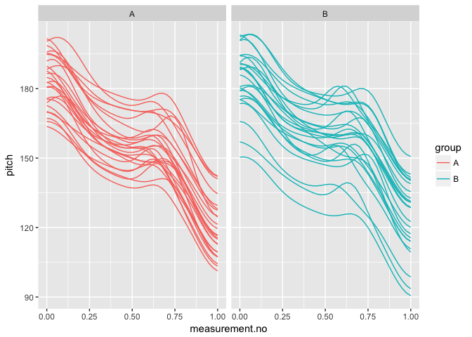
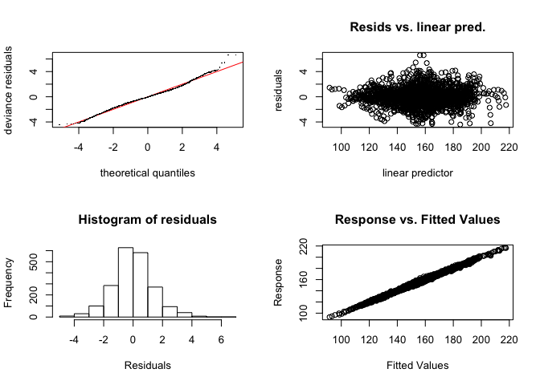
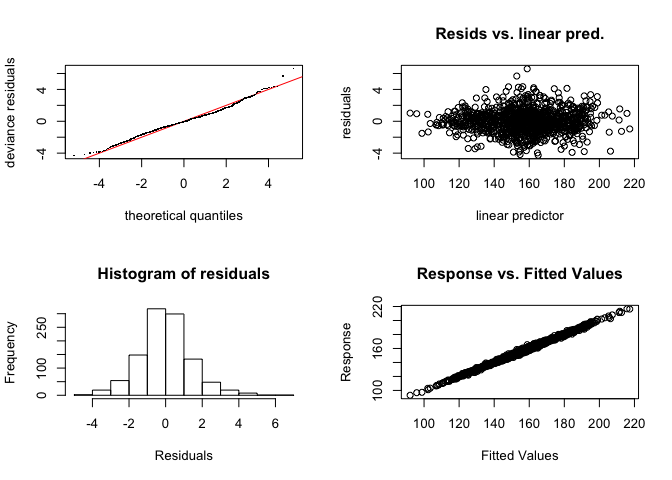

Introduction
------------

This document is a supplement to "Evaluating generalised additive mixed modelling strategies for dynamic speech analysis," relating specifically to the contents of Table 2 in Section 3.1. It presents code that illustrates (i) how the simulated data were generated and (ii) the models whose performance is summarised Table 1.

Preliminaries
-------------

The code below loads the relevant libraries.

``` r
library(ggplot2)
library(mgcv)
library(itsadug)
```

Data generation
---------------

The code in this section can be used to create data for either type I or type II simulations. Set the value of *type* to 1 for type I simulations and to 2 for type II simulations. To replicate the results in table 3, which summarise the same types of trajectories, but with a small amount of added noise, set the value of *noise* to TRUE.

``` r
type = 1
noise = FALSE
```

The data for this set of simulations consist of simulated pitch trajectories loosely modelled after triconstituent compounds in English. 50 trajectories are generated. For type I simulations, these are randomly assigned to two groups (A and B). For type II simulations, all group B trajectories are slightly modified (cf. Section 2.1 in the paper and also the Appendix).

The following code sets the parameters that determine the main characteristics of the data set.

``` r
# setting time dimension (these are the points along which the trajectories are generated)
xs_dense = seq(0,1,0.025)

# indices for extracting every second measurement; this is used for downsampling
xs_thin_ind = c(rep(c(T,F), (length(xs_dense)-1)/2), T)

# expected values & sd for starting and end points
start_mean = 170
start_sd = 10
slope_mean = -30
slope_sd = 8

# boundaries between N1, N2 and N3

boundary.1_min = (1/3) - 0.1
boundary.1_max = (1/3) + 0.1

boundary.2_min = (2/3) - 0.1
boundary.2_max = (2/3) + 0.1

# pitch accent 1 - vertical target
H.star.1_vertical_mean = 15 # roughly the equivalent of ~ 1.5-2 semitones
H.star.1_vertical_sd = 6

# pitch accent 1 - horizontal target
H.star.1_horizontal_min = 0 # as a proportion of the duration of W1
H.star.1_horizontal_max = 0.25

# pitch accent 1 - width
H.star.1_bw = 0.12 # as a proportion of *overall* duration

# pitch accent 2 - vertical target
H.star.2_vertical_mean = 4.5
H.star.2_vertical_sd = 6

# pitch accent 2 - horizontal target
H.star.2_horizontal_min = 0 # as a proportion of the duration of W2
H.star.2_horizontal_max = 0.25

# pitch accent 2 - width
H.star.2_bw = 0.12 # as a proportion of *overall* duration
  
# boundary tone - vertical target
H.minus_vertical_mean = 8 # about half of H.star
H.minus_vertical_sd = 3

# boundary tone - width
H.minus_bw = 0.08

# final boundary tone - vertical target & width
L.percent_vertical = -20
L.percent_bw = 0.12

# noise
noise_sd = 1

# number of trajectories to generate
n_trajectories <- 50
```

The code below assembles the dense version of the data set.

``` r
# creating matrix that will store the trajectories
ys_m <- matrix(0, nrow=length(xs_dense), ncol=n_trajectories)

# assembling individual trajectories in pairs (one for group A and one for group B)
for (i in 1:n_trajectories) {
  # sampling start values, slopes, boundary positions and pitch accents / boundary tones 
  # for trajectories A and B
  start <- rnorm(1, start_mean, start_sd)
  slope <- rnorm(1, slope_mean, slope_sd)
  boundary.1 <- runif(1, boundary.1_min, boundary.1_max)
  boundary.2 <- runif(1, boundary.2_min, boundary.2_max)
  H.star.1_horizontal <- runif(1, H.star.1_horizontal_min, H.star.1_horizontal_max)
  H.star.1_vertical <- rnorm(1, H.star.1_vertical_mean, H.star.1_vertical_sd)
  H.star.2_horizontal <- runif(1, H.star.2_horizontal_min, H.star.2_horizontal_max)
  H.star.2_vertical <- rnorm(1, H.star.2_vertical_mean, H.star.2_vertical_sd)
  H.minus_vertical <- rnorm(1, H.minus_vertical_mean, H.minus_vertical_sd)
  
  # assembling the trajectories
  ys_m[,i] <- start + xs_dense*slope +  # declination
    exp(-((xs_dense - (boundary.1*H.star.1_horizontal))**2)/(2*H.star.1_bw**2)) * H.star.1_vertical + # 1st pitch accent
    exp(-((xs_dense - boundary.2)**2)/(2*H.minus_bw**2)) * H.minus_vertical + # boundary tone
    exp(-((xs_dense - 1)**2)/(2*L.percent_bw**2)) * L.percent_vertical # final boundary tone
  
  # adding additional pitch accent for group B if this is a type II simulation
  if (i > (n_trajectories/2) & type==2) {
    ys_m[,i] <- ys_m[,i] + 
      exp(-((xs_dense - (boundary.1+(boundary.2-boundary.1)*H.star.2_horizontal))**2)/(2*H.star.2_bw**2)) * H.star.2_vertical # 2nd pitch accent
  }
  
  # adding noise
  if (noise) {
    ys_m[,i] <- ys_m[,i] + rnorm(length(xs_dense), 0, noise_sd)
  }
}

# assembling data set
dat_dense <- data.frame(traj=paste("traj_", rep(1:n_trajectories, each=length(xs_dense)), sep=""), # traj ids
                  group=rep(c("A","B"), each=length(xs_dense)*(n_trajectories / 2)),               # group ids
                  measurement.no=xs_dense,                          # measurement number (i.e. time dimension)
                  pitch=c(ys_m),                                                             # pitch  values
                  stringsAsFactors = F
)

# setting up different types of grouping factors
dat_dense$group.factor <- as.factor(dat_dense$group)
dat_dense$group.ordered <- as.ordered(dat_dense$group) 
contrasts(dat_dense$group.ordered) <- "contr.treatment"
dat_dense$group.bin <- as.numeric(dat_dense$group.factor) - 1

# trajectory ids must be factors  
dat_dense$traj <- as.factor(dat_dense$traj)

# add dat$start for AR.start (for autoregressive error models)
dat_dense$start <- dat_dense$measurement.no == 0
```

Downsampling to thin version of the data set.

``` r
dat_thin <- dat_dense[rep(xs_thin_ind, n_trajectories),]
```

Here is what the data set looks like.

``` r
ggplot(dat_dense, aes(x=measurement.no, y=pitch, group=traj, col=group)) +
  geom_line() +
  facet_grid(~group)
```



Models
------

All the models (and sets of models) from Table 1 are shown below in the same order as in the table.

### 1. No components

``` r
# dense
nocomp_dense <- bam(pitch ~ group.ordered + 
                      s(measurement.no, bs = "tp", k = 15) + 
                      s(measurement.no, by = group.ordered, bs = "tp", k = 15),
                    data = dat_dense, method = "fREML", discrete = T, nthreads = 1)
summary(nocomp_dense)
```

    ## 
    ## Family: gaussian 
    ## Link function: identity 
    ## 
    ## Formula:
    ## pitch ~ group.ordered + s(measurement.no, bs = "tp", k = 15) + 
    ##     s(measurement.no, by = group.ordered, bs = "tp", k = 15)
    ## 
    ## Parametric coefficients:
    ##                Estimate Std. Error t value Pr(>|t|)    
    ## (Intercept)    155.2099     0.3908 397.187  < 2e-16 ***
    ## group.orderedB   3.5986     0.5526   6.512 9.33e-11 ***
    ## ---
    ## Signif. codes:  0 '***' 0.001 '**' 0.01 '*' 0.05 '.' 0.1 ' ' 1
    ## 
    ## Approximate significance of smooth terms:
    ##                                    edf Ref.df       F p-value    
    ## s(measurement.no)                8.042  9.772 211.799  <2e-16 ***
    ## s(measurement.no):group.orderedB 1.000  1.001   6.345  0.0118 *  
    ## ---
    ## Signif. codes:  0 '***' 0.001 '**' 0.01 '*' 0.05 '.' 0.1 ' ' 1
    ## 
    ## R-sq.(adj) =  0.635   Deviance explained = 63.7%
    ## fREML =   8097  Scale est. = 156.52    n = 2050

``` r
# thin
nocomp_thin <- bam(pitch ~ group.ordered + 
                     s(measurement.no, bs = "tp", k = 15) + 
                     s(measurement.no, by = group.ordered, bs = "tp", k = 15), 
                   data = dat_thin, method = "fREML", discrete = T, nthreads = 1)
summary(nocomp_thin)
```

    ## 
    ## Family: gaussian 
    ## Link function: identity 
    ## 
    ## Formula:
    ## pitch ~ group.ordered + s(measurement.no, bs = "tp", k = 15) + 
    ##     s(measurement.no, by = group.ordered, bs = "tp", k = 15)
    ## 
    ## Parametric coefficients:
    ##                Estimate Std. Error t value Pr(>|t|)    
    ## (Intercept)    155.1048     0.5482 282.952  < 2e-16 ***
    ## group.orderedB   3.5953     0.7752   4.638 3.97e-06 ***
    ## ---
    ## Signif. codes:  0 '***' 0.001 '**' 0.01 '*' 0.05 '.' 0.1 ' ' 1
    ## 
    ## Approximate significance of smooth terms:
    ##                                    edf Ref.df      F p-value    
    ## s(measurement.no)                7.002  8.595 129.07  <2e-16 ***
    ## s(measurement.no):group.orderedB 1.000  1.000   3.39  0.0659 .  
    ## ---
    ## Signif. codes:  0 '***' 0.001 '**' 0.01 '*' 0.05 '.' 0.1 ' ' 1
    ## 
    ## R-sq.(adj) =  0.647   Deviance explained =   65%
    ## fREML = 4152.2  Scale est. = 157.76    n = 1050

### 2. Rand intcpt (= Random Intercept)

``` r
# dense
rand_intcpt_dense <- bam(pitch ~ group.ordered + 
                           s(measurement.no, bs = "tp", k = 15) + 
                           s(measurement.no, by = group.ordered, bs = "tp", k = 15) + 
                           s(traj, bs = "re"), 
                         data = dat_dense, method = "fREML", discrete = T, nthreads = 1)
summary(rand_intcpt_dense)
```

    ## 
    ## Family: gaussian 
    ## Link function: identity 
    ## 
    ## Formula:
    ## pitch ~ group.ordered + s(measurement.no, bs = "tp", k = 15) + 
    ##     s(measurement.no, by = group.ordered, bs = "tp", k = 15) + 
    ##     s(traj, bs = "re")
    ## 
    ## Parametric coefficients:
    ##                Estimate Std. Error t value Pr(>|t|)    
    ## (Intercept)     155.407      2.460  63.181   <2e-16 ***
    ## group.orderedB    3.601      3.478   1.035    0.301    
    ## ---
    ## Signif. codes:  0 '***' 0.001 '**' 0.01 '*' 0.05 '.' 0.1 ' ' 1
    ## 
    ## Approximate significance of smooth terms:
    ##                                    edf Ref.df       F p-value    
    ## s(measurement.no)                12.45 13.589 2242.42  <2e-16 ***
    ## s(measurement.no):group.orderedB  1.00  1.001   93.05  <2e-16 ***
    ## s(traj)                          47.92 49.000  568.15  <2e-16 ***
    ## ---
    ## Signif. codes:  0 '***' 0.001 '**' 0.01 '*' 0.05 '.' 0.1 ' ' 1
    ## 
    ## R-sq.(adj) =  0.975   Deviance explained = 97.6%
    ## fREML = 5515.3  Scale est. = 10.674    n = 2050

``` r
# thin
rand_intcpt_thin <- bam(pitch ~ group.ordered + 
                           s(measurement.no, bs = "tp", k = 15) + 
                           s(measurement.no, by = group.ordered, bs = "tp", k = 15) + 
                           s(traj, bs = "re"), 
                         data = dat_thin, method = "fREML", discrete = T, nthreads = 1)
summary(rand_intcpt_thin)
```

    ## 
    ## Family: gaussian 
    ## Link function: identity 
    ## 
    ## Formula:
    ## pitch ~ group.ordered + s(measurement.no, bs = "tp", k = 15) + 
    ##     s(measurement.no, by = group.ordered, bs = "tp", k = 15) + 
    ##     s(traj, bs = "re")
    ## 
    ## Parametric coefficients:
    ##                Estimate Std. Error t value Pr(>|t|)    
    ## (Intercept)     154.884      2.461  62.933   <2e-16 ***
    ## group.orderedB    3.553      3.480   1.021    0.308    
    ## ---
    ## Signif. codes:  0 '***' 0.001 '**' 0.01 '*' 0.05 '.' 0.1 ' ' 1
    ## 
    ## Approximate significance of smooth terms:
    ##                                    edf Ref.df       F  p-value    
    ## s(measurement.no)                11.64 13.114 1188.18  < 2e-16 ***
    ## s(measurement.no):group.orderedB  1.00  1.001   47.29 1.05e-11 ***
    ## s(traj)                          47.83 48.000  280.18  < 2e-16 ***
    ## ---
    ## Signif. codes:  0 '***' 0.001 '**' 0.01 '*' 0.05 '.' 0.1 ' ' 1
    ## 
    ## R-sq.(adj) =  0.975   Deviance explained = 97.6%
    ## fREML = 2920.3  Scale est. = 11.306    n = 1050

### 3. Rand intcpt + slope (= random intercept + slope)

``` r
# dense
rand_intcpt_slope_dense <- 
  bam(pitch ~ group.ordered + 
        s(measurement.no, bs = "tp", k = 15) + 
        s(measurement.no, by = group.ordered, bs = "tp", k = 15) + 
        s(traj, bs = "re") + 
        s(traj, measurement.no, bs = "re"), 
      data = dat_dense, method = "fREML", discrete = T, nthreads = 1) 
summary(rand_intcpt_slope_dense)
```

    ## 
    ## Family: gaussian 
    ## Link function: identity 
    ## 
    ## Formula:
    ## pitch ~ group.ordered + s(measurement.no, bs = "tp", k = 15) + 
    ##     s(measurement.no, by = group.ordered, bs = "tp", k = 15) + 
    ##     s(traj, bs = "re") + s(traj, measurement.no, bs = "re")
    ## 
    ## Parametric coefficients:
    ##                Estimate Std. Error t value Pr(>|t|)    
    ## (Intercept)     155.408      2.564  60.614   <2e-16 ***
    ## group.orderedB    3.601      3.626   0.993    0.321    
    ## ---
    ## Signif. codes:  0 '***' 0.001 '**' 0.01 '*' 0.05 '.' 0.1 ' ' 1
    ## 
    ## Approximate significance of smooth terms:
    ##                                    edf Ref.df         F p-value    
    ## s(measurement.no)                13.29 13.906 9.944e+02  <2e-16 ***
    ## s(measurement.no):group.orderedB  1.00  1.001 3.575e+00  0.0588 .  
    ## s(traj)                          47.88 48.000 2.847e+05  <2e-16 ***
    ## s(measurement.no,traj)           47.30 48.000 2.801e+05  <2e-16 ***
    ## ---
    ## Signif. codes:  0 '***' 0.001 '**' 0.01 '*' 0.05 '.' 0.1 ' ' 1
    ## 
    ## R-sq.(adj) =  0.991   Deviance explained = 99.1%
    ## fREML = 4653.1  Scale est. = 4.0484    n = 2050

``` r
# thin
rand_intcpt_slope_thin <- 
  bam(pitch ~ group.ordered + 
        s(measurement.no, bs = "tp", k = 15) + 
        s(measurement.no, by = group.ordered, bs = "tp", k = 15) + 
        s(traj, bs = "re") + 
        s(traj, measurement.no, bs = "re"), 
      data = dat_thin, method = "fREML", discrete = T, nthreads = 1) 
summary(rand_intcpt_slope_thin)
```

    ## 
    ## Family: gaussian 
    ## Link function: identity 
    ## 
    ## Formula:
    ## pitch ~ group.ordered + s(measurement.no, bs = "tp", k = 15) + 
    ##     s(measurement.no, by = group.ordered, bs = "tp", k = 15) + 
    ##     s(traj, bs = "re") + s(traj, measurement.no, bs = "re")
    ## 
    ## Parametric coefficients:
    ##                Estimate Std. Error t value Pr(>|t|)    
    ## (Intercept)     154.879      2.549  60.753   <2e-16 ***
    ## group.orderedB    3.553      3.605   0.986    0.325    
    ## ---
    ## Signif. codes:  0 '***' 0.001 '**' 0.01 '*' 0.05 '.' 0.1 ' ' 1
    ## 
    ## Approximate significance of smooth terms:
    ##                                    edf Ref.df         F p-value    
    ## s(measurement.no)                12.79  13.75   524.821  <2e-16 ***
    ## s(measurement.no):group.orderedB  1.00   1.00     3.623  0.0573 .  
    ## s(traj)                          47.75  48.00 63742.688  <2e-16 ***
    ## s(measurement.no,traj)           46.60  48.00 61643.797  <2e-16 ***
    ## ---
    ## Signif. codes:  0 '***' 0.001 '**' 0.01 '*' 0.05 '.' 0.1 ' ' 1
    ## 
    ## R-sq.(adj) =   0.99   Deviance explained = 99.1%
    ## fREML = 2529.6  Scale est. = 4.3222    n = 1050

### 4. Rand smooth, 5 bs

``` r
# dense
rand_smooth_3_dense <- 
  bam(pitch ~ group.ordered + 
        s(measurement.no, bs = "tp", k = 15) + 
        s(measurement.no, by = group.ordered, bs = "tp", k = 15) + 
        s(measurement.no, traj, bs = "fs", m = 1, xt = "tp", k = 5), 
      data = dat_dense, method = "fREML", discrete = T, nthreads = 1)
```

    ## Warning in gam.side(sm, X, tol = .Machine$double.eps^0.5): model has
    ## repeated 1-d smooths of same variable.

``` r
summary(rand_smooth_3_dense)
```

    ## 
    ## Family: gaussian 
    ## Link function: identity 
    ## 
    ## Formula:
    ## pitch ~ group.ordered + s(measurement.no, bs = "tp", k = 15) + 
    ##     s(measurement.no, by = group.ordered, bs = "tp", k = 15) + 
    ##     s(measurement.no, traj, bs = "fs", m = 1, xt = "tp", k = 5)
    ## 
    ## Parametric coefficients:
    ##                Estimate Std. Error t value Pr(>|t|)    
    ## (Intercept)     155.331      2.594  59.876   <2e-16 ***
    ## group.orderedB    3.725      3.662   1.017    0.309    
    ## ---
    ## Signif. codes:  0 '***' 0.001 '**' 0.01 '*' 0.05 '.' 0.1 ' ' 1
    ## 
    ## Approximate significance of smooth terms:
    ##                                     edf  Ref.df        F p-value    
    ## s(measurement.no)                 13.71  13.947  207.945  <2e-16 ***
    ## s(measurement.no):group.orderedB   5.72   7.114    1.657  0.0902 .  
    ## s(measurement.no,traj)           235.89 249.000 1029.656  <2e-16 ***
    ## ---
    ## Signif. codes:  0 '***' 0.001 '**' 0.01 '*' 0.05 '.' 0.1 ' ' 1
    ## 
    ## R-sq.(adj) =  0.997   Deviance explained = 99.7%
    ## fREML = 3764.2  Scale est. = 1.2338    n = 2050

``` r
# thin
rand_smooth_3_thin <- 
  bam(pitch ~ group.ordered + 
        s(measurement.no, bs = "tp", k = 15) + 
        s(measurement.no, by = group.ordered, bs = "tp", k = 15) + 
        s(measurement.no, traj, bs = "fs", m = 1, xt = "tp", k = 5), 
      data = dat_thin, method = "fREML", discrete = T, nthreads = 1)
```

    ## Warning in gam.side(sm, X, tol = .Machine$double.eps^0.5): model has
    ## repeated 1-d smooths of same variable.

``` r
summary(rand_smooth_3_thin)
```

    ## 
    ## Family: gaussian 
    ## Link function: identity 
    ## 
    ## Formula:
    ## pitch ~ group.ordered + s(measurement.no, bs = "tp", k = 15) + 
    ##     s(measurement.no, by = group.ordered, bs = "tp", k = 15) + 
    ##     s(measurement.no, traj, bs = "fs", m = 1, xt = "tp", k = 5)
    ## 
    ## Parametric coefficients:
    ##                Estimate Std. Error t value Pr(>|t|)    
    ## (Intercept)     154.866      2.571  60.235   <2e-16 ***
    ## group.orderedB    3.566      3.612   0.987    0.324    
    ## ---
    ## Signif. codes:  0 '***' 0.001 '**' 0.01 '*' 0.05 '.' 0.1 ' ' 1
    ## 
    ## Approximate significance of smooth terms:
    ##                                    edf Ref.df       F p-value    
    ## s(measurement.no)                 13.5  13.94 226.336  <2e-16 ***
    ## s(measurement.no):group.orderedB   1.0   1.00   3.064  0.0804 .  
    ## s(measurement.no,traj)           230.2 249.00 437.945  <2e-16 ***
    ## ---
    ## Signif. codes:  0 '***' 0.001 '**' 0.01 '*' 0.05 '.' 0.1 ' ' 1
    ## 
    ## R-sq.(adj) =  0.997   Deviance explained = 99.7%
    ## fREML = 2223.2  Scale est. = 1.4875    n = 1050

### 5. Rand smooth, 8 bs

``` r
# dense
rand_smooth_5_dense <- 
  bam(pitch ~ group.ordered + 
        s(measurement.no, bs = "tp", k = 15) + 
        s(measurement.no, by = group.ordered, bs = "tp", k = 15) + 
        s(measurement.no, traj, bs = "fs", m = 1, xt = "tp", k = 8), 
      data = dat_dense, method = "fREML", discrete = T, nthreads = 1)
```

    ## Warning in gam.side(sm, X, tol = .Machine$double.eps^0.5): model has
    ## repeated 1-d smooths of same variable.

``` r
summary(rand_smooth_5_dense)
```

    ## 
    ## Family: gaussian 
    ## Link function: identity 
    ## 
    ## Formula:
    ## pitch ~ group.ordered + s(measurement.no, bs = "tp", k = 15) + 
    ##     s(measurement.no, by = group.ordered, bs = "tp", k = 15) + 
    ##     s(measurement.no, traj, bs = "fs", m = 1, xt = "tp", k = 8)
    ## 
    ## Parametric coefficients:
    ##                Estimate Std. Error t value Pr(>|t|)    
    ## (Intercept)     155.487      2.576  60.356   <2e-16 ***
    ## group.orderedB    3.275      3.631   0.902    0.367    
    ## ---
    ## Signif. codes:  0 '***' 0.001 '**' 0.01 '*' 0.05 '.' 0.1 ' ' 1
    ## 
    ## Approximate significance of smooth terms:
    ##                                      edf  Ref.df        F p-value    
    ## s(measurement.no)                 13.862  13.901  198.463  <2e-16 ***
    ## s(measurement.no):group.orderedB   6.796   8.175    3.432  0.0435 *  
    ## s(measurement.no,traj)           385.422 399.000 4974.756  <2e-16 ***
    ## ---
    ## Signif. codes:  0 '***' 0.001 '**' 0.01 '*' 0.05 '.' 0.1 ' ' 1
    ## 
    ## R-sq.(adj) =      1   Deviance explained =  100%
    ## fREML = 2259.6  Scale est. = 0.16045   n = 2050

``` r
# thin
rand_smooth_5_thin <- 
  bam(pitch ~ group.ordered + 
        s(measurement.no, bs = "tp", k = 15) + 
        s(measurement.no, by = group.ordered, bs = "tp", k = 15) + 
        s(measurement.no, traj, bs = "fs", m = 1, xt = "tp", k = 8), 
      data = dat_thin, method = "fREML", discrete = T, nthreads = 1)
```

    ## Warning in gam.side(sm, X, tol = .Machine$double.eps^0.5): model has
    ## repeated 1-d smooths of same variable.

``` r
summary(rand_smooth_5_thin)
```

    ## 
    ## Family: gaussian 
    ## Link function: identity 
    ## 
    ## Formula:
    ## pitch ~ group.ordered + s(measurement.no, bs = "tp", k = 15) + 
    ##     s(measurement.no, by = group.ordered, bs = "tp", k = 15) + 
    ##     s(measurement.no, traj, bs = "fs", m = 1, xt = "tp", k = 8)
    ## 
    ## Parametric coefficients:
    ##                Estimate Std. Error t value Pr(>|t|)    
    ## (Intercept)     155.078      2.568  60.382   <2e-16 ***
    ## group.orderedB    3.140      3.618   0.868    0.386    
    ## ---
    ## Signif. codes:  0 '***' 0.001 '**' 0.01 '*' 0.05 '.' 0.1 ' ' 1
    ## 
    ## Approximate significance of smooth terms:
    ##                                      edf  Ref.df        F p-value    
    ## s(measurement.no)                 13.833  13.914  199.780  <2e-16 ***
    ## s(measurement.no):group.orderedB   3.577   4.423    1.184   0.315    
    ## s(measurement.no,traj)           381.088 398.000 1828.565  <2e-16 ***
    ## ---
    ## Signif. codes:  0 '***' 0.001 '**' 0.01 '*' 0.05 '.' 0.1 ' ' 1
    ## 
    ## R-sq.(adj) =  0.999   Deviance explained =  100%
    ## fREML = 1725.9  Scale est. = 0.22465   n = 1050

### 6. Rand smooth, 12 bs

``` r
# dense
rand_smooth_10_dense <- 
  bam(pitch ~ group.ordered + 
        s(measurement.no, bs = "tp", k = 15) + 
        s(measurement.no, by = group.ordered, bs = "tp", k = 15) + 
        s(measurement.no, traj, bs = "fs", m = 1, xt = "tp", k = 12), 
      data = dat_dense, method = "fREML", discrete = T, nthreads = 1)
```

    ## Warning in gam.side(sm, X, tol = .Machine$double.eps^0.5): model has
    ## repeated 1-d smooths of same variable.

``` r
summary(rand_smooth_10_dense)
```

    ## 
    ## Family: gaussian 
    ## Link function: identity 
    ## 
    ## Formula:
    ## pitch ~ group.ordered + s(measurement.no, bs = "tp", k = 15) + 
    ##     s(measurement.no, by = group.ordered, bs = "tp", k = 15) + 
    ##     s(measurement.no, traj, bs = "fs", m = 1, xt = "tp", k = 12)
    ## 
    ## Parametric coefficients:
    ##                Estimate Std. Error t value Pr(>|t|)    
    ## (Intercept)     154.862      2.562  60.444   <2e-16 ***
    ## group.orderedB    3.723      3.599   1.034    0.301    
    ## ---
    ## Signif. codes:  0 '***' 0.001 '**' 0.01 '*' 0.05 '.' 0.1 ' ' 1
    ## 
    ## Approximate significance of smooth terms:
    ##                                      edf  Ref.df         F p-value    
    ## s(measurement.no)                 13.872  13.878   287.281 < 2e-16 ***
    ## s(measurement.no):group.orderedB   2.583   3.165     5.334 0.00139 ** 
    ## s(measurement.no,traj)           587.878 599.000 84108.180 < 2e-16 ***
    ## ---
    ## Signif. codes:  0 '***' 0.001 '**' 0.01 '*' 0.05 '.' 0.1 ' ' 1
    ## 
    ## R-sq.(adj) =      1   Deviance explained =  100%
    ## fREML = 216.87  Scale est. = 0.0063278  n = 2050

``` r
# thin
rand_smooth_10_thin <- 
  bam(pitch ~ group.ordered + 
        s(measurement.no, bs = "tp", k = 15) + 
        s(measurement.no, by = group.ordered, bs = "tp", k = 15) + 
        s(measurement.no, traj, bs = "fs", m = 1, xt = "tp", k = 12), 
      data = dat_thin, method = "fREML", discrete = T, nthreads = 1)
```

    ## Warning in gam.side(sm, X, tol = .Machine$double.eps^0.5): model has
    ## repeated 1-d smooths of same variable.

``` r
summary(rand_smooth_10_thin)
```

    ## 
    ## Family: gaussian 
    ## Link function: identity 
    ## 
    ## Formula:
    ## pitch ~ group.ordered + s(measurement.no, bs = "tp", k = 15) + 
    ##     s(measurement.no, by = group.ordered, bs = "tp", k = 15) + 
    ##     s(measurement.no, traj, bs = "fs", m = 1, xt = "tp", k = 12)
    ## 
    ## Parametric coefficients:
    ##                Estimate Std. Error t value Pr(>|t|)    
    ## (Intercept)     154.650      2.558  60.469   <2e-16 ***
    ## group.orderedB    3.512      3.592   0.978    0.329    
    ## ---
    ## Signif. codes:  0 '***' 0.001 '**' 0.01 '*' 0.05 '.' 0.1 ' ' 1
    ## 
    ## Approximate significance of smooth terms:
    ##                                      edf  Ref.df         F p-value    
    ## s(measurement.no)                 13.864  13.874   298.126  <2e-16 ***
    ## s(measurement.no):group.orderedB   1.436   1.694     5.359   0.013 *  
    ## s(measurement.no,traj)           586.420 599.000 37751.366  <2e-16 ***
    ## ---
    ## Signif. codes:  0 '***' 0.001 '**' 0.01 '*' 0.05 '.' 0.1 ' ' 1
    ## 
    ## R-sq.(adj) =      1   Deviance explained =  100%
    ## fREML = 1145.8  Scale est. = 0.0072401  n = 1050

### 7. Rand smooth, gam.check

The model fitted in this section uses random smooths where the number of basis functions (k) is determined using the gam.check() function: after fitting an initial model with a relatively low value of k, gam.check() is used to see whether more wiggliness is necessary (essentially, whether the smooths use up all the degrees of freedom afforded to them). If gam.check() suggests that more wiggliness is necessary, this procedure is repeated again using a model with a higher value of k.

Below is a convenience function for extracting the relevant p-value from the output of gam.check.

``` r
gam.check.p.value <- function (mod, which.line) { # which.line is a regexp
  str.out <- capture.output(gam.check(mod))
  relevant.line <- str.out[grep(which.line, str.out)]
  p.value <- as.numeric(regmatches(relevant.line, regexpr("[0-9.]*$", relevant.line)))
  return(p.value)
}
```

Fitting the models. Dense first.

``` r
# what k's should be tried?
k_min = 4
k_max = 12
k_step = 4
```

``` r
# dense
for (k in seq(k_min,k_max,k_step)) {
  cat("fitting model with  k =", k, "\n")
  
  # fitting model
  
  rand_smooth_gam.check_dense <- 
    bam(pitch ~ group.ordered + 
          s(measurement.no, bs = "tp", k = 15) + 
          s(measurement.no, by = group.ordered, bs = "tp", k = 15) + 
          s(measurement.no, traj, bs = "fs", m = 1, xt = "tp", k = k), 
        data = dat_dense, method = "fREML", discrete = T, nthreads = 1)
  
  # check whether more complexity is needed using gam.check
  
  if (gam.check.p.value(rand_smooth_gam.check_dense, "traj") >= 0.05 | k == k_max) {
    print(summary(rand_smooth_gam.check_dense))
    break
  }
}
```

    ## fitting model with  k = 4

    ## Warning in gam.side(sm, X, tol = .Machine$double.eps^0.5): model has
    ## repeated 1-d smooths of same variable.



    ## 
    ## Family: gaussian 
    ## Link function: identity 
    ## 
    ## Formula:
    ## pitch ~ group.ordered + s(measurement.no, bs = "tp", k = 15) + 
    ##     s(measurement.no, by = group.ordered, bs = "tp", k = 15) + 
    ##     s(measurement.no, traj, bs = "fs", m = 1, xt = "tp", k = k)
    ## 
    ## Parametric coefficients:
    ##                Estimate Std. Error t value Pr(>|t|)    
    ## (Intercept)     155.267      2.599  59.737   <2e-16 ***
    ## group.orderedB    3.879      3.666   1.058     0.29    
    ## ---
    ## Signif. codes:  0 '***' 0.001 '**' 0.01 '*' 0.05 '.' 0.1 ' ' 1
    ## 
    ## Approximate significance of smooth terms:
    ##                                      edf  Ref.df       F p-value    
    ## s(measurement.no)                 13.599  13.956 291.063  <2e-16 ***
    ## s(measurement.no):group.orderedB   3.448   4.319   1.293   0.218    
    ## s(measurement.no,traj)           188.136 198.000 782.657  <2e-16 ***
    ## ---
    ## Signif. codes:  0 '***' 0.001 '**' 0.01 '*' 0.05 '.' 0.1 ' ' 1
    ## 
    ## R-sq.(adj) =  0.995   Deviance explained = 99.6%
    ## fREML = 4138.5  Scale est. = 2.0308    n = 2050

And now the thin data set.

``` r
# thin
for (k in seq(k_min,k_max,k_step)) {
  cat("fitting model with  k =", k, "\n")
  
  # fitting model
  
  rand_smooth_gam.check_thin <- 
    bam(pitch ~ group.ordered + 
          s(measurement.no, bs = "tp", k = 15) + 
          s(measurement.no, by = group.ordered, bs = "tp", k = 15) + 
          s(measurement.no, traj, bs = "fs", m = 1, xt = "tp", k = k), 
        data = dat_thin, method = "fREML", discrete = T, nthreads = 1)
  
  # check whether more complexity is needed using gam.check
  
  if (gam.check.p.value(rand_smooth_gam.check_thin, "traj") >= 0.05 | k == k_max) {
    print(summary(rand_smooth_gam.check_thin))
    break
  }
}
```

    ## fitting model with  k = 4

    ## Warning in gam.side(sm, X, tol = .Machine$double.eps^0.5): model has
    ## repeated 1-d smooths of same variable.



    ## 
    ## Family: gaussian 
    ## Link function: identity 
    ## 
    ## Formula:
    ## pitch ~ group.ordered + s(measurement.no, bs = "tp", k = 15) + 
    ##     s(measurement.no, by = group.ordered, bs = "tp", k = 15) + 
    ##     s(measurement.no, traj, bs = "fs", m = 1, xt = "tp", k = k)
    ## 
    ## Parametric coefficients:
    ##                Estimate Std. Error t value Pr(>|t|)    
    ## (Intercept)     154.817      2.583  59.947   <2e-16 ***
    ## group.orderedB    3.682      3.637   1.012    0.312    
    ## ---
    ## Signif. codes:  0 '***' 0.001 '**' 0.01 '*' 0.05 '.' 0.1 ' ' 1
    ## 
    ## Approximate significance of smooth terms:
    ##                                     edf Ref.df       F p-value    
    ## s(measurement.no)                 13.26   13.9 286.495  <2e-16 ***
    ## s(measurement.no):group.orderedB   1.00    1.0   4.251  0.0395 *  
    ## s(measurement.no,traj)           182.49  200.0 342.281  <2e-16 ***
    ## ---
    ## Signif. codes:  0 '***' 0.001 '**' 0.01 '*' 0.05 '.' 0.1 ' ' 1
    ## 
    ## R-sq.(adj) =  0.995   Deviance explained = 99.6%
    ## fREML = 2356.2  Scale est. = 2.3564    n = 1050

### 8. AR1

First fitting models without AR component in order to estimate rho. This is equivalent to the nocomp model above.

``` r
# dense
nocomp_dense <- bam(pitch ~ group.ordered + 
                      s(measurement.no, bs = "tp", k = 15) + 
                      s(measurement.no, by = group.ordered, bs = "tp", k = 15), 
                    data = dat_dense, method = "fREML", discrete = T, nthreads = 1)
# thin
nocomp_thin <- bam(pitch ~ group.ordered + 
                      s(measurement.no, bs = "tp", k = 15) + 
                      s(measurement.no, by = group.ordered, bs = "tp", k = 15), 
                    data = dat_thin, method = "fREML", discrete = T, nthreads = 1)
```

Extracting rho.

``` r
rho_dense <- start_value_rho(nocomp_dense)
cat("rho =", rho_dense, "for the dense data set\n")
```

    ## rho = 0.9750566 for the dense data set

``` r
rho_thin <- start_value_rho(nocomp_thin)
cat("rho =", rho_thin, "for the thin data set\n")
```

    ## rho = 0.9485643 for the thin data set

Fitting models with AR1

``` r
# dense
AR1_dense <- bam(pitch ~ group.ordered + 
                   s(measurement.no, bs = "tp", k = 15) + 
                   s(measurement.no, by = group.ordered, bs = "tp", k = 15), 
                 data = dat_dense, 
                 AR.start = dat_dense$start, rho = rho_dense, 
                 method = "fREML", discrete = T, nthreads = 1)
summary(AR1_dense)
```

    ## 
    ## Family: gaussian 
    ## Link function: identity 
    ## 
    ## Formula:
    ## pitch ~ group.ordered + s(measurement.no, bs = "tp", k = 15) + 
    ##     s(measurement.no, by = group.ordered, bs = "tp", k = 15)
    ## 
    ## Parametric coefficients:
    ##                Estimate Std. Error t value Pr(>|t|)    
    ## (Intercept)    155.2490     0.6326 245.395  < 2e-16 ***
    ## group.orderedB   3.5211     0.8738   4.029  5.8e-05 ***
    ## ---
    ## Signif. codes:  0 '***' 0.001 '**' 0.01 '*' 0.05 '.' 0.1 ' ' 1
    ## 
    ## Approximate significance of smooth terms:
    ##                                   edf Ref.df      F p-value    
    ## s(measurement.no)                13.8  13.99 679.11 < 2e-16 ***
    ## s(measurement.no):group.orderedB  1.0   1.00  15.69 7.7e-05 ***
    ## ---
    ## Signif. codes:  0 '***' 0.001 '**' 0.01 '*' 0.05 '.' 0.1 ' ' 1
    ## 
    ## R-sq.(adj) =  0.635   Deviance explained = 63.7%
    ## fREML = 2659.6  Scale est. = 14.367    n = 2050

``` r
# thin
AR1_thin <- bam(pitch ~ group.ordered + 
                   s(measurement.no, bs = "tp", k = 15) + 
                   s(measurement.no, by = group.ordered, bs = "tp", k = 15), 
                 data = dat_thin, 
                 AR.start = dat_thin$start, rho = rho_thin, 
                 method = "fREML", discrete = T, nthreads = 1)
summary(AR1_thin)
```

    ## 
    ## Family: gaussian 
    ## Link function: identity 
    ## 
    ## Formula:
    ## pitch ~ group.ordered + s(measurement.no, bs = "tp", k = 15) + 
    ##     s(measurement.no, by = group.ordered, bs = "tp", k = 15)
    ## 
    ## Parametric coefficients:
    ##                Estimate Std. Error t value Pr(>|t|)    
    ## (Intercept)    155.1403     0.8594 180.515  < 2e-16 ***
    ## group.orderedB   3.5222     1.1885   2.963  0.00311 ** 
    ## ---
    ## Signif. codes:  0 '***' 0.001 '**' 0.01 '*' 0.05 '.' 0.1 ' ' 1
    ## 
    ## Approximate significance of smooth terms:
    ##                                    edf Ref.df       F p-value    
    ## s(measurement.no)                13.56 13.973 346.951  <2e-16 ***
    ## s(measurement.no):group.orderedB  1.00  1.001   8.145  0.0044 ** 
    ## ---
    ## Signif. codes:  0 '***' 0.001 '**' 0.01 '*' 0.05 '.' 0.1 ' ' 1
    ## 
    ## R-sq.(adj) =  0.645   Deviance explained = 65.1%
    ## fREML = 2093.2  Scale est. = 26.98     n = 1050
