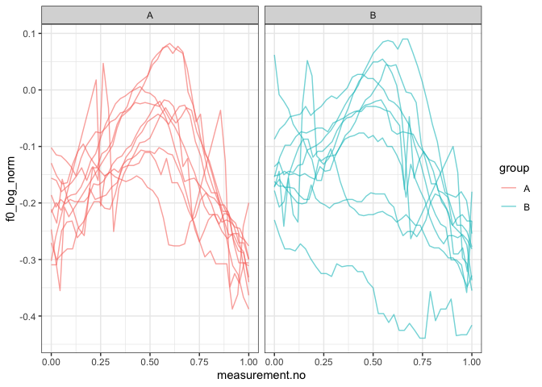

Introduction
------------

This document is a supplement to “Evaluating generalised additive mixed
modelling strategies for dynamic speech analysis,” relating specifically
to the contents of the “real pitch” columns of Table 1 in Section 3.1.2.
It presents code that illustrates (i) how the resampled data were
generated and (ii) the models whose performance is summarised in the
“real pitch” columns of Table 1.

Preliminaries
-------------

The code below loads the relevant libraries.

``` r
library(ggplot2)
```

    ## Warning: package 'ggplot2' was built under R version 3.5.2

``` r
library(mgcv)
```

    ## Warning: package 'mgcv' was built under R version 3.5.2

``` r
library(itsadug)
library(stringr)
```

    ## Warning: package 'stringr' was built under R version 3.5.2

Data generation
---------------

The code in this section can be only be used to process the data for
type I simulations. Note that the paths in this file will only work if
the whole GitHub repository is downloaded and this markdown file is kept
in its folder.

The data for this set of simulations consist of real pitch trajectories
representing contrastive focus in Standard German from a single speaker.
There are no more than 20 contours per speaker. Each contour is randomly
assigned to one of two groups (A and B).

``` r
dat_full <- readRDS("../data/final_data/pitch_contr_27_speakers.rds")

# we sample a single speaker from this data set

dat <- subset(dat_full, speaker == sample(unique(dat_full$speaker), 1))

# we only take what we need
# (< 50 trajectories)

dat <- subset(dat, 
              traj %in% sample(unique(dat$traj), 
                               size=min(length(unique(dat$traj)), 50)
              )
)

# we now add randomly assigned category labels

ids <- unique(dat$traj)
group.Bs <- sample(ids, round(length(ids)/2))
dat$group <- "A"
dat$group[dat$traj %in% group.Bs] <- "B"

# setting up different types of grouping factors
dat$group.factor <- as.factor(dat$group)
dat$group.ordered <- as.ordered(dat$group)
contrasts(dat$group.ordered) <- "contr.treatment"
dat$group.bin <- as.numeric(dat$group.factor) - 1

# ids ought to be factors  
dat$traj <- as.factor(dat$traj)

# dat$start has already been added at data prep stage (for AR.start, i.e. for autoregressive error models)
```

Here is what the data set looks like.

``` r
ggplot(dat, aes(x=measurement.no, y=f0_log_norm, group=traj, col=group)) +
  geom_line(alpha=0.6) +
  facet_grid(~group) +
  theme_bw()
```



Models
------

All the models (and sets of models) from Table 1 are shown below in the
same order as in the table. The numbers in the section headers
correspond to the row numbers.

### NO SMOOTHS: 1. No components

``` r
nocomp <- bam(f0_log_norm ~ group.ordered + 
                   s(measurement.no, bs = "tp", k = 20) + 
                   s(measurement.no, by = group.ordered, bs = "tp", k = 20), 
              data = dat, method = "fREML", discrete = T, nthreads = 1)
summary(nocomp)
```

    ## 
    ## Family: gaussian 
    ## Link function: identity 
    ## 
    ## Formula:
    ## f0_log_norm ~ group.ordered + s(measurement.no, bs = "tp", k = 20) + 
    ##     s(measurement.no, by = group.ordered, bs = "tp", k = 20)
    ## 
    ## Parametric coefficients:
    ##                 Estimate Std. Error t value Pr(>|t|)    
    ## (Intercept)    -0.142120   0.004395 -32.340   <2e-16 ***
    ## group.orderedB -0.003199   0.006124  -0.522    0.602    
    ## ---
    ## Signif. codes:  0 '***' 0.001 '**' 0.01 '*' 0.05 '.' 0.1 ' ' 1
    ## 
    ## Approximate significance of smooth terms:
    ##                                    edf Ref.df     F  p-value    
    ## s(measurement.no)                5.947  7.392 42.06  < 2e-16 ***
    ## s(measurement.no):group.orderedB 2.839  3.540  7.21 3.59e-05 ***
    ## ---
    ## Signif. codes:  0 '***' 0.001 '**' 0.01 '*' 0.05 '.' 0.1 ' ' 1
    ## 
    ## R-sq.(adj) =  0.389   Deviance explained = 39.7%
    ## fREML = -798.58  Scale est. = 0.0073055  n = 791

### NO SMOOTHS: 2. Rand intcpt (= Random Intercept)

``` r
rand_intcpt <- bam(f0_log_norm ~ group.ordered + 
                        s(measurement.no, bs = "tp", k = 20) + 
                        s(measurement.no, by = group.ordered, bs = "tp", k = 20) + 
                        s(traj, bs = "re"), 
                    data = dat, method = "fREML", discrete = T, nthreads = 1)
summary(rand_intcpt)
```

    ## 
    ## Family: gaussian 
    ## Link function: identity 
    ## 
    ## Formula:
    ## f0_log_norm ~ group.ordered + s(measurement.no, bs = "tp", k = 20) + 
    ##     s(measurement.no, by = group.ordered, bs = "tp", k = 20) + 
    ##     s(traj, bs = "re")
    ## 
    ## Parametric coefficients:
    ##                 Estimate Std. Error t value Pr(>|t|)    
    ## (Intercept)    -0.142699   0.021092  -6.766 2.65e-11 ***
    ## group.orderedB -0.001708   0.029820  -0.057    0.954    
    ## ---
    ## Signif. codes:  0 '***' 0.001 '**' 0.01 '*' 0.05 '.' 0.1 ' ' 1
    ## 
    ## Approximate significance of smooth terms:
    ##                                     edf Ref.df     F  p-value    
    ## s(measurement.no)                 7.076  8.766 76.85  < 2e-16 ***
    ## s(measurement.no):group.orderedB  3.413  4.256 13.27 8.78e-11 ***
    ## s(traj)                          17.654 18.000 99.59 1.68e-13 ***
    ## ---
    ## Signif. codes:  0 '***' 0.001 '**' 0.01 '*' 0.05 '.' 0.1 ' ' 1
    ## 
    ## R-sq.(adj) =  0.719   Deviance explained =   73%
    ## fREML =  -1066  Scale est. = 0.0033588  n = 791

### NO SMOOTHS: 3. Rand intcpt + slope (= random intercept + slope)

``` r
rand_intcpt_slope <- 
  bam(f0_log_norm ~ group.ordered + 
        s(measurement.no, bs = "tp", k = 20) + 
        s(measurement.no, by = group.ordered, bs = "tp", k = 20) + 
        s(traj, bs = "re") + 
        s(traj, measurement.no, bs = "re"), 
      data = dat, method = "fREML", discrete = T, nthreads = 1) 
summary(rand_intcpt_slope)
```

    ## 
    ## Family: gaussian 
    ## Link function: identity 
    ## 
    ## Formula:
    ## f0_log_norm ~ group.ordered + s(measurement.no, bs = "tp", k = 20) + 
    ##     s(measurement.no, by = group.ordered, bs = "tp", k = 20) + 
    ##     s(traj, bs = "re") + s(traj, measurement.no, bs = "re")
    ## 
    ## Parametric coefficients:
    ##                  Estimate Std. Error t value Pr(>|t|)    
    ## (Intercept)    -0.1434969  0.0245069  -5.855 7.14e-09 ***
    ## group.orderedB -0.0008354  0.0346506  -0.024    0.981    
    ## ---
    ## Signif. codes:  0 '***' 0.001 '**' 0.01 '*' 0.05 '.' 0.1 ' ' 1
    ## 
    ## Approximate significance of smooth terms:
    ##                                     edf Ref.df       F  p-value    
    ## s(measurement.no)                 7.416  9.177   83.35  < 2e-16 ***
    ## s(measurement.no):group.orderedB  3.569  4.448   10.71 6.02e-09 ***
    ## s(traj)                          16.962 18.000 1424.83  < 2e-16 ***
    ## s(measurement.no,traj)           16.135 19.000 1282.10  < 2e-16 ***
    ## ---
    ## Signif. codes:  0 '***' 0.001 '**' 0.01 '*' 0.05 '.' 0.1 ' ' 1
    ## 
    ## R-sq.(adj) =  0.768   Deviance explained = 78.1%
    ## fREML = -1118.6  Scale est. = 0.0027739  n = 791

### TP SMOOTHS: 4. Rand smooth, tp, 3 bs

``` r
rand_smooth_tp_3 <- 
  bam(f0_log_norm ~ group.ordered + 
        s(measurement.no, bs = "tp", k = 20) + 
        s(measurement.no, by = group.ordered, bs = "tp", k = 20) + 
        s(measurement.no, traj, bs = "fs", m = 1, xt = "tp", k = 3), 
      data = dat, method = "fREML", discrete = T, nthreads = 1)
```

    ## Warning in gam.side(sm, X, tol = .Machine$double.eps^0.5): model has
    ## repeated 1-d smooths of same variable.

``` r
summary(rand_smooth_tp_3)
```

    ## 
    ## Family: gaussian 
    ## Link function: identity 
    ## 
    ## Formula:
    ## f0_log_norm ~ group.ordered + s(measurement.no, bs = "tp", k = 20) + 
    ##     s(measurement.no, by = group.ordered, bs = "tp", k = 20) + 
    ##     s(measurement.no, traj, bs = "fs", m = 1, xt = "tp", k = 3)
    ## 
    ## Parametric coefficients:
    ##                Estimate Std. Error t value Pr(>|t|)    
    ## (Intercept)    -0.15740    0.01632  -9.642   <2e-16 ***
    ## group.orderedB  0.01600    0.02123   0.754    0.451    
    ## ---
    ## Signif. codes:  0 '***' 0.001 '**' 0.01 '*' 0.05 '.' 0.1 ' ' 1
    ## 
    ## Approximate significance of smooth terms:
    ##                                     edf Ref.df      F p-value    
    ## s(measurement.no)                 8.203 10.126 13.710  <2e-16 ***
    ## s(measurement.no):group.orderedB  2.838  3.527  1.441    0.27    
    ## s(measurement.no,traj)           53.039 58.000 56.110  <2e-16 ***
    ## ---
    ## Signif. codes:  0 '***' 0.001 '**' 0.01 '*' 0.05 '.' 0.1 ' ' 1
    ## 
    ## R-sq.(adj) =  0.882   Deviance explained = 89.2%
    ## fREML = -1336.6  Scale est. = 0.0014129  n = 791

### TP SMOOTHS: 5. Rand smooth, tp, 5 bs

``` r
rand_smooth_tp_5 <- 
  bam(f0_log_norm ~ group.ordered + 
        s(measurement.no, bs = "tp", k = 20) + 
        s(measurement.no, by = group.ordered, bs = "tp", k = 20) + 
        s(measurement.no, traj, bs = "fs", m = 1, xt = "tp", k = 5), 
      data = dat, method = "fREML", discrete = T, nthreads = 1)
```

    ## Warning in gam.side(sm, X, tol = .Machine$double.eps^0.5): model has
    ## repeated 1-d smooths of same variable.

``` r
summary(rand_smooth_tp_5)
```

    ## 
    ## Family: gaussian 
    ## Link function: identity 
    ## 
    ## Formula:
    ## f0_log_norm ~ group.ordered + s(measurement.no, bs = "tp", k = 20) + 
    ##     s(measurement.no, by = group.ordered, bs = "tp", k = 20) + 
    ##     s(measurement.no, traj, bs = "fs", m = 1, xt = "tp", k = 5)
    ## 
    ## Parametric coefficients:
    ##                Estimate Std. Error t value Pr(>|t|)    
    ## (Intercept)    -0.16270    0.01681  -9.680   <2e-16 ***
    ## group.orderedB  0.02771    0.02150   1.289    0.198    
    ## ---
    ## Signif. codes:  0 '***' 0.001 '**' 0.01 '*' 0.05 '.' 0.1 ' ' 1
    ## 
    ## Approximate significance of smooth terms:
    ##                                    edf Ref.df      F p-value    
    ## s(measurement.no)                 8.81 10.853  9.845  <2e-16 ***
    ## s(measurement.no):group.orderedB  2.00  2.368  0.988   0.405    
    ## s(measurement.no,traj)           87.89 98.000 53.493  <2e-16 ***
    ## ---
    ## Signif. codes:  0 '***' 0.001 '**' 0.01 '*' 0.05 '.' 0.1 ' ' 1
    ## 
    ## R-sq.(adj) =  0.921   Deviance explained = 93.1%
    ## fREML = -1438.1  Scale est. = 0.00094643  n = 791

### TP SMOOTHS: 6. Rand smooth, tp, 10 bs

``` r
rand_smooth_tp_10 <- 
  bam(f0_log_norm ~ group.ordered + 
        s(measurement.no, bs = "tp", k = 20) + 
        s(measurement.no, by = group.ordered, bs = "tp", k = 20) + 
        s(measurement.no, traj, bs = "fs", m = 1, xt = "tp", k = 10), 
      data = dat, method = "fREML", discrete = T, nthreads = 1)
```

    ## Warning in gam.side(sm, X, tol = .Machine$double.eps^0.5): model has
    ## repeated 1-d smooths of same variable.

``` r
summary(rand_smooth_tp_10)
```

    ## 
    ## Family: gaussian 
    ## Link function: identity 
    ## 
    ## Formula:
    ## f0_log_norm ~ group.ordered + s(measurement.no, bs = "tp", k = 20) + 
    ##     s(measurement.no, by = group.ordered, bs = "tp", k = 20) + 
    ##     s(measurement.no, traj, bs = "fs", m = 1, xt = "tp", k = 10)
    ## 
    ## Parametric coefficients:
    ##                Estimate Std. Error t value Pr(>|t|)    
    ## (Intercept)    -0.16160    0.01865  -8.666   <2e-16 ***
    ## group.orderedB  0.01669    0.02461   0.678    0.498    
    ## ---
    ## Signif. codes:  0 '***' 0.001 '**' 0.01 '*' 0.05 '.' 0.1 ' ' 1
    ## 
    ## Approximate significance of smooth terms:
    ##                                      edf  Ref.df      F  p-value    
    ## s(measurement.no)                  8.965  10.725  7.230 2.09e-11 ***
    ## s(measurement.no):group.orderedB   2.424   2.711  1.388    0.288    
    ## s(measurement.no,traj)           166.489 198.000 45.106  < 2e-16 ***
    ## ---
    ## Signif. codes:  0 '***' 0.001 '**' 0.01 '*' 0.05 '.' 0.1 ' ' 1
    ## 
    ## R-sq.(adj) =  0.951   Deviance explained = 96.2%
    ## fREML = -1515.5  Scale est. = 0.00058595  n = 791

### TP SMOOTHS: 7. Rand smooth, tp, 15 bs

``` r
rand_smooth_tp_15 <- 
  bam(f0_log_norm ~ group.ordered + 
        s(measurement.no, bs = "tp", k = 20) + 
        s(measurement.no, by = group.ordered, bs = "tp", k = 20) + 
        s(measurement.no, traj, bs = "fs", m = 1, xt = "tp", k = 15), 
      data = dat, method = "fREML", discrete = T, nthreads = 1)
```

    ## Warning in gam.side(sm, X, tol = .Machine$double.eps^0.5): model has
    ## repeated 1-d smooths of same variable.

``` r
summary(rand_smooth_tp_15)
```

    ## 
    ## Family: gaussian 
    ## Link function: identity 
    ## 
    ## Formula:
    ## f0_log_norm ~ group.ordered + s(measurement.no, bs = "tp", k = 20) + 
    ##     s(measurement.no, by = group.ordered, bs = "tp", k = 20) + 
    ##     s(measurement.no, traj, bs = "fs", m = 1, xt = "tp", k = 15)
    ## 
    ## Parametric coefficients:
    ##                Estimate Std. Error t value Pr(>|t|)    
    ## (Intercept)    -0.16304    0.01905  -8.558   <2e-16 ***
    ## group.orderedB  0.02213    0.02470   0.896    0.371    
    ## ---
    ## Signif. codes:  0 '***' 0.001 '**' 0.01 '*' 0.05 '.' 0.1 ' ' 1
    ## 
    ## Approximate significance of smooth terms:
    ##                                      edf  Ref.df      F  p-value    
    ## s(measurement.no)                  8.064   9.092  7.838 4.76e-11 ***
    ## s(measurement.no):group.orderedB   2.094   2.241  0.887    0.419    
    ## s(measurement.no,traj)           238.800 298.000 42.595  < 2e-16 ***
    ## ---
    ## Signif. codes:  0 '***' 0.001 '**' 0.01 '*' 0.05 '.' 0.1 ' ' 1
    ## 
    ## R-sq.(adj) =  0.965   Deviance explained = 97.6%
    ## fREML = -1551.8  Scale est. = 0.00042232  n = 791

### TP SMOOTHS: 6. Rand smooth, tp, 20 bs

``` r
rand_smooth_tp_20 <- 
  bam(f0_log_norm ~ group.ordered + 
        s(measurement.no, bs = "tp", k = 20) + 
        s(measurement.no, by = group.ordered, bs = "tp", k = 20) + 
        s(measurement.no, traj, bs = "fs", m = 1, xt = "tp", k = 20), 
      data = dat, method = "fREML", discrete = T, nthreads = 1)
```

    ## Warning in gam.side(sm, X, tol = .Machine$double.eps^0.5): model has
    ## repeated 1-d smooths of same variable.

``` r
summary(rand_smooth_tp_20)
```

    ## 
    ## Family: gaussian 
    ## Link function: identity 
    ## 
    ## Formula:
    ## f0_log_norm ~ group.ordered + s(measurement.no, bs = "tp", k = 20) + 
    ##     s(measurement.no, by = group.ordered, bs = "tp", k = 20) + 
    ##     s(measurement.no, traj, bs = "fs", m = 1, xt = "tp", k = 20)
    ## 
    ## Parametric coefficients:
    ##                Estimate Std. Error t value Pr(>|t|)    
    ## (Intercept)    -0.16041    0.01898  -8.452 3.34e-16 ***
    ## group.orderedB  0.01703    0.02509   0.679    0.498    
    ## ---
    ## Signif. codes:  0 '***' 0.001 '**' 0.01 '*' 0.05 '.' 0.1 ' ' 1
    ## 
    ## Approximate significance of smooth terms:
    ##                                      edf  Ref.df      F  p-value    
    ## s(measurement.no)                  8.110   8.798  8.826 3.92e-12 ***
    ## s(measurement.no):group.orderedB   2.325   2.457  0.968    0.372    
    ## s(measurement.no,traj)           291.374 398.000 36.363  < 2e-16 ***
    ## ---
    ## Signif. codes:  0 '***' 0.001 '**' 0.01 '*' 0.05 '.' 0.1 ' ' 1
    ## 
    ## R-sq.(adj) =  0.969   Deviance explained = 98.1%
    ## fREML = -1556.2  Scale est. = 0.00037296  n = 791

### TP SMOOTHS: 9. Rand smooth, tp, gam.check

The model fitted in this section uses random smooths where the number of
basis functions (k) is determined using the gam.check() function: after
fitting an initial model with a relatively low value of k, gam.check()
is used to see whether more wiggliness is necessary (essentially,
whether the smooths use up all the degrees of freedom afforded to them).
If gam.check() suggests that more wiggliness is necessary, this
procedure is repeated again using a model with a higher value of k.

Below is a convenience function for extracting the relevant p-value from
the output of gam.check.

``` r
gam.check.p.value <- function (mod, which.line) {
  str.out <- capture.output(gam.check(mod))
  relevant.line <- str.out[grep(which.line, str.out)]
  p.value <- as.numeric(str_match(relevant.line, "([0-9.]*)[ *.]*$")[[2]])
  return(p.value)
}
```

Fitting the models.

``` r
# what k's should be tried?
k_min = 4
k_max = 16
k_step = 3
```

``` r
for (k in seq(k_min,k_max,k_step)) {
  cat("fitting model with  k =", k, "\n")
  
  # fitting model
  
  rand_smooth_tp_gam.check <- 
    bam(f0_log_norm ~ group.ordered + 
          s(measurement.no, bs = "tp", k = 20) + 
          s(measurement.no, by = group.ordered, bs = "tp", k = 20) + 
          s(measurement.no, traj, bs = "fs", m = 1, xt = "tp", k = k), 
        data = dat, method = "fREML", discrete = T, nthreads = 1)
  
  # check whether more complexity is needed using gam.check
  
  if (gam.check.p.value(rand_smooth_tp_gam.check, "traj") >= 0.05 | k == k_max) {
    print(summary(rand_smooth_tp_gam.check))
    break
  }
}
```

    ## fitting model with  k = 4

    ## Warning in gam.side(sm, X, tol = .Machine$double.eps^0.5): model has
    ## repeated 1-d smooths of same variable.

    ## 
    ## Family: gaussian 
    ## Link function: identity 
    ## 
    ## Formula:
    ## f0_log_norm ~ group.ordered + s(measurement.no, bs = "tp", k = 20) + 
    ##     s(measurement.no, by = group.ordered, bs = "tp", k = 20) + 
    ##     s(measurement.no, traj, bs = "fs", m = 1, xt = "tp", k = k)
    ## 
    ## Parametric coefficients:
    ##                Estimate Std. Error t value Pr(>|t|)    
    ## (Intercept)    -0.15795    0.01646  -9.594   <2e-16 ***
    ## group.orderedB  0.01571    0.02151   0.730    0.465    
    ## ---
    ## Signif. codes:  0 '***' 0.001 '**' 0.01 '*' 0.05 '.' 0.1 ' ' 1
    ## 
    ## Approximate significance of smooth terms:
    ##                                     edf Ref.df      F  p-value    
    ## s(measurement.no)                 8.699 10.717  9.487 9.74e-16 ***
    ## s(measurement.no):group.orderedB  3.031  3.751  1.813    0.151    
    ## s(measurement.no,traj)           70.995 78.000 59.265  < 2e-16 ***
    ## ---
    ## Signif. codes:  0 '***' 0.001 '**' 0.01 '*' 0.05 '.' 0.1 ' ' 1
    ## 
    ## R-sq.(adj) =  0.912   Deviance explained = 92.1%
    ## fREML = -1417.3  Scale est. = 0.0010544  n = 791

### CR SMOOTHS: 10. Rand smooth, cr, 3 bs

``` r
rand_smooth_cr_3 <- 
  bam(f0_log_norm ~ group.ordered + 
        s(measurement.no, bs = "tp", k = 20) + 
        s(measurement.no, by = group.ordered, bs = "tp", k = 20) + 
        s(measurement.no, traj, bs = "fs", m = 1, xt = "cr", k = 3), 
      data = dat, method = "fREML", discrete = T, nthreads = 1)
```

    ## Warning in gam.side(sm, X, tol = .Machine$double.eps^0.5): model has
    ## repeated 1-d smooths of same variable.

``` r
summary(rand_smooth_cr_3)
```

    ## 
    ## Family: gaussian 
    ## Link function: identity 
    ## 
    ## Formula:
    ## f0_log_norm ~ group.ordered + s(measurement.no, bs = "tp", k = 20) + 
    ##     s(measurement.no, by = group.ordered, bs = "tp", k = 20) + 
    ##     s(measurement.no, traj, bs = "fs", m = 1, xt = "cr", k = 3)
    ## 
    ## Parametric coefficients:
    ##                Estimate Std. Error t value Pr(>|t|)    
    ## (Intercept)    -0.15813    0.01673  -9.450   <2e-16 ***
    ## group.orderedB  0.02233    0.02083   1.072    0.284    
    ## ---
    ## Signif. codes:  0 '***' 0.001 '**' 0.01 '*' 0.05 '.' 0.1 ' ' 1
    ## 
    ## Approximate significance of smooth terms:
    ##                                     edf Ref.df      F p-value    
    ## s(measurement.no)                 8.202  10.13 14.417  <2e-16 ***
    ## s(measurement.no):group.orderedB  1.000   1.00  2.825  0.0932 .  
    ## s(measurement.no,traj)           52.968  56.00 54.622  <2e-16 ***
    ## ---
    ## Signif. codes:  0 '***' 0.001 '**' 0.01 '*' 0.05 '.' 0.1 ' ' 1
    ## 
    ## R-sq.(adj) =  0.873   Deviance explained = 88.3%
    ## fREML = -1318.3  Scale est. = 0.0015158  n = 791

### CR SMOOTHS: 11. Rand smooth, cr, 5 bs

``` r
rand_smooth_cr_5 <- 
  bam(f0_log_norm ~ group.ordered + 
        s(measurement.no, bs = "tp", k = 20) + 
        s(measurement.no, by = group.ordered, bs = "tp", k = 20) + 
        s(measurement.no, traj, bs = "fs", m = 1, xt = "cr", k = 5), 
      data = dat, method = "fREML", discrete = T, nthreads = 1)
```

    ## Warning in gam.side(sm, X, tol = .Machine$double.eps^0.5): model has
    ## repeated 1-d smooths of same variable.

``` r
summary(rand_smooth_cr_5)
```

    ## 
    ## Family: gaussian 
    ## Link function: identity 
    ## 
    ## Formula:
    ## f0_log_norm ~ group.ordered + s(measurement.no, bs = "tp", k = 20) + 
    ##     s(measurement.no, by = group.ordered, bs = "tp", k = 20) + 
    ##     s(measurement.no, traj, bs = "fs", m = 1, xt = "cr", k = 5)
    ## 
    ## Parametric coefficients:
    ##                Estimate Std. Error t value Pr(>|t|)    
    ## (Intercept)    -0.15279    0.01903  -8.029 4.21e-15 ***
    ## group.orderedB  0.01133    0.02567   0.441    0.659    
    ## ---
    ## Signif. codes:  0 '***' 0.001 '**' 0.01 '*' 0.05 '.' 0.1 ' ' 1
    ## 
    ## Approximate significance of smooth terms:
    ##                                     edf Ref.df      F  p-value    
    ## s(measurement.no)                 8.772  10.84  6.081 1.93e-09 ***
    ## s(measurement.no):group.orderedB  1.000   1.00  4.079   0.0438 *  
    ## s(measurement.no,traj)           86.221  96.00 53.810  < 2e-16 ***
    ## ---
    ## Signif. codes:  0 '***' 0.001 '**' 0.01 '*' 0.05 '.' 0.1 ' ' 1
    ## 
    ## R-sq.(adj) =  0.918   Deviance explained = 92.8%
    ## fREML = -1429.6  Scale est. = 0.00097856  n = 791

### CR SMOOTHS: 12. Rand smooth, cr, 10 bs

``` r
rand_smooth_cr_10 <- 
  bam(f0_log_norm ~ group.ordered + 
        s(measurement.no, bs = "tp", k = 20) + 
        s(measurement.no, by = group.ordered, bs = "tp", k = 20) + 
        s(measurement.no, traj, bs = "fs", m = 1, xt = "cr", k = 10), 
      data = dat, method = "fREML", discrete = T, nthreads = 1)
```

    ## Warning in gam.side(sm, X, tol = .Machine$double.eps^0.5): model has
    ## repeated 1-d smooths of same variable.

``` r
summary(rand_smooth_cr_10)
```

    ## 
    ## Family: gaussian 
    ## Link function: identity 
    ## 
    ## Formula:
    ## f0_log_norm ~ group.ordered + s(measurement.no, bs = "tp", k = 20) + 
    ##     s(measurement.no, by = group.ordered, bs = "tp", k = 20) + 
    ##     s(measurement.no, traj, bs = "fs", m = 1, xt = "cr", k = 10)
    ## 
    ## Parametric coefficients:
    ##                 Estimate Std. Error t value Pr(>|t|)    
    ## (Intercept)    -0.147586   0.020747  -7.114 3.05e-12 ***
    ## group.orderedB  0.002958   0.028839   0.103    0.918    
    ## ---
    ## Signif. codes:  0 '***' 0.001 '**' 0.01 '*' 0.05 '.' 0.1 ' ' 1
    ## 
    ## Approximate significance of smooth terms:
    ##                                      edf Ref.df      F p-value    
    ## s(measurement.no)                  8.799  10.81  2.737 0.00173 ** 
    ## s(measurement.no):group.orderedB   1.000   1.00  2.950 0.08636 .  
    ## s(measurement.no,traj)           142.721 196.00 39.901 < 2e-16 ***
    ## ---
    ## Signif. codes:  0 '***' 0.001 '**' 0.01 '*' 0.05 '.' 0.1 ' ' 1
    ## 
    ## R-sq.(adj) =  0.943   Deviance explained = 95.4%
    ## fREML = -1481.1  Scale est. = 0.00067631  n = 791

### CR SMOOTHS: 13. Rand smooth, cr, 15 bs

``` r
rand_smooth_cr_15 <- 
  bam(f0_log_norm ~ group.ordered + 
        s(measurement.no, bs = "tp", k = 20) + 
        s(measurement.no, by = group.ordered, bs = "tp", k = 20) + 
        s(measurement.no, traj, bs = "fs", m = 1, xt = "cr", k = 15), 
      data = dat, method = "fREML", discrete = T, nthreads = 1)
```

    ## Warning in gam.side(sm, X, tol = .Machine$double.eps^0.5): model has
    ## repeated 1-d smooths of same variable.

``` r
summary(rand_smooth_cr_15)
```

    ## 
    ## Family: gaussian 
    ## Link function: identity 
    ## 
    ## Formula:
    ## f0_log_norm ~ group.ordered + s(measurement.no, bs = "tp", k = 20) + 
    ##     s(measurement.no, by = group.ordered, bs = "tp", k = 20) + 
    ##     s(measurement.no, traj, bs = "fs", m = 1, xt = "cr", k = 15)
    ## 
    ## Parametric coefficients:
    ##                  Estimate Std. Error t value Pr(>|t|)    
    ## (Intercept)    -0.1469969  0.0210195  -6.993 7.43e-12 ***
    ## group.orderedB  0.0003855  0.0292959   0.013     0.99    
    ## ---
    ## Signif. codes:  0 '***' 0.001 '**' 0.01 '*' 0.05 '.' 0.1 ' ' 1
    ## 
    ## Approximate significance of smooth terms:
    ##                                      edf  Ref.df      F p-value    
    ## s(measurement.no)                  6.534   7.861  1.394   0.212    
    ## s(measurement.no):group.orderedB   1.000   1.000  2.708   0.100    
    ## s(measurement.no,traj)           202.156 296.000 39.001  <2e-16 ***
    ## ---
    ## Signif. codes:  0 '***' 0.001 '**' 0.01 '*' 0.05 '.' 0.1 ' ' 1
    ## 
    ## R-sq.(adj) =  0.961   Deviance explained = 97.1%
    ## fREML = -1508.4  Scale est. = 0.000472  n = 791

### CR SMOOTHS: 14. Rand smooth, cr, 20 bs

``` r
rand_smooth_cr_20 <- 
  bam(f0_log_norm ~ group.ordered + 
        s(measurement.no, bs = "tp", k = 20) + 
        s(measurement.no, by = group.ordered, bs = "tp", k = 20) + 
        s(measurement.no, traj, bs = "fs", m = 1, xt = "cr", k = 20), 
      data = dat, method = "fREML", discrete = T, nthreads = 1)
```

    ## Warning in gam.side(sm, X, tol = .Machine$double.eps^0.5): model has
    ## repeated 1-d smooths of same variable.

``` r
summary(rand_smooth_cr_20)
```

    ## 
    ## Family: gaussian 
    ## Link function: identity 
    ## 
    ## Formula:
    ## f0_log_norm ~ group.ordered + s(measurement.no, bs = "tp", k = 20) + 
    ##     s(measurement.no, by = group.ordered, bs = "tp", k = 20) + 
    ##     s(measurement.no, traj, bs = "fs", m = 1, xt = "cr", k = 20)
    ## 
    ## Parametric coefficients:
    ##                  Estimate Std. Error t value Pr(>|t|)    
    ## (Intercept)    -0.1454483  0.0211798  -6.867 1.76e-11 ***
    ## group.orderedB -0.0009891  0.0297414  -0.033    0.973    
    ## ---
    ## Signif. codes:  0 '***' 0.001 '**' 0.01 '*' 0.05 '.' 0.1 ' ' 1
    ## 
    ## Approximate significance of smooth terms:
    ##                                      edf  Ref.df      F p-value    
    ## s(measurement.no)                  5.699   6.718  1.164   0.296    
    ## s(measurement.no):group.orderedB   1.000   1.000  2.470   0.117    
    ## s(measurement.no,traj)           227.897 395.000 32.902  <2e-16 ***
    ## ---
    ## Signif. codes:  0 '***' 0.001 '**' 0.01 '*' 0.05 '.' 0.1 ' ' 1
    ## 
    ## R-sq.(adj) =  0.965   Deviance explained = 97.5%
    ## fREML =  -1513  Scale est. = 0.00042229  n = 791

### CR SMOOTHS: 15. Rand smooth, cr, gam.check

The model fitted in this section uses random smooths where the number of
basis functions (k) is determined using the gam.check() function: after
fitting an initial model with a relatively low value of k, gam.check()
is used to see whether more wiggliness is necessary (essentially,
whether the smooths use up all the degrees of freedom afforded to them).
If gam.check() suggests that more wiggliness is necessary, this
procedure is repeated again using a model with a higher value of k.

Below is a convenience function for extracting the relevant p-value from
the output of gam.check.

``` r
gam.check.p.value <- function (mod, which.line) {
  str.out <- capture.output(gam.check(mod))
  relevant.line <- str.out[grep(which.line, str.out)]
  p.value <- as.numeric(str_match(relevant.line, "([0-9.]*)[ *.]*$")[[2]])
  return(p.value)
}
```

Fitting the models.

``` r
# what k's should be tried?
k_min = 4
k_max = 16
k_step = 3
```

``` r
for (k in seq(k_min,k_max,k_step)) {
  cat("fitting model with  k =", k, "\n")
  
  # fitting model
  
  rand_smooth_cr_gam.check <- 
    bam(f0_log_norm ~ group.ordered + 
          s(measurement.no, bs = "tp", k = 20) + 
          s(measurement.no, by = group.ordered, bs = "tp", k = 20) + 
          s(measurement.no, traj, bs = "fs", m = 1, xt = "cr", k = k), 
        data = dat, method = "fREML", discrete = T, nthreads = 1)
  
  # check whether more complexity is needed using gam.check
  
  if (gam.check.p.value(rand_smooth_cr_gam.check, "traj") >= 0.05 | k == k_max) {
    print(summary(rand_smooth_cr_gam.check))
    break
  }
}
```

    ## fitting model with  k = 4

    ## Warning in gam.side(sm, X, tol = .Machine$double.eps^0.5): model has
    ## repeated 1-d smooths of same variable.

    ## 
    ## Family: gaussian 
    ## Link function: identity 
    ## 
    ## Formula:
    ## f0_log_norm ~ group.ordered + s(measurement.no, bs = "tp", k = 20) + 
    ##     s(measurement.no, by = group.ordered, bs = "tp", k = 20) + 
    ##     s(measurement.no, traj, bs = "fs", m = 1, xt = "cr", k = k)
    ## 
    ## Parametric coefficients:
    ##                Estimate Std. Error t value Pr(>|t|)    
    ## (Intercept)    -0.15443    0.01782  -8.667   <2e-16 ***
    ## group.orderedB  0.01535    0.02337   0.657    0.512    
    ## ---
    ## Signif. codes:  0 '***' 0.001 '**' 0.01 '*' 0.05 '.' 0.1 ' ' 1
    ## 
    ## Approximate significance of smooth terms:
    ##                                     edf Ref.df      F p-value    
    ## s(measurement.no)                 8.789  10.84 12.541  <2e-16 ***
    ## s(measurement.no):group.orderedB  1.000   1.00  3.934  0.0477 *  
    ## s(measurement.no,traj)           70.422  76.00 59.175  <2e-16 ***
    ## ---
    ## Signif. codes:  0 '***' 0.001 '**' 0.01 '*' 0.05 '.' 0.1 ' ' 1
    ## 
    ## R-sq.(adj) =  0.907   Deviance explained = 91.6%
    ## fREML = -1403.7  Scale est. = 0.0011152  n = 791

### 16. AR1

First fitting model without AR component in order to estimate rho. This
is equivalent to the nocomp model above.

``` r
nocomp <- bam(f0_log_norm ~ group.ordered + 
                      s(measurement.no, bs = "tp", k = 20) + 
                      s(measurement.no, by = group.ordered, bs = "tp", k = 20), 
                    data = dat, method = "fREML", discrete = T, nthreads = 1)
```

Extracting rho.

``` r
rho <- start_value_rho(nocomp)
cat("rho =", rho, "\n")
```

    ## rho = 0.8997396

Fitting model with AR1

``` r
AR1 <- bam(f0_log_norm ~ group.ordered + 
             s(measurement.no, bs = "tp", k = 20) + 
             s(measurement.no, by = group.ordered, bs = "tp", k = 20), 
           data = dat, 
           AR.start = dat$start, rho = rho, 
           method = "fREML", discrete = T, nthreads = 1)
summary(AR1)
```

    ## 
    ## Family: gaussian 
    ## Link function: identity 
    ## 
    ## Formula:
    ## f0_log_norm ~ group.ordered + s(measurement.no, bs = "tp", k = 20) + 
    ##     s(measurement.no, by = group.ordered, bs = "tp", k = 20)
    ## 
    ## Parametric coefficients:
    ##                Estimate Std. Error t value Pr(>|t|)    
    ## (Intercept)    -0.14092    0.01472  -9.571   <2e-16 ***
    ## group.orderedB -0.00865    0.02062  -0.420    0.675    
    ## ---
    ## Signif. codes:  0 '***' 0.001 '**' 0.01 '*' 0.05 '.' 0.1 ' ' 1
    ## 
    ## Approximate significance of smooth terms:
    ##                                    edf Ref.df     F p-value    
    ## s(measurement.no)                9.389 12.293 9.091 < 2e-16 ***
    ## s(measurement.no):group.orderedB 3.505  4.706 3.555 0.00456 ** 
    ## ---
    ## Signif. codes:  0 '***' 0.001 '**' 0.01 '*' 0.05 '.' 0.1 ' ' 1
    ## 
    ## R-sq.(adj) =  0.354   Deviance explained = 36.5%
    ## fREML = -1531.1  Scale est. = 0.0057834  n = 791
