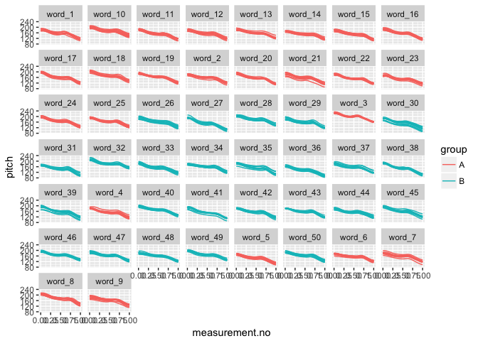

Introduction
------------

This document is a supplement to "Evaluating generalised additive mixed modelling strategies for dynamic speech analysis," relating specifically to the contents of Table 4 in Section 3.2. It presents code that illustrates (i) how the simulated data were generated and (ii) the models whose performance is summarised Table 4.

Preliminaries
-------------

The code below loads the relevant libraries.

``` r
library(ggplot2)
library(mgcv)
library(itsadug)
library(truncnorm)
```

Data generation
---------------

The code in this section can be used to create data for either type I or type II simulations. Set the value of *type* to 1 for type I simulations and to 2 for type II simulations.

``` r
type = 1
```

The data for this set of simulations consist of simulated pitch trajectories loosely modelled after triconstituent compounds in English. In this simulation, there are 50 different compound types (abbreviated as "word" in the code to ensure comparability with the code for f2 trajectories), each of which is represented by 10 trajectories. For type I simulations, each compound type is randomly assigned to one of two groups (A and B), but there is no underlying difference between the groups. For type II simulations, the curves underlying group B trajectories are slightly modified (cf. Section 2.1 in the paper and also the Appendix).

The following code sets the parameters that determine the main characteristics of the data set.

``` r
# setting time dimension (these are the points along which the trajectories are generated)
xs_dense = seq(0,1,0.025)

# indices for extracting every second measurement; this is used for downsampling
xs_thin_ind = c(rep(c(T,F), (length(xs_dense)-1)/2), T)

### population parameters: individual compounds (abbreviated as words for comparability 
#### with f2 data set) come from this distribution

# starting pitch & slope
start_mean = 170
slope_mean = -30

start_sd.word = 8 # population level sd
slope_sd.word = 6 # population level sd

start_sd.traj = 6 # trajectory level sd
slope_sd.traj = 5 # trajectory level sd

# boundaries between N1, N2 and N3
boundary.1_min.word = (1/3) - 0.08
boundary.1_max.word = (1/3) + 0.08

boundary.2_min.word = (2/3) - 0.08
boundary.2_max.word = (2/3) + 0.08

boundary.1_sd.traj = 0.035 # trajectory level sd
boundary.2_sd.traj = 0.035 # trajectory level sd
truncate_boundary_distr_at = 0.1 # trajectories vary around word-level boundary targets as ~ truncnorm with a = -0.1, b = 0.1

# pitch accent #1

H.star_vertical_mean = 15 # roughly the equivalent of ~ 1.5-2 semitones
H.star_vertical_sd.word = 5 # population level sd
H.star_vertical_sd.traj = 3 # trajectory level sd

H.star_horizontal_min = 0 # as a proportion of the duration of W1
H.star_horizontal_max = 0.25

H.star_bw = 0.12 # as a proportion of *overall* duration

# pitch accent #2

H.star.2_vertical_mean = 3.5 # a very small increase, rougly .5 semitones
H.star.2_vertical_sd.word = 5 # population level sd
H.star.2_vertical_sd.traj = 3 # trajectory level sd

H.star.2_horizontal_min = 0 # as a proportion of the duration of W1
H.star.2_horizontal_max = 0.25

H.star.2_bw = 0.12 # as a proportion of *overall* duration

# boundary tone

H.minus_vertical_mean = 8 # about half of H.star
H.minus_vertical_sd.word = 2.4 # population level sd
H.minus_vertical_sd.traj = 1.4 # trajectory level sd

H.minus_bw = 0.08

# final boundary tone

L.percent_vertical = -20
L.percent_bw = 0.12

# number of words & number of trajectories per word

n_trajectories_per_word <- 10
n_words <- 50
```

The code below assembles the dense version of the data set.

``` r
# creating matrix that will store the trajectories
ys_m <- matrix(0, nrow=length(xs_dense), ncol=n_words*n_trajectories_per_word)
for (i in 1:n_words) {
  # sampling word-level targets
  start.word <- rnorm(1, start_mean, start_sd.word)
  slope.word <- rnorm(1, slope_mean, slope_sd.word)
  boundary.1.word <- runif(1, boundary.1_min.word, boundary.1_max.word)
  boundary.2.word <- runif(1, boundary.2_min.word, boundary.2_max.word)
  
  H.star_vertical.word <- rnorm(1, H.star_vertical_mean, H.star_vertical_sd.word)
  H.star.2_vertical.word <- rnorm(1, H.star.2_vertical_mean, H.star.2_vertical_sd.word)
  H.minus_vertical.word <- rnorm(1, H.minus_vertical_mean, H.minus_vertical_sd.word)
  
  for (j in 1:n_trajectories_per_word) {
    # sampling trajectory-level targets
    start <- rnorm(1, start.word, start_sd.traj)
    slope <- rnorm(1, slope.word, slope_sd.traj)
    boundary.1 <- rtruncnorm(1, 
                             a=boundary.1.word-truncate_boundary_distr_at, 
                             b=boundary.1.word+truncate_boundary_distr_at,
                             mean=boundary.1.word,
                             sd=boundary.1_sd.traj)
    boundary.2 <- rtruncnorm(1, 
                             a=boundary.2.word-truncate_boundary_distr_at, 
                             b=boundary.2.word+truncate_boundary_distr_at,
                             mean=boundary.2.word,
                             sd=boundary.2_sd.traj)
    # vertical targets for tones
    H.star_vertical <- rnorm(1, H.star_vertical.word, H.star_vertical_sd.traj)
    H.star.2_vertical <- rnorm(1, H.star.2_vertical.word, H.star.2_vertical_sd.traj)
    H.minus_vertical <- rnorm(1, H.minus_vertical.word, H.minus_vertical_sd.traj)
    # horizontal targets vary randomly within trajs (no word-level dependencies):
    H.star_horizontal <- runif(1, H.star_horizontal_min, H.star_horizontal_max)
    H.star.2_horizontal <- runif(1, H.star.2_horizontal_min, H.star.2_horizontal_max)
    
    ys_m[,(i-1)*n_trajectories_per_word + j] <- start + xs_dense*slope +  # declination
      exp(-((xs_dense - (boundary.1*H.star_horizontal))**2)/(2*H.star_bw**2)) * H.star_vertical + # 1st pitch accent
      exp(-((xs_dense - boundary.2)**2)/(2*H.minus_bw**2)) * H.minus_vertical + # boundary tone
      exp(-((xs_dense - 1)**2)/(2*L.percent_bw**2)) * L.percent_vertical # final boundary tone
    # for type II simulations:
    if (i > (n_words/2) & type==2) {
      ys_m[,(i-1)*n_trajectories_per_word + j] <- ys_m[,(i-1)*n_trajectories_per_word + j] + 
        exp(-((xs_dense - (boundary.1+(boundary.2-boundary.1)*H.star.2_horizontal))**2)/(2*H.star.2_bw**2)) * H.star.2_vertical# 2nd pitch accent
    }
    
  }
}

dat_dense <- data.frame(traj=paste("traj_", rep(1:(n_words*n_trajectories_per_word), each=length(xs_dense)), sep=""),
                        word=paste("word_", rep(1:n_words, each=length(xs_dense)*n_trajectories_per_word), sep=""),
                        group=rep(c("A","B"), each=length(xs_dense)*(n_words*n_trajectories_per_word / 2)),
                        measurement.no=xs_dense, 
                        pitch=c(ys_m),
                        stringsAsFactors = F
)

# setting up different types of grouping factors
dat_dense$group.factor <- as.factor(dat_dense$group)
dat_dense$group.ordered <- as.ordered(dat_dense$group)
contrasts(dat_dense$group.ordered) <- "contr.treatment"
dat_dense$group.bin <- as.numeric(dat_dense$group.factor) - 1

# ids ought to be factors  
dat_dense$traj <- as.factor(dat_dense$traj)
dat_dense$word <- as.factor(dat_dense$word)

# add dat$start for AR.start (for autoregressive error models)

dat_dense$start <- dat_dense$measurement.no == 0
```

Downsampling to thin version of the data set.

``` r
dat_thin <- dat_dense[rep(xs_thin_ind, n_words*n_trajectories_per_word),]
```

Here is what the data set looks like. (Note that the difference between group A vs B trajectories in type II simulations is very subtle.)

``` r
ggplot(dat_dense, aes(x=measurement.no, y=pitch, group=traj, col=group)) +
  geom_line() +
  facet_wrap(~word)
```



Models
------

All the models (and sets of models) from Table 4 are shown below in the same order as in the table. Note that all models contain AR1 components to deal with dependencies within trajectories. For simplicity, the rho value used for these AR1 components is taken from a single model fitted without any random structures. This model is estimated below.

``` r
# dense
rho_mod_dense <- bam(pitch ~ group.ordered + 
                      s(measurement.no, bs = "tp", k = 15) + 
                      s(measurement.no, by = group.ordered, bs = "tp", k = 15), 
                    data = dat_dense, method = "fREML", discrete = T, nthreads = 1)

# thin
rho_mod_thin <- bam(pitch ~ group.ordered + 
                     s(measurement.no, bs = "tp", k = 15) + 
                     s(measurement.no, by = group.ordered, bs = "tp", k = 15), 
                   data = dat_thin, method = "fREML", discrete = T, nthreads = 1)

rho_dense <- start_value_rho(rho_mod_dense)
rho_thin <- start_value_rho(rho_mod_thin)
```

The models below differ in terms of the random components that they use to control for within-word (= compound-type) dependencies.

### 1. No random components

``` r
# dense
nocomp_dense <- bam(pitch ~ group.ordered + 
                      s(measurement.no, bs = "tp", k = 15) + 
                      s(measurement.no, by = group.ordered, bs = "tp", k = 15), 
                    data = dat_dense, 
                    AR.start = dat_dense$start, rho = rho_dense, 
                    method = "fREML", discrete = T, nthreads = 1)
summary(nocomp_dense)
```

    ## 
    ## Family: gaussian 
    ## Link function: identity 
    ## 
    ## Formula:
    ## pitch ~ group.ordered + s(measurement.no, bs = "tp", k = 15) + 
    ##     s(measurement.no, by = group.ordered, bs = "tp", k = 15)
    ## 
    ## Parametric coefficients:
    ##                Estimate Std. Error t value Pr(>|t|)    
    ## (Intercept)    159.1550     0.2546 625.188  < 2e-16 ***
    ## group.orderedB  -1.7740     0.3598  -4.931 8.25e-07 ***
    ## ---
    ## Signif. codes:  0 '***' 0.001 '**' 0.01 '*' 0.05 '.' 0.1 ' ' 1
    ## 
    ## Approximate significance of smooth terms:
    ##                                     edf Ref.df        F  p-value    
    ## s(measurement.no)                13.982 13.998 6776.066  < 2e-16 ***
    ## s(measurement.no):group.orderedB  6.378  8.542    4.681 6.58e-06 ***
    ## ---
    ## Signif. codes:  0 '***' 0.001 '**' 0.01 '*' 0.05 '.' 0.1 ' ' 1
    ## 
    ## R-sq.(adj) =  0.663   Deviance explained = 66.4%
    ## fREML =  23512  Scale est. = 19.42     n = 20500

``` r
# thin
nocomp_thin <- bam(pitch ~ group.ordered + 
                      s(measurement.no, bs = "tp", k = 15) + 
                      s(measurement.no, by = group.ordered, bs = "tp", k = 15), 
                    data = dat_thin, 
                    AR.start = dat_thin$start, rho = rho_thin, 
                    method = "fREML", discrete = T, nthreads = 1)
summary(nocomp_thin)
```

    ## 
    ## Family: gaussian 
    ## Link function: identity 
    ## 
    ## Formula:
    ## pitch ~ group.ordered + s(measurement.no, bs = "tp", k = 15) + 
    ##     s(measurement.no, by = group.ordered, bs = "tp", k = 15)
    ## 
    ## Parametric coefficients:
    ##                Estimate Std. Error t value Pr(>|t|)    
    ## (Intercept)    159.0137     0.3390 469.058  < 2e-16 ***
    ## group.orderedB  -1.7083     0.4774  -3.578 0.000348 ***
    ## ---
    ## Signif. codes:  0 '***' 0.001 '**' 0.01 '*' 0.05 '.' 0.1 ' ' 1
    ## 
    ## Approximate significance of smooth terms:
    ##                                     edf Ref.df        F p-value    
    ## s(measurement.no)                13.965 13.999 3897.488 < 2e-16 ***
    ## s(measurement.no):group.orderedB  2.846  3.896    3.818 0.00474 ** 
    ## ---
    ## Signif. codes:  0 '***' 0.001 '**' 0.01 '*' 0.05 '.' 0.1 ' ' 1
    ## 
    ## R-sq.(adj) =  0.676   Deviance explained = 67.6%
    ## fREML =  19308  Scale est. = 35.188    n = 10500

### 2. Rand intcpt (= Random Intercept)

``` r
# dense
rand_intcpt_dense <- bam(pitch ~ group.ordered + 
                      s(measurement.no, bs = "tp", k = 15) + 
                      s(measurement.no, by = group.ordered, bs = "tp", k = 15) +
                      s(word, bs = "re"), 
                    data = dat_dense, 
                    AR.start = dat_dense$start, rho = rho_dense, 
                    method = "fREML", discrete = T, nthreads = 1)
summary(rand_intcpt_dense)
```

    ## 
    ## Family: gaussian 
    ## Link function: identity 
    ## 
    ## Formula:
    ## pitch ~ group.ordered + s(measurement.no, bs = "tp", k = 15) + 
    ##     s(measurement.no, by = group.ordered, bs = "tp", k = 15) + 
    ##     s(word, bs = "re")
    ## 
    ## Parametric coefficients:
    ##                Estimate Std. Error t value Pr(>|t|)    
    ## (Intercept)     159.364      2.188  72.838   <2e-16 ***
    ## group.orderedB   -1.783      3.094  -0.576    0.564    
    ## ---
    ## Signif. codes:  0 '***' 0.001 '**' 0.01 '*' 0.05 '.' 0.1 ' ' 1
    ## 
    ## Approximate significance of smooth terms:
    ##                                     edf Ref.df        F  p-value    
    ## s(measurement.no)                13.984 13.998 8173.246  < 2e-16 ***
    ## s(measurement.no):group.orderedB  7.318  9.626    5.329 1.31e-07 ***
    ## s(word)                          47.500 50.000   91.291  < 2e-16 ***
    ## ---
    ## Signif. codes:  0 '***' 0.001 '**' 0.01 '*' 0.05 '.' 0.1 ' ' 1
    ## 
    ## R-sq.(adj) =  0.898   Deviance explained = 89.9%
    ## fREML =  21561  Scale est. = 15.879    n = 20500

``` r
# thin
rand_intcpt_thin <- bam(pitch ~ group.ordered + 
                      s(measurement.no, bs = "tp", k = 15) + 
                      s(measurement.no, by = group.ordered, bs = "tp", k = 15) +
                      s(word, bs = "re"), 
                    data = dat_thin, 
                    AR.start = dat_thin$start, rho = rho_thin, 
                    method = "fREML", discrete = T, nthreads = 1)
summary(rand_intcpt_thin)
```

    ## 
    ## Family: gaussian 
    ## Link function: identity 
    ## 
    ## Formula:
    ## pitch ~ group.ordered + s(measurement.no, bs = "tp", k = 15) + 
    ##     s(measurement.no, by = group.ordered, bs = "tp", k = 15) + 
    ##     s(word, bs = "re")
    ## 
    ## Parametric coefficients:
    ##                Estimate Std. Error t value Pr(>|t|)    
    ## (Intercept)     158.815      2.188   72.59   <2e-16 ***
    ## group.orderedB   -1.733      3.094   -0.56    0.575    
    ## ---
    ## Signif. codes:  0 '***' 0.001 '**' 0.01 '*' 0.05 '.' 0.1 ' ' 1
    ## 
    ## Approximate significance of smooth terms:
    ##                                     edf Ref.df       F p-value    
    ## s(measurement.no)                13.971 13.998 4679.22 < 2e-16 ***
    ## s(measurement.no):group.orderedB  3.781  5.181    3.88 0.00133 ** 
    ## s(word)                          47.123 50.000   51.58 < 2e-16 ***
    ## ---
    ## Signif. codes:  0 '***' 0.001 '**' 0.01 '*' 0.05 '.' 0.1 ' ' 1
    ## 
    ## R-sq.(adj) =  0.901   Deviance explained = 90.2%
    ## fREML =  18252  Scale est. = 28.236    n = 10500

### 3. Rand intcpt + slope (= random intercept + slope)

``` r
# dense
rand_intcpt_slope_dense <- bam(pitch ~ group.ordered + 
                      s(measurement.no, bs = "tp", k = 15) + 
                      s(measurement.no, by = group.ordered, bs = "tp", k = 15) +
                      s(word, bs = "re") +
                      s(word, measurement.no, bs = "re"), 
                    data = dat_dense, 
                    AR.start = dat_dense$start, rho = rho_dense, 
                    method = "fREML", discrete = T, nthreads = 1)
summary(rand_intcpt_slope_dense)
```

    ## 
    ## Family: gaussian 
    ## Link function: identity 
    ## 
    ## Formula:
    ## pitch ~ group.ordered + s(measurement.no, bs = "tp", k = 15) + 
    ##     s(measurement.no, by = group.ordered, bs = "tp", k = 15) + 
    ##     s(word, bs = "re") + s(word, measurement.no, bs = "re")
    ## 
    ## Parametric coefficients:
    ##                Estimate Std. Error t value Pr(>|t|)    
    ## (Intercept)     159.365      2.262  70.445   <2e-16 ***
    ## group.orderedB   -1.784      3.199  -0.558    0.577    
    ## ---
    ## Signif. codes:  0 '***' 0.001 '**' 0.01 '*' 0.05 '.' 0.1 ' ' 1
    ## 
    ## Approximate significance of smooth terms:
    ##                                     edf Ref.df        F p-value    
    ## s(measurement.no)                13.985  14.00 2996.195 < 2e-16 ***
    ## s(measurement.no):group.orderedB  7.668  10.01    2.839 0.00156 ** 
    ## s(word)                          47.405  48.00 1071.194 < 2e-16 ***
    ## s(measurement.no,word)           46.709  48.00 1002.076 < 2e-16 ***
    ## ---
    ## Signif. codes:  0 '***' 0.001 '**' 0.01 '*' 0.05 '.' 0.1 ' ' 1
    ## 
    ## R-sq.(adj) =  0.905   Deviance explained = 90.6%
    ## fREML =  20815  Scale est. = 14.636    n = 20500

``` r
# thin
rand_intcpt_slope_thin <- bam(pitch ~ group.ordered + 
                      s(measurement.no, bs = "tp", k = 15) + 
                      s(measurement.no, by = group.ordered, bs = "tp", k = 15) +
                      s(word, bs = "re") +
                      s(word, measurement.no, bs = "re"), 
                    data = dat_thin, 
                    AR.start = dat_thin$start, rho = rho_thin, 
                    method = "fREML", discrete = T, nthreads = 1)
summary(rand_intcpt_slope_thin)
```

    ## 
    ## Family: gaussian 
    ## Link function: identity 
    ## 
    ## Formula:
    ## pitch ~ group.ordered + s(measurement.no, bs = "tp", k = 15) + 
    ##     s(measurement.no, by = group.ordered, bs = "tp", k = 15) + 
    ##     s(word, bs = "re") + s(word, measurement.no, bs = "re")
    ## 
    ## Parametric coefficients:
    ##                Estimate Std. Error t value Pr(>|t|)    
    ## (Intercept)     158.820      2.252  70.538   <2e-16 ***
    ## group.orderedB   -1.743      3.184  -0.547    0.584    
    ## ---
    ## Signif. codes:  0 '***' 0.001 '**' 0.01 '*' 0.05 '.' 0.1 ' ' 1
    ## 
    ## Approximate significance of smooth terms:
    ##                                     edf Ref.df        F p-value    
    ## s(measurement.no)                13.973 13.998 1945.171  <2e-16 ***
    ## s(measurement.no):group.orderedB  4.237  5.791    1.365   0.204    
    ## s(word)                          46.949 48.000  358.553  <2e-16 ***
    ## s(measurement.no,word)           45.606 48.000  317.494  <2e-16 ***
    ## ---
    ## Signif. codes:  0 '***' 0.001 '**' 0.01 '*' 0.05 '.' 0.1 ' ' 1
    ## 
    ## R-sq.(adj) =  0.909   Deviance explained =   91%
    ## fREML =  17885  Scale est. = 25.962    n = 10500

### 4. Rand smooth, 5 bs

``` r
# dense
rand_smooth_5_dense <- 
  bam(pitch ~ group.ordered + 
        s(measurement.no, bs = "tp", k = 15) + 
        s(measurement.no, by = group.ordered, bs = "tp", k = 15) + 
        s(measurement.no, word, bs = "fs", m = 1, xt = "tp", k = 5), 
      data = dat_dense, 
      AR.start = dat_dense$start, rho = rho_dense, 
      method = "fREML", discrete = T, nthreads = 1)
```

    ## Warning in gam.side(sm, X, tol = .Machine$double.eps^0.5): model has
    ## repeated 1-d smooths of same variable.

``` r
summary(rand_smooth_5_dense)
```

    ## 
    ## Family: gaussian 
    ## Link function: identity 
    ## 
    ## Formula:
    ## pitch ~ group.ordered + s(measurement.no, bs = "tp", k = 15) + 
    ##     s(measurement.no, by = group.ordered, bs = "tp", k = 15) + 
    ##     s(measurement.no, word, bs = "fs", m = 1, xt = "tp", k = 5)
    ## 
    ## Parametric coefficients:
    ##                Estimate Std. Error t value Pr(>|t|)    
    ## (Intercept)     158.935      2.227  71.377   <2e-16 ***
    ## group.orderedB   -1.454      3.131  -0.464    0.642    
    ## ---
    ## Signif. codes:  0 '***' 0.001 '**' 0.01 '*' 0.05 '.' 0.1 ' ' 1
    ## 
    ## Approximate significance of smooth terms:
    ##                                      edf Ref.df       F p-value    
    ## s(measurement.no)                 13.974  13.99 546.589  <2e-16 ***
    ## s(measurement.no):group.orderedB   4.468   6.08   0.178   0.983    
    ## s(measurement.no,word)           238.513 250.00  53.573  <2e-16 ***
    ## ---
    ## Signif. codes:  0 '***' 0.001 '**' 0.01 '*' 0.05 '.' 0.1 ' ' 1
    ## 
    ## R-sq.(adj) =  0.911   Deviance explained = 91.2%
    ## fREML =  18844  Scale est. = 11.743    n = 20500

``` r
# thin
rand_smooth_5_thin <- 
  bam(pitch ~ group.ordered + 
        s(measurement.no, bs = "tp", k = 15) + 
        s(measurement.no, by = group.ordered, bs = "tp", k = 15) + 
        s(measurement.no, word, bs = "fs", m = 1, xt = "tp", k = 5), 
      data = dat_thin, 
      AR.start = dat_thin$start, rho = rho_thin, 
      method = "fREML", discrete = T, nthreads = 1)
```

    ## Warning in gam.side(sm, X, tol = .Machine$double.eps^0.5): model has
    ## repeated 1-d smooths of same variable.

``` r
summary(rand_smooth_5_thin)
```

    ## 
    ## Family: gaussian 
    ## Link function: identity 
    ## 
    ## Formula:
    ## pitch ~ group.ordered + s(measurement.no, bs = "tp", k = 15) + 
    ##     s(measurement.no, by = group.ordered, bs = "tp", k = 15) + 
    ##     s(measurement.no, word, bs = "fs", m = 1, xt = "tp", k = 5)
    ## 
    ## Parametric coefficients:
    ##                Estimate Std. Error t value Pr(>|t|)    
    ## (Intercept)     158.661      2.219  71.496   <2e-16 ***
    ## group.orderedB   -1.457      3.119  -0.467     0.64    
    ## ---
    ## Signif. codes:  0 '***' 0.001 '**' 0.01 '*' 0.05 '.' 0.1 ' ' 1
    ## 
    ## Approximate significance of smooth terms:
    ##                                      edf  Ref.df       F p-value    
    ## s(measurement.no)                 13.971  13.992 548.203  <2e-16 ***
    ## s(measurement.no):group.orderedB   1.001   1.001   0.482   0.488    
    ## s(measurement.no,word)           232.523 250.000  28.000  <2e-16 ***
    ## ---
    ## Signif. codes:  0 '***' 0.001 '**' 0.01 '*' 0.05 '.' 0.1 ' ' 1
    ## 
    ## R-sq.(adj) =  0.913   Deviance explained = 91.5%
    ## fREML =  17019  Scale est. = 21.107    n = 10500

### 5. Rand smooth, 8 bs

``` r
# dense
rand_smooth_8_dense <- 
  bam(pitch ~ group.ordered + 
        s(measurement.no, bs = "tp", k = 15) + 
        s(measurement.no, by = group.ordered, bs = "tp", k = 15) + 
        s(measurement.no, word, bs = "fs", m = 1, xt = "tp", k = 8), 
      data = dat_dense, 
      AR.start = dat_dense$start, rho = rho_dense, 
      method = "fREML", discrete = T, nthreads = 1)
```

    ## Warning in gam.side(sm, X, tol = .Machine$double.eps^0.5): model has
    ## repeated 1-d smooths of same variable.

``` r
summary(rand_smooth_8_dense)
```

    ## 
    ## Family: gaussian 
    ## Link function: identity 
    ## 
    ## Formula:
    ## pitch ~ group.ordered + s(measurement.no, bs = "tp", k = 15) + 
    ##     s(measurement.no, by = group.ordered, bs = "tp", k = 15) + 
    ##     s(measurement.no, word, bs = "fs", m = 1, xt = "tp", k = 8)
    ## 
    ## Parametric coefficients:
    ##                Estimate Std. Error t value Pr(>|t|)    
    ## (Intercept)     158.580      2.230  71.115   <2e-16 ***
    ## group.orderedB   -1.353      3.123  -0.433    0.665    
    ## ---
    ## Signif. codes:  0 '***' 0.001 '**' 0.01 '*' 0.05 '.' 0.1 ' ' 1
    ## 
    ## Approximate significance of smooth terms:
    ##                                      edf  Ref.df       F p-value    
    ## s(measurement.no)                 13.941  13.953 358.763  <2e-16 ***
    ## s(measurement.no):group.orderedB   1.897   2.445   0.326   0.748    
    ## s(measurement.no,word)           387.076 400.000  58.901  <2e-16 ***
    ## ---
    ## Signif. codes:  0 '***' 0.001 '**' 0.01 '*' 0.05 '.' 0.1 ' ' 1
    ## 
    ## R-sq.(adj) =  0.911   Deviance explained = 91.3%
    ## fREML =  16552  Scale est. = 9.0338    n = 20500

``` r
# thin
rand_smooth_8_thin <- 
  bam(pitch ~ group.ordered + 
        s(measurement.no, bs = "tp", k = 15) + 
        s(measurement.no, by = group.ordered, bs = "tp", k = 15) + 
        s(measurement.no, word, bs = "fs", m = 1, xt = "tp", k = 8), 
      data = dat_thin, 
      AR.start = dat_thin$start, rho = rho_thin, 
      method = "fREML", discrete = T, nthreads = 1)
```

    ## Warning in gam.side(sm, X, tol = .Machine$double.eps^0.5): model has
    ## repeated 1-d smooths of same variable.

``` r
summary(rand_smooth_8_thin)
```

    ## 
    ## Family: gaussian 
    ## Link function: identity 
    ## 
    ## Formula:
    ## pitch ~ group.ordered + s(measurement.no, bs = "tp", k = 15) + 
    ##     s(measurement.no, by = group.ordered, bs = "tp", k = 15) + 
    ##     s(measurement.no, word, bs = "fs", m = 1, xt = "tp", k = 8)
    ## 
    ## Parametric coefficients:
    ##                Estimate Std. Error t value Pr(>|t|)    
    ## (Intercept)     158.634      2.217  71.553   <2e-16 ***
    ## group.orderedB   -1.450      3.116  -0.465    0.642    
    ## ---
    ## Signif. codes:  0 '***' 0.001 '**' 0.01 '*' 0.05 '.' 0.1 ' ' 1
    ## 
    ## Approximate significance of smooth terms:
    ##                                      edf  Ref.df      F p-value    
    ## s(measurement.no)                 13.948  13.964 513.07  <2e-16 ***
    ## s(measurement.no):group.orderedB   1.001   1.001   0.73   0.393    
    ## s(measurement.no,word)           374.591 400.000  29.39  <2e-16 ***
    ## ---
    ## Signif. codes:  0 '***' 0.001 '**' 0.01 '*' 0.05 '.' 0.1 ' ' 1
    ## 
    ## R-sq.(adj) =  0.913   Deviance explained = 91.6%
    ## fREML =  16009  Scale est. = 16.594    n = 10500

### 6. Rand smooth, 12 bs

``` r
# dense
rand_smooth_12_dense <- 
  bam(pitch ~ group.ordered + 
        s(measurement.no, bs = "tp", k = 15) + 
        s(measurement.no, by = group.ordered, bs = "tp", k = 15) + 
        s(measurement.no, word, bs = "fs", m = 1, xt = "tp", k = 12), 
      data = dat_dense, 
      AR.start = dat_dense$start, rho = rho_dense, 
      method = "fREML", discrete = T, nthreads = 1)
```

    ## Warning in gam.side(sm, X, tol = .Machine$double.eps^0.5): model has
    ## repeated 1-d smooths of same variable.

``` r
summary(rand_smooth_12_dense)
```

    ## 
    ## Family: gaussian 
    ## Link function: identity 
    ## 
    ## Formula:
    ## pitch ~ group.ordered + s(measurement.no, bs = "tp", k = 15) + 
    ##     s(measurement.no, by = group.ordered, bs = "tp", k = 15) + 
    ##     s(measurement.no, word, bs = "fs", m = 1, xt = "tp", k = 12)
    ## 
    ## Parametric coefficients:
    ##                Estimate Std. Error t value Pr(>|t|)    
    ## (Intercept)     158.894      2.215  71.725   <2e-16 ***
    ## group.orderedB   -1.469      3.115  -0.472    0.637    
    ## ---
    ## Signif. codes:  0 '***' 0.001 '**' 0.01 '*' 0.05 '.' 0.1 ' ' 1
    ## 
    ## Approximate significance of smooth terms:
    ##                                     edf Ref.df       F p-value    
    ## s(measurement.no)                 13.92  13.93 478.990  <2e-16 ***
    ## s(measurement.no):group.orderedB   1.00   1.00   0.698   0.404    
    ## s(measurement.no,word)           575.41 600.00  44.769  <2e-16 ***
    ## ---
    ## Signif. codes:  0 '***' 0.001 '**' 0.01 '*' 0.05 '.' 0.1 ' ' 1
    ## 
    ## R-sq.(adj) =  0.911   Deviance explained = 91.3%
    ## fREML =  16085  Scale est. = 8.4085    n = 20500

``` r
# thin
rand_smooth_12_thin <- 
  bam(pitch ~ group.ordered + 
        s(measurement.no, bs = "tp", k = 15) + 
        s(measurement.no, by = group.ordered, bs = "tp", k = 15) + 
        s(measurement.no, word, bs = "fs", m = 1, xt = "tp", k = 12), 
      data = dat_thin, 
      AR.start = dat_thin$start, rho = rho_thin, 
      method = "fREML", discrete = T, nthreads = 1)
```

    ## Warning in gam.side(sm, X, tol = .Machine$double.eps^0.5): model has
    ## repeated 1-d smooths of same variable.

``` r
summary(rand_smooth_12_thin)
```

    ## 
    ## Family: gaussian 
    ## Link function: identity 
    ## 
    ## Formula:
    ## pitch ~ group.ordered + s(measurement.no, bs = "tp", k = 15) + 
    ##     s(measurement.no, by = group.ordered, bs = "tp", k = 15) + 
    ##     s(measurement.no, word, bs = "fs", m = 1, xt = "tp", k = 12)
    ## 
    ## Parametric coefficients:
    ##                Estimate Std. Error t value Pr(>|t|)    
    ## (Intercept)     158.635      2.211  71.733   <2e-16 ***
    ## group.orderedB   -1.457      3.113  -0.468     0.64    
    ## ---
    ## Signif. codes:  0 '***' 0.001 '**' 0.01 '*' 0.05 '.' 0.1 ' ' 1
    ## 
    ## Approximate significance of smooth terms:
    ##                                    edf Ref.df      F p-value    
    ## s(measurement.no)                 13.9  13.91 546.35  <2e-16 ***
    ## s(measurement.no):group.orderedB   1.0   1.00   1.16   0.282    
    ## s(measurement.no,word)           553.7 600.00  21.91  <2e-16 ***
    ## ---
    ## Signif. codes:  0 '***' 0.001 '**' 0.01 '*' 0.05 '.' 0.1 ' ' 1
    ## 
    ## R-sq.(adj) =  0.911   Deviance explained = 91.6%
    ## fREML =  15918  Scale est. = 15.615    n = 10500

### 7. Rand smooth, gam.check

The model fitted in this section uses random smooths where the number of basis functions (k) is determined using the gam.check() function: after fitting an initial model with a relatively low value of k, gam.check() is used to see whether more wiggliness is necessary (essentially, whether the smooths use up all the degrees of freedom afforded to them). If gam.check() suggests that more wiggliness is necessary, this procedure is repeated again using a model with a higher value of k.

Below is a convenience function for extracting the relevant p-value from the output of gam.check.

``` r
gam.check.p.value <- function (mod, which.line) { # which.line is a regexp
  str.out <- capture.output(gam.check(mod))
  relevant.line <- str.out[grep(which.line, str.out)]
  p.value <- as.numeric(gsub(".*?([0-9.e-]*)[ .*]*$", "\\1", relevant.line, perl=T))
  return(p.value)
}
```

Fitting the models. Dense first.

``` r
# what k's should be tried?
k_min = 4
k_max = 12
k_step = 4
```

``` r
# dense
for (k in seq(k_min,k_max,k_step)) {
  cat("fitting model with  k =", k, "\n")
  
  # fitting model
  
  rand_smooth_gam.check_dense <- 
    bam(pitch ~ group.ordered + 
          s(measurement.no, bs = "tp", k = 15) + 
          s(measurement.no, by = group.ordered, bs = "tp", k = 15) + 
          s(measurement.no, word, bs = "fs", m = 1, xt = "tp", k = k), 
        data = dat_dense, 
        AR.start = dat_dense$start, rho = rho_dense, 
        method = "fREML", discrete = T, nthreads = 1)
  
  # check whether more complexity is needed using gam.check
  
  if (gam.check.p.value(rand_smooth_gam.check_dense, "word") >= 0.05 | k == k_max) {
    print(summary(rand_smooth_gam.check_dense))
    break
  }
}
```

    ## fitting model with  k = 4

    ## Warning in gam.side(sm, X, tol = .Machine$double.eps^0.5): model has
    ## repeated 1-d smooths of same variable.

    ## 
    ## Family: gaussian 
    ## Link function: identity 
    ## 
    ## Formula:
    ## pitch ~ group.ordered + s(measurement.no, bs = "tp", k = 15) + 
    ##     s(measurement.no, by = group.ordered, bs = "tp", k = 15) + 
    ##     s(measurement.no, word, bs = "fs", m = 1, xt = "tp", k = k)
    ## 
    ## Parametric coefficients:
    ##                Estimate Std. Error t value Pr(>|t|)    
    ## (Intercept)     159.236      2.215   71.89   <2e-16 ***
    ## group.orderedB   -1.750      3.124   -0.56    0.575    
    ## ---
    ## Signif. codes:  0 '***' 0.001 '**' 0.01 '*' 0.05 '.' 0.1 ' ' 1
    ## 
    ## Approximate significance of smooth terms:
    ##                                      edf  Ref.df       F  p-value    
    ## s(measurement.no)                 13.979  13.992 804.745  < 2e-16 ***
    ## s(measurement.no):group.orderedB   7.411   9.561   3.055 0.000898 ***
    ## s(measurement.no,word)           188.517 200.000  47.124  < 2e-16 ***
    ## ---
    ## Signif. codes:  0 '***' 0.001 '**' 0.01 '*' 0.05 '.' 0.1 ' ' 1
    ## 
    ## R-sq.(adj) =   0.91   Deviance explained = 91.1%
    ## fREML =  19999  Scale est. = 13.298    n = 20500

And now the thin data set.

``` r
# thin
for (k in seq(k_min,k_max,k_step)) {
  cat("fitting model with  k =", k, "\n")
  
  # fitting model
  
  rand_smooth_gam.check_thin <- 
    bam(pitch ~ group.ordered + 
          s(measurement.no, bs = "tp", k = 15) + 
          s(measurement.no, by = group.ordered, bs = "tp", k = 15) + 
          s(measurement.no, word, bs = "fs", m = 1, xt = "tp", k = k), 
        data = dat_thin, 
        AR.start = dat_thin$start, rho = rho_thin, 
        method = "fREML", discrete = T, nthreads = 1)
  
  # check whether more complexity is needed using gam.check
  
  if (gam.check.p.value(rand_smooth_gam.check_thin, "word") >= 0.05 | k == k_max) {
    print(summary(rand_smooth_gam.check_thin))
    break
  }
}
```

    ## fitting model with  k = 4

    ## Warning in gam.side(sm, X, tol = .Machine$double.eps^0.5): model has
    ## repeated 1-d smooths of same variable.

    ## 
    ## Family: gaussian 
    ## Link function: identity 
    ## 
    ## Formula:
    ## pitch ~ group.ordered + s(measurement.no, bs = "tp", k = 15) + 
    ##     s(measurement.no, by = group.ordered, bs = "tp", k = 15) + 
    ##     s(measurement.no, word, bs = "fs", m = 1, xt = "tp", k = k)
    ## 
    ## Parametric coefficients:
    ##                Estimate Std. Error t value Pr(>|t|)    
    ## (Intercept)     158.829      2.211  71.832   <2e-16 ***
    ## group.orderedB   -1.762      3.120  -0.565    0.572    
    ## ---
    ## Signif. codes:  0 '***' 0.001 '**' 0.01 '*' 0.05 '.' 0.1 ' ' 1
    ## 
    ## Approximate significance of smooth terms:
    ##                                      edf  Ref.df       F p-value    
    ## s(measurement.no)                 13.970  13.994 652.158  <2e-16 ***
    ## s(measurement.no):group.orderedB   4.845   6.518   1.568    0.19    
    ## s(measurement.no,word)           182.594 200.000  25.348  <2e-16 ***
    ## ---
    ## Signif. codes:  0 '***' 0.001 '**' 0.01 '*' 0.05 '.' 0.1 ' ' 1
    ## 
    ## R-sq.(adj) =  0.912   Deviance explained = 91.4%
    ## fREML =  17535  Scale est. = 23.708    n = 10500
