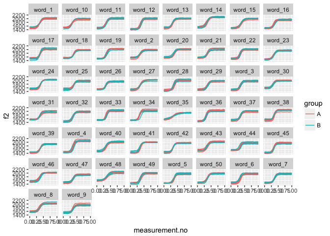

Introduction
------------

This document is a supplement to "Evaluating generalised additive mixed modelling strategies for dynamic speech analysis," relating specifically to the contents of Table 5 in Section 3.3. It presents code that illustrates (i) how the simulated data were generated and (ii) the models whose performance is summarised Table 5.

Preliminaries
-------------

The code below loads the relevant libraries.

``` r
library(ggplot2)
library(mgcv)
library(itsadug)
library(MASS)
```

Data generation
---------------

The code in this section can be used to create data for either type I or type II simulations. Set the value of *type* to 1 for type I simulations and to 2 for type II simulations.

``` r
type = 1
```

The data for this set of simulations consist of simulated f2 trajectories loosely modelled after the diphthong /eI/. In this simulation, there are 50 different word types, each of which is represented by 10 trajectories. Five of these trajectories are assigned to group A and five to group B - in other words, these simulations exemplify a within-item design. For type I simulations, there is no underlying difference between the two groups. For type II simulations, the underlying trajectories are slightly different (cf. Section 2.1 in the paper and also the Appendix).

The following code sets the parameters that determine the main characteristics of the data set.

``` r
# setting time dimension (these are the points along which the trajectories are generated)
xs_dense = seq(0,1,0.05)

# indices for extracting every second measurement; this is used for downsampling
xs_thin_ind = c(rep(c(T,F), (length(xs_dense)-1)/2), T)

# population parameters: individual words come from this dist
f2_start_mean = 1500
f2_end_1_mean = 2000
if (type==2) {
  f2_end_2_mean = 1960
} else {
  f2_end_2_mean = 2000
}
f2_start_sd.word = 40 # population level sd
f2_end_sd.word = 40 # population level sd
# correlation between pairs of parameter values sampled for two groups within same word;
# (this is necessary, since now there are two distinct groups per word; these correlation
# parameters ensure that there is some consistency at the word level as well as within
# the groups)
# rho = 7/8 means that the sd of the difference between the two groups within
#   the same word is 0.5 * the sd of the target values
# in mixed model lingo: the sd of the random slope is half of the sd of the intercept
f2_start_rho.word = 7/8 # population level rho
f2_end_rho.word = 7/8 # population level rho

# expected value & sd for transition point
x0_mean = 0.35
x0_sd.word = 0.020 # population level sd
x0_rho.word = 7/8 #  population level rho (same as above)
# expected value & sd for steepness (higher -> more steep)
k_mean = 25
k_sd.word = 4 # population level sd
k_rho.word = 7/8 #  population level rho (same as above)

# how much variation within word-group pairs? (unchanged from before)
f2_start_sd.traj = 30 # trajectory level sd
f2_end_sd.traj = 30 # trajectory level sd
x0_sd.traj = 0.015 # trajectory level sd
k_sd.traj = 3 # trajectory level sd

# amount of random noise

noise_sd <- 5

n_words <- 50
n_trajectories_per_word <- 10
```

The code below assembles the dense version of the data set.

``` r
# convenience function fid creating covariance matrix from sd's and correlation parameter
make_cov_matrix <- function (a.sd, b.sd, rho) {
  matrix(c(a.sd**2, rho*a.sd*b.sd, rho*a.sd*b.sd, b.sd**2), nrow=2)
}

# creating matrix that will store the trajectories
ys_m <- matrix(0, nrow=length(xs_dense), ncol=n_words*n_trajectories_per_word)
for (i in 1:n_words) {
  # sampling targets for groups A and B for a given word
  f2_start.word <- mvrnorm(1, rep(f2_start_mean, 2), 
                           make_cov_matrix(f2_start_sd.word, f2_start_sd.word, f2_start_rho.word))
  f2_end.word <- mvrnorm(1, c(f2_end_1_mean, f2_end_2_mean), 
                         make_cov_matrix(f2_end_sd.word, f2_end_sd.word, f2_end_rho.word))
  x0.word <- mvrnorm(1, rep(x0_mean, 2), 
                     make_cov_matrix(x0_sd.word, x0_sd.word, x0_rho.word))
  k.word <- mvrnorm(1, rep(k_mean, 2), 
                     make_cov_matrix(k_sd.word, k_sd.word, k_rho.word))
  for (j in 1:(n_trajectories_per_word/2)) {
    # sampling trajectories for group A
    f2_start <- rnorm(1, f2_start.word[1], f2_start_sd.traj)
    f2_end <- rnorm(1, f2_end.word[1], f2_end_sd.traj)
    x0 <- rnorm(1, x0.word[1], x0_sd.traj)
    k <- rnorm(1, k.word[1], k_sd.traj)
    ys_m[,(i-1)*n_trajectories_per_word + j*2 - 1] <- ((f2_end - f2_start) / (1 + exp(-k*(xs_dense-x0)))) + f2_start + rnorm(length(xs_dense), 0, noise_sd)
    # sampling trajectories for group B
    f2_start <- rnorm(1, f2_start.word[2], f2_start_sd.traj)
    f2_end <- rnorm(1, f2_end.word[2], f2_end_sd.traj)
    x0 <- rnorm(1, x0.word[2], x0_sd.traj)
    k <- rnorm(1, k.word[2], k_sd.traj)
    ys_m[,(i-1)*n_trajectories_per_word + j*2] <- ((f2_end - f2_start) / (1 + exp(-k*(xs_dense-x0)))) + f2_start + rnorm(length(xs_dense), 0, noise_sd)
  }
}

# assembling data set (randomly assigned to categories)
dat_dense <- data.frame(traj=paste("traj_", rep(1:(n_words*n_trajectories_per_word), each=length(xs_dense)), sep=""),
                  word=paste("word_", rep(1:n_words, each=length(xs_dense)*n_trajectories_per_word), sep=""),
                  group=rep(c("A","B"), each=length(xs_dense), times=n_words*n_trajectories_per_word / 2),
                  measurement.no=xs_dense, 
                  f2=c(ys_m),
                  stringsAsFactors = F
                 )

# setting up different types of grouping factors
dat_dense$group.factor <- as.factor(dat_dense$group)
dat_dense$group.ordered <- as.ordered(dat_dense$group)
contrasts(dat_dense$group.ordered) <- "contr.treatment"
dat_dense$group.bin <- as.numeric(dat_dense$group.factor) - 1

# traj/word ids must be factors  
dat_dense$traj <- as.factor(dat_dense$traj)
dat_dense$word <- as.factor(dat_dense$word)
dat_dense$wordGroup <- interaction(dat_dense$word, dat_dense$group)

# add dat$start for AR.start (for autoregressive error models)

dat_dense$start <- dat_dense$measurement.no == 0
```

Downsampling to thin version of the data set.

``` r
dat_thin <- dat_dense[rep(xs_thin_ind, n_words*n_trajectories_per_word),]
```

Here is what the data set looks like.

``` r
ggplot(dat_dense, aes(x=measurement.no, y=f2, group=traj, col=group)) +
  geom_line() +
  facet_wrap(~word)
```



Models
------

All the models (and sets of models) from Table 5 are shown below in the same order as in the table. Note that all models contain AR1 components to deal with dependencies within trajectories. For simplicity, the rho value used for these AR1 components is taken from a single model fitted without any random structures. This model is estimated below.

``` r
# dense
rho_mod_dense <- bam(f2 ~ group.ordered + 
                      s(measurement.no, bs = "tp", k = 10) + 
                      s(measurement.no, by = group.ordered, bs = "tp", k = 10), 
                    data = dat_dense, method = "fREML", discrete = T, nthreads = 1)

# thin
rho_mod_thin <- bam(f2 ~ group.ordered + 
                     s(measurement.no, bs = "tp", k = 10) + 
                     s(measurement.no, by = group.ordered, bs = "tp", k = 10), 
                   data = dat_thin, method = "fREML", discrete = T, nthreads = 1)

rho_dense <- start_value_rho(rho_mod_dense)
rho_thin <- start_value_rho(rho_mod_thin)
```

### 1. Random smooth by word, 3 bs

``` r
# dense
rand_smooth_3_dense <- 
  bam(f2 ~ group.ordered + 
        s(measurement.no, bs = "tp", k = 10) + 
        s(measurement.no, by = group.ordered, bs = "tp", k = 10) + 
        s(measurement.no, word, bs = "fs", m = 1, xt = "tp", k = 3), 
      data = dat_dense, 
      AR.start = dat_dense$start, rho = rho_dense, 
      method = "fREML", discrete = T, nthreads = 1)
```

    ## Warning in gam.side(sm, X, tol = .Machine$double.eps^0.5): model has
    ## repeated 1-d smooths of same variable.

``` r
summary(rand_smooth_3_dense)
```

    ## 
    ## Family: gaussian 
    ## Link function: identity 
    ## 
    ## Formula:
    ## f2 ~ group.ordered + s(measurement.no, bs = "tp", k = 10) + s(measurement.no, 
    ##     by = group.ordered, bs = "tp", k = 10) + s(measurement.no, 
    ##     word, bs = "fs", m = 1, xt = "tp", k = 3)
    ## 
    ## Parametric coefficients:
    ##                Estimate Std. Error t value Pr(>|t|)    
    ## (Intercept)    1791.088      5.210 343.760   <2e-16 ***
    ## group.orderedB    1.312      2.811   0.467    0.641    
    ## ---
    ## Signif. codes:  0 '***' 0.001 '**' 0.01 '*' 0.05 '.' 0.1 ' ' 1
    ## 
    ## Approximate significance of smooth terms:
    ##                                      edf  Ref.df        F p-value    
    ## s(measurement.no)                  8.997   9.000 3105.417  <2e-16 ***
    ## s(measurement.no):group.orderedB   2.736   3.662    2.008  0.0864 .  
    ## s(measurement.no,word)           132.899 150.000    9.758  <2e-16 ***
    ## ---
    ## Signif. codes:  0 '***' 0.001 '**' 0.01 '*' 0.05 '.' 0.1 ' ' 1
    ## 
    ## R-sq.(adj) =  0.969   Deviance explained =   97%
    ## fREML =  45603  Scale est. = 1768.1    n = 10500

``` r
# thin
rand_smooth_3_thin <- 
  bam(f2 ~ group.ordered + 
        s(measurement.no, bs = "tp", k = 10) + 
        s(measurement.no, by = group.ordered, bs = "tp", k = 10) + 
        s(measurement.no, word, bs = "fs", m = 1, xt = "tp", k = 3), 
      data = dat_thin, 
      AR.start = dat_thin$start, rho = rho_thin, 
      method = "fREML", discrete = T, nthreads = 1)
```

    ## Warning in gam.side(sm, X, tol = .Machine$double.eps^0.5): model has
    ## repeated 1-d smooths of same variable.

``` r
summary(rand_smooth_3_thin)
```

    ## 
    ## Family: gaussian 
    ## Link function: identity 
    ## 
    ## Formula:
    ## f2 ~ group.ordered + s(measurement.no, bs = "tp", k = 10) + s(measurement.no, 
    ##     by = group.ordered, bs = "tp", k = 10) + s(measurement.no, 
    ##     word, bs = "fs", m = 1, xt = "tp", k = 3)
    ## 
    ## Parametric coefficients:
    ##                Estimate Std. Error t value Pr(>|t|)    
    ## (Intercept)    1833.758      5.243 349.748   <2e-16 ***
    ## group.orderedB    1.345      2.750   0.489    0.625    
    ## ---
    ## Signif. codes:  0 '***' 0.001 '**' 0.01 '*' 0.05 '.' 0.1 ' ' 1
    ## 
    ## Approximate significance of smooth terms:
    ##                                      edf  Ref.df        F p-value    
    ## s(measurement.no)                  8.995   9.000 2603.259  <2e-16 ***
    ## s(measurement.no):group.orderedB   1.753   2.271    2.233   0.096 .  
    ## s(measurement.no,word)           129.328 149.000    8.330  <2e-16 ***
    ## ---
    ## Signif. codes:  0 '***' 0.001 '**' 0.01 '*' 0.05 '.' 0.1 ' ' 1
    ## 
    ## R-sq.(adj) =   0.97   Deviance explained = 97.1%
    ## fREML =  26414  Scale est. = 1947.4    n = 5500

### 2. Random smooth by word, 5 bs

``` r
# dense
rand_smooth_5_dense <- 
  bam(f2 ~ group.ordered + 
        s(measurement.no, bs = "tp", k = 10) + 
        s(measurement.no, by = group.ordered, bs = "tp", k = 10) + 
        s(measurement.no, word, bs = "fs", m = 1, xt = "tp", k = 5), 
      data = dat_dense, 
      AR.start = dat_dense$start, rho = rho_dense, 
      method = "fREML", discrete = T, nthreads = 1)
```

    ## Warning in gam.side(sm, X, tol = .Machine$double.eps^0.5): model has
    ## repeated 1-d smooths of same variable.

``` r
summary(rand_smooth_5_dense)
```

    ## 
    ## Family: gaussian 
    ## Link function: identity 
    ## 
    ## Formula:
    ## f2 ~ group.ordered + s(measurement.no, bs = "tp", k = 10) + s(measurement.no, 
    ##     by = group.ordered, bs = "tp", k = 10) + s(measurement.no, 
    ##     word, bs = "fs", m = 1, xt = "tp", k = 5)
    ## 
    ## Parametric coefficients:
    ##                Estimate Std. Error t value Pr(>|t|)    
    ## (Intercept)    1784.377      5.496  324.68   <2e-16 ***
    ## group.orderedB    1.253      2.665    0.47    0.638    
    ## ---
    ## Signif. codes:  0 '***' 0.001 '**' 0.01 '*' 0.05 '.' 0.1 ' ' 1
    ## 
    ## Approximate significance of smooth terms:
    ##                                      edf  Ref.df        F p-value    
    ## s(measurement.no)                  8.995   8.998 1601.581  <2e-16 ***
    ## s(measurement.no):group.orderedB   3.290   4.395    2.475  0.0511 .  
    ## s(measurement.no,word)           227.177 250.000   11.769  <2e-16 ***
    ## ---
    ## Signif. codes:  0 '***' 0.001 '**' 0.01 '*' 0.05 '.' 0.1 ' ' 1
    ## 
    ## R-sq.(adj) =  0.973   Deviance explained = 97.3%
    ## fREML =  45143  Scale est. = 1573.3    n = 10500

``` r
# thin
rand_smooth_5_thin <- 
  bam(f2 ~ group.ordered + 
        s(measurement.no, bs = "tp", k = 10) + 
        s(measurement.no, by = group.ordered, bs = "tp", k = 10) + 
        s(measurement.no, word, bs = "fs", m = 1, xt = "tp", k = 5), 
      data = dat_thin, 
      AR.start = dat_thin$start, rho = rho_thin, 
      method = "fREML", discrete = T, nthreads = 1)
```

    ## Warning in gam.side(sm, X, tol = .Machine$double.eps^0.5): model has
    ## repeated 1-d smooths of same variable.

``` r
summary(rand_smooth_5_thin)
```

    ## 
    ## Family: gaussian 
    ## Link function: identity 
    ## 
    ## Formula:
    ## f2 ~ group.ordered + s(measurement.no, bs = "tp", k = 10) + s(measurement.no, 
    ##     by = group.ordered, bs = "tp", k = 10) + s(measurement.no, 
    ##     word, bs = "fs", m = 1, xt = "tp", k = 5)
    ## 
    ## Parametric coefficients:
    ##                Estimate Std. Error t value Pr(>|t|)    
    ## (Intercept)    1832.367      5.422 337.969   <2e-16 ***
    ## group.orderedB    1.178      2.590   0.455    0.649    
    ## ---
    ## Signif. codes:  0 '***' 0.001 '**' 0.01 '*' 0.05 '.' 0.1 ' ' 1
    ## 
    ## Approximate significance of smooth terms:
    ##                                      edf  Ref.df        F p-value    
    ## s(measurement.no)                  8.994   8.998 1468.753  <2e-16 ***
    ## s(measurement.no):group.orderedB   2.035   2.674    2.259  0.0824 .  
    ## s(measurement.no,word)           219.072 249.000    8.928  <2e-16 ***
    ## ---
    ## Signif. codes:  0 '***' 0.001 '**' 0.01 '*' 0.05 '.' 0.1 ' ' 1
    ## 
    ## R-sq.(adj) =  0.973   Deviance explained = 97.4%
    ## fREML =  26163  Scale est. = 1699.3    n = 5500

### 3. Random smooth by word, 10 bs

``` r
# dense
rand_smooth_10_dense <- 
  bam(f2 ~ group.ordered + 
        s(measurement.no, bs = "tp", k = 10) + 
        s(measurement.no, by = group.ordered, bs = "tp", k = 10) + 
        s(measurement.no, word, bs = "fs", m = 1, xt = "tp", k = 10), 
      data = dat_dense, 
      AR.start = dat_dense$start, rho = rho_dense, 
      method = "fREML", discrete = T, nthreads = 1)
```

    ## Warning in gam.side(sm, X, tol = .Machine$double.eps^0.5): model has
    ## repeated 1-d smooths of same variable.

``` r
summary(rand_smooth_10_dense)
```

    ## 
    ## Family: gaussian 
    ## Link function: identity 
    ## 
    ## Formula:
    ## f2 ~ group.ordered + s(measurement.no, bs = "tp", k = 10) + s(measurement.no, 
    ##     by = group.ordered, bs = "tp", k = 10) + s(measurement.no, 
    ##     word, bs = "fs", m = 1, xt = "tp", k = 10)
    ## 
    ## Parametric coefficients:
    ##                Estimate Std. Error t value Pr(>|t|)    
    ## (Intercept)    1782.559      5.718 311.765   <2e-16 ***
    ## group.orderedB    1.259      2.258   0.558    0.577    
    ## ---
    ## Signif. codes:  0 '***' 0.001 '**' 0.01 '*' 0.05 '.' 0.1 ' ' 1
    ## 
    ## Approximate significance of smooth terms:
    ##                                      edf  Ref.df       F p-value    
    ## s(measurement.no)                  8.971   8.975 561.736 < 2e-16 ***
    ## s(measurement.no):group.orderedB   4.608   6.009   3.022 0.00591 ** 
    ## s(measurement.no,word)           469.516 500.000  16.923 < 2e-16 ***
    ## ---
    ## Signif. codes:  0 '***' 0.001 '**' 0.01 '*' 0.05 '.' 0.1 ' ' 1
    ## 
    ## R-sq.(adj) =  0.974   Deviance explained = 97.6%
    ## fREML =  43783  Scale est. = 1114.9    n = 10500

``` r
# thin
rand_smooth_10_thin <- 
  bam(f2 ~ group.ordered + 
        s(measurement.no, bs = "tp", k = 10) + 
        s(measurement.no, by = group.ordered, bs = "tp", k = 10) + 
        s(measurement.no, word, bs = "fs", m = 1, xt = "tp", k = 10), 
      data = dat_thin, 
      AR.start = dat_thin$start, rho = rho_thin, 
      method = "fREML", discrete = T, nthreads = 1)
```

    ## Warning in gam.side(sm, X, tol = .Machine$double.eps^0.5): model has
    ## repeated 1-d smooths of same variable.

``` r
summary(rand_smooth_10_thin)
```

    ## 
    ## Family: gaussian 
    ## Link function: identity 
    ## 
    ## Formula:
    ## f2 ~ group.ordered + s(measurement.no, bs = "tp", k = 10) + s(measurement.no, 
    ##     by = group.ordered, bs = "tp", k = 10) + s(measurement.no, 
    ##     word, bs = "fs", m = 1, xt = "tp", k = 10)
    ## 
    ## Parametric coefficients:
    ##                 Estimate Std. Error t value Pr(>|t|)    
    ## (Intercept)    1827.8452     5.5374  330.09   <2e-16 ***
    ## group.orderedB    0.8086     2.2442    0.36    0.719    
    ## ---
    ## Signif. codes:  0 '***' 0.001 '**' 0.01 '*' 0.05 '.' 0.1 ' ' 1
    ## 
    ## Approximate significance of smooth terms:
    ##                                      edf  Ref.df       F p-value    
    ## s(measurement.no)                  8.970   8.973 785.397  <2e-16 ***
    ## s(measurement.no):group.orderedB   3.155   4.174   2.596  0.0274 *  
    ## s(measurement.no,word)           448.596 498.000  10.342  <2e-16 ***
    ## ---
    ## Signif. codes:  0 '***' 0.001 '**' 0.01 '*' 0.05 '.' 0.1 ' ' 1
    ## 
    ## R-sq.(adj) =  0.974   Deviance explained = 97.6%
    ## fREML =  25613  Scale est. = 1231.5    n = 5500

### 4. Random smooth by word, 3 bs + random slope over group by word

``` r
# dense
rand_slope_smooth_3_dense <- 
  bam(f2 ~ group.ordered + 
        s(measurement.no, bs = "tp", k = 10) + 
        s(measurement.no, by = group.ordered, bs = "tp", k = 10) + 
        s(measurement.no, word, bs = "fs", m = 1, xt = "tp", k = 3) +
        s(word, group.ordered, bs="re"), 
      data = dat_dense, 
      AR.start = dat_dense$start, rho = rho_dense, 
      method = "fREML", discrete = T, nthreads = 1)
summary(rand_slope_smooth_3_dense)
```

    ## 
    ## Family: gaussian 
    ## Link function: identity 
    ## 
    ## Formula:
    ## f2 ~ group.ordered + s(measurement.no, bs = "tp", k = 10) + s(measurement.no, 
    ##     by = group.ordered, bs = "tp", k = 10) + s(measurement.no, 
    ##     word, bs = "fs", m = 1, xt = "tp", k = 3) + s(word, group.ordered, 
    ##     bs = "re")
    ## 
    ## Parametric coefficients:
    ##                Estimate Std. Error t value Pr(>|t|)    
    ## (Intercept)    1791.088      5.210 343.760   <2e-16 ***
    ## group.orderedB    1.312      2.811   0.467    0.641    
    ## ---
    ## Signif. codes:  0 '***' 0.001 '**' 0.01 '*' 0.05 '.' 0.1 ' ' 1
    ## 
    ## Approximate significance of smooth terms:
    ##                                        edf  Ref.df        F p-value    
    ## s(measurement.no)                8.997e+00   9.000 3105.417  <2e-16 ***
    ## s(measurement.no):group.orderedB 2.736e+00   3.662    2.008  0.0864 .  
    ## s(measurement.no,word)           1.329e+02 149.000    9.823  <2e-16 ***
    ## s(group.ordered,word)            8.287e-04  99.000    0.000  0.5157    
    ## ---
    ## Signif. codes:  0 '***' 0.001 '**' 0.01 '*' 0.05 '.' 0.1 ' ' 1
    ## 
    ## R-sq.(adj) =  0.969   Deviance explained =   97%
    ## fREML =  45603  Scale est. = 1768.1    n = 10500

``` r
# thin
rand_slope_smooth_3_thin <- 
  bam(f2 ~ group.ordered + 
        s(measurement.no, bs = "tp", k = 10) + 
        s(measurement.no, by = group.ordered, bs = "tp", k = 10) + 
        s(measurement.no, word, bs = "fs", m = 1, xt = "tp", k = 3) +
        s(word, group.ordered, bs="re"), 
      data = dat_thin, 
      AR.start = dat_thin$start, rho = rho_thin, 
      method = "fREML", discrete = T, nthreads = 1)
summary(rand_slope_smooth_3_thin)
```

    ## 
    ## Family: gaussian 
    ## Link function: identity 
    ## 
    ## Formula:
    ## f2 ~ group.ordered + s(measurement.no, bs = "tp", k = 10) + s(measurement.no, 
    ##     by = group.ordered, bs = "tp", k = 10) + s(measurement.no, 
    ##     word, bs = "fs", m = 1, xt = "tp", k = 3) + s(word, group.ordered, 
    ##     bs = "re")
    ## 
    ## Parametric coefficients:
    ##                Estimate Std. Error t value Pr(>|t|)    
    ## (Intercept)    1833.758      5.243 349.748   <2e-16 ***
    ## group.orderedB    1.345      2.750   0.489    0.625    
    ## ---
    ## Signif. codes:  0 '***' 0.001 '**' 0.01 '*' 0.05 '.' 0.1 ' ' 1
    ## 
    ## Approximate significance of smooth terms:
    ##                                        edf  Ref.df        F p-value    
    ## s(measurement.no)                8.995e+00   9.000 2603.259  <2e-16 ***
    ## s(measurement.no):group.orderedB 1.753e+00   2.271    2.233   0.096 .  
    ## s(measurement.no,word)           1.293e+02 149.000    8.330  <2e-16 ***
    ## s(group.ordered,word)            9.590e-04  98.000    0.000   0.448    
    ## ---
    ## Signif. codes:  0 '***' 0.001 '**' 0.01 '*' 0.05 '.' 0.1 ' ' 1
    ## 
    ## R-sq.(adj) =   0.97   Deviance explained = 97.1%
    ## fREML =  26414  Scale est. = 1947.4    n = 5500

### 5. Random smooth by word, 5 bs + random slope over group by word

``` r
# dense
rand_slope_smooth_5_dense <- 
  bam(f2 ~ group.ordered + 
        s(measurement.no, bs = "tp", k = 10) + 
        s(measurement.no, by = group.ordered, bs = "tp", k = 10) + 
        s(measurement.no, word, bs = "fs", m = 1, xt = "tp", k = 5) +
        s(word, group.ordered, bs="re"), 
      data = dat_dense, 
      AR.start = dat_dense$start, rho = rho_dense, 
      method = "fREML", discrete = T, nthreads = 1)
summary(rand_slope_smooth_5_dense)
```

    ## 
    ## Family: gaussian 
    ## Link function: identity 
    ## 
    ## Formula:
    ## f2 ~ group.ordered + s(measurement.no, bs = "tp", k = 10) + s(measurement.no, 
    ##     by = group.ordered, bs = "tp", k = 10) + s(measurement.no, 
    ##     word, bs = "fs", m = 1, xt = "tp", k = 5) + s(word, group.ordered, 
    ##     bs = "re")
    ## 
    ## Parametric coefficients:
    ##                Estimate Std. Error t value Pr(>|t|)    
    ## (Intercept)    1784.376      5.497 324.582   <2e-16 ***
    ## group.orderedB    1.253      2.678   0.468     0.64    
    ## ---
    ## Signif. codes:  0 '***' 0.001 '**' 0.01 '*' 0.05 '.' 0.1 ' ' 1
    ## 
    ## Approximate significance of smooth terms:
    ##                                       edf  Ref.df        F p-value    
    ## s(measurement.no)                  8.9951   8.998 1601.607  <2e-16 ***
    ## s(measurement.no):group.orderedB   3.2907   4.395    2.475  0.0511 .  
    ## s(measurement.no,word)           227.1355 249.000   11.835  <2e-16 ***
    ## s(group.ordered,word)              0.5636  99.000    0.006  0.3174    
    ## ---
    ## Signif. codes:  0 '***' 0.001 '**' 0.01 '*' 0.05 '.' 0.1 ' ' 1
    ## 
    ## R-sq.(adj) =  0.973   Deviance explained = 97.3%
    ## fREML =  45143  Scale est. = 1573.2    n = 10500

``` r
# thin
rand_slope_smooth_5_thin <- 
  bam(f2 ~ group.ordered + 
        s(measurement.no, bs = "tp", k = 10) + 
        s(measurement.no, by = group.ordered, bs = "tp", k = 10) + 
        s(measurement.no, word, bs = "fs", m = 1, xt = "tp", k = 5) +
        s(word, group.ordered, bs="re"), 
      data = dat_thin, 
      AR.start = dat_thin$start, rho = rho_thin, 
      method = "fREML", discrete = T, nthreads = 1)
summary(rand_slope_smooth_5_thin)
```

    ## 
    ## Family: gaussian 
    ## Link function: identity 
    ## 
    ## Formula:
    ## f2 ~ group.ordered + s(measurement.no, bs = "tp", k = 10) + s(measurement.no, 
    ##     by = group.ordered, bs = "tp", k = 10) + s(measurement.no, 
    ##     word, bs = "fs", m = 1, xt = "tp", k = 5) + s(word, group.ordered, 
    ##     bs = "re")
    ## 
    ## Parametric coefficients:
    ##                Estimate Std. Error t value Pr(>|t|)    
    ## (Intercept)    1832.365      5.432  337.32   <2e-16 ***
    ## group.orderedB    1.177      2.675    0.44     0.66    
    ## ---
    ## Signif. codes:  0 '***' 0.001 '**' 0.01 '*' 0.05 '.' 0.1 ' ' 1
    ## 
    ## Approximate significance of smooth terms:
    ##                                      edf  Ref.df        F p-value    
    ## s(measurement.no)                  8.994   8.998 1469.188  <2e-16 ***
    ## s(measurement.no):group.orderedB   2.036   2.676    2.259  0.0823 .  
    ## s(measurement.no,word)           218.815 249.000    9.069  <2e-16 ***
    ## s(group.ordered,word)              3.605  98.000    0.039  0.2222    
    ## ---
    ## Signif. codes:  0 '***' 0.001 '**' 0.01 '*' 0.05 '.' 0.1 ' ' 1
    ## 
    ## R-sq.(adj) =  0.973   Deviance explained = 97.4%
    ## fREML =  26163  Scale est. = 1698.2    n = 5500

### 6. Random smooth by word, 3 bs + random slope over group by word

``` r
# dense
rand_slope_smooth_10_dense <- 
  bam(f2 ~ group.ordered + 
        s(measurement.no, bs = "tp", k = 10) + 
        s(measurement.no, by = group.ordered, bs = "tp", k = 10) + 
        s(measurement.no, word, bs = "fs", m = 1, xt = "tp", k = 10) +
        s(word, group.ordered, bs="re"), 
      data = dat_dense, 
      AR.start = dat_dense$start, rho = rho_dense, 
      method = "fREML", discrete = T, nthreads = 1)
summary(rand_slope_smooth_10_dense)
```

    ## 
    ## Family: gaussian 
    ## Link function: identity 
    ## 
    ## Formula:
    ## f2 ~ group.ordered + s(measurement.no, bs = "tp", k = 10) + s(measurement.no, 
    ##     by = group.ordered, bs = "tp", k = 10) + s(measurement.no, 
    ##     word, bs = "fs", m = 1, xt = "tp", k = 10) + s(word, group.ordered, 
    ##     bs = "re")
    ## 
    ## Parametric coefficients:
    ##                Estimate Std. Error t value Pr(>|t|)    
    ## (Intercept)    1782.559      5.760 309.450   <2e-16 ***
    ## group.orderedB    1.259      2.654   0.475    0.635    
    ## ---
    ## Signif. codes:  0 '***' 0.001 '**' 0.01 '*' 0.05 '.' 0.1 ' ' 1
    ## 
    ## Approximate significance of smooth terms:
    ##                                      edf  Ref.df       F p-value    
    ## s(measurement.no)                  8.971   8.975 561.575 < 2e-16 ***
    ## s(measurement.no):group.orderedB   4.614   6.017   3.027 0.00582 ** 
    ## s(measurement.no,word)           468.389 499.000  17.560 < 2e-16 ***
    ## s(group.ordered,word)             15.900  99.000   0.225 0.01273 *  
    ## ---
    ## Signif. codes:  0 '***' 0.001 '**' 0.01 '*' 0.05 '.' 0.1 ' ' 1
    ## 
    ## R-sq.(adj) =  0.975   Deviance explained = 97.6%
    ## fREML =  43781  Scale est. = 1112.5    n = 10500

``` r
# thin
rand_slope_smooth_10_thin <- 
  bam(f2 ~ group.ordered + 
        s(measurement.no, bs = "tp", k = 10) + 
        s(measurement.no, by = group.ordered, bs = "tp", k = 10) + 
        s(measurement.no, word, bs = "fs", m = 1, xt = "tp", k = 10) +
        s(word, group.ordered, bs="re"), 
      data = dat_thin, 
      AR.start = dat_thin$start, rho = rho_thin, 
      method = "fREML", discrete = T, nthreads = 1)
summary(rand_slope_smooth_10_thin)
```

    ## 
    ## Family: gaussian 
    ## Link function: identity 
    ## 
    ## Formula:
    ## f2 ~ group.ordered + s(measurement.no, bs = "tp", k = 10) + s(measurement.no, 
    ##     by = group.ordered, bs = "tp", k = 10) + s(measurement.no, 
    ##     word, bs = "fs", m = 1, xt = "tp", k = 10) + s(word, group.ordered, 
    ##     bs = "re")
    ## 
    ## Parametric coefficients:
    ##                 Estimate Std. Error t value Pr(>|t|)    
    ## (Intercept)    1827.8013     5.5873   327.1   <2e-16 ***
    ## group.orderedB    0.8045     2.6807     0.3    0.764    
    ## ---
    ## Signif. codes:  0 '***' 0.001 '**' 0.01 '*' 0.05 '.' 0.1 ' ' 1
    ## 
    ## Approximate significance of smooth terms:
    ##                                      edf  Ref.df       F p-value    
    ## s(measurement.no)                  8.970   8.973 784.322 < 2e-16 ***
    ## s(measurement.no):group.orderedB   3.177   4.202   2.594 0.02690 *  
    ## s(measurement.no,word)           447.535 498.000  11.057 < 2e-16 ***
    ## s(group.ordered,word)             17.356  98.000   0.257 0.00723 ** 
    ## ---
    ## Signif. codes:  0 '***' 0.001 '**' 0.01 '*' 0.05 '.' 0.1 ' ' 1
    ## 
    ## R-sq.(adj) =  0.975   Deviance explained = 97.7%
    ## fREML =  25611  Scale est. = 1225.5    n = 5500

### 7. Item x effect random smooths, 3 bs

``` r
# dense
item_effect_rand_smooth_3_dense <- 
  bam(f2 ~ group.ordered + 
        s(measurement.no, bs = "tp", k = 10) + 
        s(measurement.no, by = group.ordered, bs = "tp", k = 10) + 
        s(measurement.no, wordGroup, bs = "fs", m = 1, xt = "tp", k = 3), 
      data = dat_dense, 
      AR.start = dat_dense$start, rho = rho_dense, 
      method = "fREML", discrete = T, nthreads = 1)
```

    ## Warning in gam.side(sm, X, tol = .Machine$double.eps^0.5): model has
    ## repeated 1-d smooths of same variable.

``` r
summary(item_effect_rand_smooth_3_dense)
```

    ## 
    ## Family: gaussian 
    ## Link function: identity 
    ## 
    ## Formula:
    ## f2 ~ group.ordered + s(measurement.no, bs = "tp", k = 10) + s(measurement.no, 
    ##     by = group.ordered, bs = "tp", k = 10) + s(measurement.no, 
    ##     wordGroup, bs = "fs", m = 1, xt = "tp", k = 3)
    ## 
    ## Parametric coefficients:
    ##                Estimate Std. Error t value Pr(>|t|)    
    ## (Intercept)    1816.284      4.981  364.61   <2e-16 ***
    ## group.orderedB    3.593      6.657    0.54    0.589    
    ## ---
    ## Signif. codes:  0 '***' 0.001 '**' 0.01 '*' 0.05 '.' 0.1 ' ' 1
    ## 
    ## Approximate significance of smooth terms:
    ##                                      edf  Ref.df        F p-value    
    ## s(measurement.no)                  8.997   9.000 3956.276  <2e-16 ***
    ## s(measurement.no):group.orderedB   1.000   1.001    0.366   0.546    
    ## s(measurement.no,wordGroup)      243.341 299.000    4.942  <2e-16 ***
    ## ---
    ## Signif. codes:  0 '***' 0.001 '**' 0.01 '*' 0.05 '.' 0.1 ' ' 1
    ## 
    ## R-sq.(adj) =  0.972   Deviance explained = 97.2%
    ## fREML =  45683  Scale est. = 1766.6    n = 10500

``` r
# thin
item_effect_rand_smooth_3_thin <- 
  bam(f2 ~ group.ordered + 
        s(measurement.no, bs = "tp", k = 10) + 
        s(measurement.no, by = group.ordered, bs = "tp", k = 10) + 
        s(measurement.no, wordGroup, bs = "fs", m = 1, xt = "tp", k = 3), 
      data = dat_thin, 
      AR.start = dat_thin$start, rho = rho_thin, 
      method = "fREML", discrete = T, nthreads = 1)
```

    ## Warning in gam.side(sm, X, tol = .Machine$double.eps^0.5): model has
    ## repeated 1-d smooths of same variable.

``` r
summary(item_effect_rand_smooth_3_thin)
```

    ## 
    ## Family: gaussian 
    ## Link function: identity 
    ## 
    ## Formula:
    ## f2 ~ group.ordered + s(measurement.no, bs = "tp", k = 10) + s(measurement.no, 
    ##     by = group.ordered, bs = "tp", k = 10) + s(measurement.no, 
    ##     wordGroup, bs = "fs", m = 1, xt = "tp", k = 3)
    ## 
    ## Parametric coefficients:
    ##                Estimate Std. Error t value Pr(>|t|)    
    ## (Intercept)    1808.817      4.922 367.520   <2e-16 ***
    ## group.orderedB    3.580      6.649   0.538     0.59    
    ## ---
    ## Signif. codes:  0 '***' 0.001 '**' 0.01 '*' 0.05 '.' 0.1 ' ' 1
    ## 
    ## Approximate significance of smooth terms:
    ##                                      edf Ref.df        F p-value    
    ## s(measurement.no)                  8.995      9 3099.146  <2e-16 ***
    ## s(measurement.no):group.orderedB   1.000      1    0.606   0.436    
    ## s(measurement.no,wordGroup)      231.603    299    4.117  <2e-16 ***
    ## ---
    ## Signif. codes:  0 '***' 0.001 '**' 0.01 '*' 0.05 '.' 0.1 ' ' 1
    ## 
    ## R-sq.(adj) =  0.972   Deviance explained = 97.3%
    ## fREML =  26492  Scale est. = 1950.7    n = 5500

### 8. Item x effect random smooths, 5 bs

``` r
# dense
item_effect_rand_smooth_5_dense <- 
  bam(f2 ~ group.ordered + 
        s(measurement.no, bs = "tp", k = 10) + 
        s(measurement.no, by = group.ordered, bs = "tp", k = 10) + 
        s(measurement.no, wordGroup, bs = "fs", m = 1, xt = "tp", k = 5), 
      data = dat_dense, 
      AR.start = dat_dense$start, rho = rho_dense, 
      method = "fREML", discrete = T, nthreads = 1)
```

    ## Warning in gam.side(sm, X, tol = .Machine$double.eps^0.5): model has
    ## repeated 1-d smooths of same variable.

``` r
summary(item_effect_rand_smooth_5_dense)
```

    ## 
    ## Family: gaussian 
    ## Link function: identity 
    ## 
    ## Formula:
    ## f2 ~ group.ordered + s(measurement.no, bs = "tp", k = 10) + s(measurement.no, 
    ##     by = group.ordered, bs = "tp", k = 10) + s(measurement.no, 
    ##     wordGroup, bs = "fs", m = 1, xt = "tp", k = 5)
    ## 
    ## Parametric coefficients:
    ##                Estimate Std. Error t value Pr(>|t|)    
    ## (Intercept)    1813.177      5.107 355.055   <2e-16 ***
    ## group.orderedB    3.197      6.567   0.487    0.626    
    ## ---
    ## Signif. codes:  0 '***' 0.001 '**' 0.01 '*' 0.05 '.' 0.1 ' ' 1
    ## 
    ## Approximate significance of smooth terms:
    ##                                      edf  Ref.df        F p-value    
    ## s(measurement.no)                  8.996   8.999 2240.624  <2e-16 ***
    ## s(measurement.no):group.orderedB   1.000   1.000    0.022   0.881    
    ## s(measurement.no,wordGroup)      423.858 499.000    6.055  <2e-16 ***
    ## ---
    ## Signif. codes:  0 '***' 0.001 '**' 0.01 '*' 0.05 '.' 0.1 ' ' 1
    ## 
    ## R-sq.(adj) =  0.975   Deviance explained = 97.6%
    ## fREML =  45279  Scale est. = 1564.7    n = 10500

``` r
# thin
item_effect_rand_smooth_5_thin <- 
  bam(f2 ~ group.ordered + 
        s(measurement.no, bs = "tp", k = 10) + 
        s(measurement.no, by = group.ordered, bs = "tp", k = 10) + 
        s(measurement.no, wordGroup, bs = "fs", m = 1, xt = "tp", k = 5), 
      data = dat_thin, 
      AR.start = dat_thin$start, rho = rho_thin, 
      method = "fREML", discrete = T, nthreads = 1)
```

    ## Warning in gam.side(sm, X, tol = .Machine$double.eps^0.5): model has
    ## repeated 1-d smooths of same variable.

``` r
summary(item_effect_rand_smooth_5_thin)
```

    ## 
    ## Family: gaussian 
    ## Link function: identity 
    ## 
    ## Formula:
    ## f2 ~ group.ordered + s(measurement.no, bs = "tp", k = 10) + s(measurement.no, 
    ##     by = group.ordered, bs = "tp", k = 10) + s(measurement.no, 
    ##     wordGroup, bs = "fs", m = 1, xt = "tp", k = 5)
    ## 
    ## Parametric coefficients:
    ##                Estimate Std. Error t value Pr(>|t|)    
    ## (Intercept)    1808.285      4.997 361.907   <2e-16 ***
    ## group.orderedB    3.199      6.580   0.486    0.627    
    ## ---
    ## Signif. codes:  0 '***' 0.001 '**' 0.01 '*' 0.05 '.' 0.1 ' ' 1
    ## 
    ## Approximate significance of smooth terms:
    ##                                      edf  Ref.df        F p-value    
    ## s(measurement.no)                  8.995   8.999 1968.738  <2e-16 ***
    ## s(measurement.no):group.orderedB   1.000   1.000    0.255   0.613    
    ## s(measurement.no,wordGroup)      397.410 499.000    4.456  <2e-16 ***
    ## ---
    ## Signif. codes:  0 '***' 0.001 '**' 0.01 '*' 0.05 '.' 0.1 ' ' 1
    ## 
    ## R-sq.(adj) =  0.975   Deviance explained = 97.7%
    ## fREML =  26298  Scale est. = 1699.6    n = 5500

### 9. Item x effect random smooths, 10 bs

``` r
# dense
item_effect_rand_smooth_10_dense <- 
  bam(f2 ~ group.ordered + 
        s(measurement.no, bs = "tp", k = 10) + 
        s(measurement.no, by = group.ordered, bs = "tp", k = 10) + 
        s(measurement.no, wordGroup, bs = "fs", m = 1, xt = "tp", k = 10), 
      data = dat_dense, 
      AR.start = dat_dense$start, rho = rho_dense, 
      method = "fREML", discrete = T, nthreads = 1)
```

    ## Warning in gam.side(sm, X, tol = .Machine$double.eps^0.5): model has
    ## repeated 1-d smooths of same variable.

``` r
summary(item_effect_rand_smooth_10_dense)
```

    ## 
    ## Family: gaussian 
    ## Link function: identity 
    ## 
    ## Formula:
    ## f2 ~ group.ordered + s(measurement.no, bs = "tp", k = 10) + s(measurement.no, 
    ##     by = group.ordered, bs = "tp", k = 10) + s(measurement.no, 
    ##     wordGroup, bs = "fs", m = 1, xt = "tp", k = 10)
    ## 
    ## Parametric coefficients:
    ##                Estimate Std. Error t value Pr(>|t|)    
    ## (Intercept)    1808.668      5.270 343.176   <2e-16 ***
    ## group.orderedB    3.327      6.610   0.503    0.615    
    ## ---
    ## Signif. codes:  0 '***' 0.001 '**' 0.01 '*' 0.05 '.' 0.1 ' ' 1
    ## 
    ## Approximate significance of smooth terms:
    ##                                      edf  Ref.df       F p-value    
    ## s(measurement.no)                  8.985   8.988 994.998  <2e-16 ***
    ## s(measurement.no):group.orderedB   1.001   1.001   0.154   0.695    
    ## s(measurement.no,wordGroup)      903.052 999.000   9.240  <2e-16 ***
    ## ---
    ## Signif. codes:  0 '***' 0.001 '**' 0.01 '*' 0.05 '.' 0.1 ' ' 1
    ## 
    ## R-sq.(adj) =  0.977   Deviance explained = 97.9%
    ## fREML =  44025  Scale est. = 1072      n = 10500

``` r
# thin
item_effect_rand_smooth_10_thin <- 
  bam(f2 ~ group.ordered + 
        s(measurement.no, bs = "tp", k = 10) + 
        s(measurement.no, by = group.ordered, bs = "tp", k = 10) + 
        s(measurement.no, wordGroup, bs = "fs", m = 1, xt = "tp", k = 10), 
      data = dat_thin, 
      AR.start = dat_thin$start, rho = rho_thin, 
      method = "fREML", discrete = T, nthreads = 1)
```

    ## Warning in gam.side(sm, X, tol = .Machine$double.eps^0.5): model has
    ## repeated 1-d smooths of same variable.

``` r
summary(item_effect_rand_smooth_10_thin)
```

    ## 
    ## Family: gaussian 
    ## Link function: identity 
    ## 
    ## Formula:
    ## f2 ~ group.ordered + s(measurement.no, bs = "tp", k = 10) + s(measurement.no, 
    ##     by = group.ordered, bs = "tp", k = 10) + s(measurement.no, 
    ##     wordGroup, bs = "fs", m = 1, xt = "tp", k = 10)
    ## 
    ## Parametric coefficients:
    ##                Estimate Std. Error t value Pr(>|t|)    
    ## (Intercept)    1806.184      5.052 357.506   <2e-16 ***
    ## group.orderedB    3.313      6.612   0.501    0.616    
    ## ---
    ## Signif. codes:  0 '***' 0.001 '**' 0.01 '*' 0.05 '.' 0.1 ' ' 1
    ## 
    ## Approximate significance of smooth terms:
    ##                                      edf  Ref.df        F p-value    
    ## s(measurement.no)                  8.985   8.988 1358.652  <2e-16 ***
    ## s(measurement.no):group.orderedB   1.001   1.001    0.524   0.469    
    ## s(measurement.no,wordGroup)      827.393 997.000    5.373  <2e-16 ***
    ## ---
    ## Signif. codes:  0 '***' 0.001 '**' 0.01 '*' 0.05 '.' 0.1 ' ' 1
    ## 
    ## R-sq.(adj) =  0.976   Deviance explained = 97.9%
    ## fREML =  25862  Scale est. = 1208.5    n = 5500
