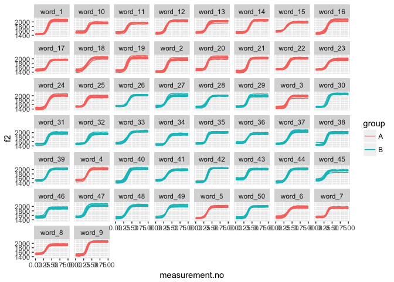
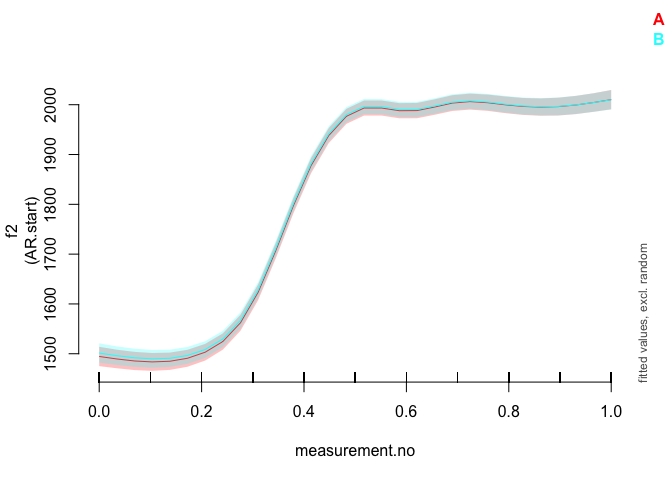
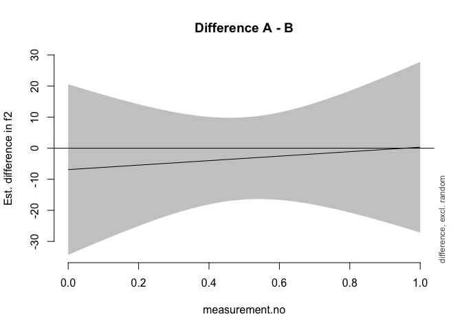

Introduction
------------

This document is a supplement to "Evaluating generalised additive mixed modelling strategies for dynamic speech analysis," relating specifically to the contents of the top panel of Table 6 in Section 3.4. It presents code that illustrates (i) how the simulated data were generated and (ii) the models whose performance is summarised Table 6.

Preliminaries
-------------

The code below loads the relevant libraries.

``` r
library(ggplot2)
library(mgcv)
library(itsadug)
```

Data generation
---------------

The code in this section can be used to create data for either type I or type II simulations. Set the value of *type* to 1 for type I simulations and to 2 for type II simulations.

``` r
type = 1
```

The data for this set of simulations consist of simulated f2 trajectories loosely modelled after the diphthong /eI/. In this simulation, there are 50 different word types, each of which is represented by 10 trajectories. For type I simulations, each word is randomly assigned to one of two groups (A and B), but there is no underlying difference between the groups. For type II simulations, all group B words have slightly different targets (cf. Section 2.1 in the paper and also the Appendix).

The following code sets the parameters that determine the main characteristics of the data set.

``` r
# setting time dimension (these are the points along which the trajectories are generated)
xs_dense = seq(0,1,0.05)

# indices for extracting every second measurement; this is used for downsampling
xs_thin_ind = c(rep(c(T,F), (length(xs_dense)-1)/2), T) 

# population parameters: individual words come from this distribution
f2_start_mean = 1500
f2_end_1_mean = 2000
f2_end_2_mean = 1960

f2_start_sd.word = 40 # population level sd
f2_end_1_sd.word = 40 # population level sd
f2_end_2_sd.word = 40 # population level sd

# expected value & sd for transition point
x0_mean = 0.35
x0_sd.word = 0.020 # population level sd
# expected value & sd for steepness (higher -> more steep)
k_mean = 25
k_sd.word = 4 # population level sd

# how much variation within words?
f2_start_sd.traj = 30 # trajectory level sd
f2_end_1_sd.traj = 30 # trajectory level sd
f2_end_2_sd.traj = 30 # trajectory level sd
x0_sd.traj = 0.015 # trajectory level sd
k_sd.traj = 3 # trajectory level sd

# amount of random noise
noise_sd <- 5

# number of words & trajectories / word
n_words <- 50
n_trajectories_per_word <- 10
```

The code below assembles the dense version of the data set.

``` r
# creating matrix that will store the trajectories
ys_m <- matrix(0, nrow=length(xs_dense), ncol=n_words*n_trajectories_per_word)

# assembling words & individual trajectories
for (i in 1:n_words) {
  # sampling word-level targets
  f2_start.word <- rnorm(1, f2_start_mean, f2_start_sd.word)
  f2_end_1.word <- rnorm(1, f2_end_1_mean, f2_end_1_sd.word)
  if (type==1) {
    f2_end_2.word <- rnorm(1, f2_end_1_mean, f2_end_1_sd.word)
  } else {
    f2_end_2.word <- rnorm(1, f2_end_2_mean, f2_end_2_sd.word)
  }
  x0.word <- rnorm(1, x0_mean, x0_sd.word)
  k.word <- rnorm(1, k_mean, k_sd.word)
  
  # sampling trajectory-level targets,
  for (j in 1:n_trajectories_per_word) {
    f2_start <- rnorm(1, f2_start.word, f2_start_sd.traj)
    f2_end_1 <- rnorm(1, f2_end_1.word, f2_end_1_sd.traj)
    f2_end_2 <- rnorm(1, f2_end_2.word, f2_end_2_sd.traj)
    x0 <- rnorm(1, x0.word, x0_sd.traj)
    k <- rnorm(1, k.word, k_sd.traj)
    
    # assembling trajectories
    if (i <= (n_words / 2)) {
      ys_m[,(i-1)*n_trajectories_per_word + j] <- ((f2_end_1 - f2_start) / (1 + exp(-k*(xs_dense-x0)))) + f2_start + rnorm(length(xs_dense), 0, noise_sd)
    } else {
      ys_m[,(i-1)*n_trajectories_per_word + j] <- ((f2_end_2 - f2_start) / (1 + exp(-k*(xs_dense-x0)))) + f2_start + rnorm(length(xs_dense), 0, noise_sd)
    }
  }
}

# assembling data set (randomly assigned to categories)
dat_dense <- data.frame(traj=paste("traj_", rep(1:(n_words*n_trajectories_per_word), each=length(xs_dense)), sep=""),
                  word=paste("word_", rep(1:n_words, each=length(xs_dense)*n_trajectories_per_word), sep=""),
                  group=rep(c("A","B"), each=length(xs_dense)*(n_words*n_trajectories_per_word / 2)),
                  measurement.no=xs_dense, 
                  f2=c(ys_m),
                  stringsAsFactors = F
                 )

# setting up different types of grouping factors
dat_dense$group.factor <- as.factor(dat_dense$group)
dat_dense$group.ordered <- as.ordered(dat_dense$group)
contrasts(dat_dense$group.ordered) <- "contr.treatment"
dat_dense$group.bin <- as.numeric(dat_dense$group.factor) - 1

# traj/word ids must be factors  
dat_dense$traj <- as.factor(dat_dense$traj)
dat_dense$word <- as.factor(dat_dense$word)

# add dat$start for AR.start (for autoregressive error models)

dat_dense$start <- dat_dense$measurement.no == 0
```

Downsampling to thin version of the data set.

``` r
dat_thin <- dat_dense[rep(xs_thin_ind, n_words*n_trajectories_per_word),]
```

Here is what the data set looks like.

``` r
ggplot(dat_dense, aes(x=measurement.no, y=f2, group=traj, col=group)) +
  geom_line() +
  facet_wrap(~word)
```



Methods of significance testing
-------------------------------

All the types of significance tests from Table 6 are shown below in the same order as in the table. Note that all models contain AR1 components to deal with dependencies within trajectories. For simplicity, the rho value used for these AR1 components is taken from a single model fitted without any random structures. This model is estimated below.

``` r
# thin
rho_mod_thin <- bam(f2 ~ group.ordered + 
                     s(measurement.no, bs = "tp", k = 10) + 
                     s(measurement.no, by = group.ordered, bs = "tp", k = 10), 
                   data = dat_thin, method = "fREML", discrete = T, nthreads = 1)

rho_thin <- start_value_rho(rho_mod_thin)
```

### 1. Looking at model summary

``` r
modsum <- bam(f2 ~ group.ordered + 
                      s(measurement.no, bs = "tp", k = 10) + 
                      s(measurement.no, by = group.ordered, bs = "tp", k = 10) +
                      s(measurement.no, word, bs = "fs", m = 1, xt = "tp", k = 10), 
                    data = dat_thin, 
                    AR.start = dat_thin$start, rho = rho_thin, 
                    method = "fREML", discrete = T, nthreads = 1)
```

    ## Warning in gam.side(sm, X, tol = .Machine$double.eps^0.5): model has
    ## repeated 1-d smooths of same variable.

``` r
summary(modsum)
```

    ## 
    ## Family: gaussian 
    ## Link function: identity 
    ## 
    ## Formula:
    ## f2 ~ group.ordered + s(measurement.no, bs = "tp", k = 10) + s(measurement.no, 
    ##     by = group.ordered, bs = "tp", k = 10) + s(measurement.no, 
    ##     word, bs = "fs", m = 1, xt = "tp", k = 10)
    ## 
    ## Parametric coefficients:
    ##                Estimate Std. Error t value Pr(>|t|)    
    ## (Intercept)    1832.539      5.921 309.521   <2e-16 ***
    ## group.orderedB    3.287      6.750   0.487    0.626    
    ## ---
    ## Signif. codes:  0 '***' 0.001 '**' 0.01 '*' 0.05 '.' 0.1 ' ' 1
    ## 
    ## Approximate significance of smooth terms:
    ##                                      edf  Ref.df       F p-value    
    ## s(measurement.no)                  8.963   8.966 558.915  <2e-16 ***
    ## s(measurement.no):group.orderedB   1.000   1.000   0.086   0.769    
    ## s(measurement.no,word)           452.632 497.000  12.608  <2e-16 ***
    ## ---
    ## Signif. codes:  0 '***' 0.001 '**' 0.01 '*' 0.05 '.' 0.1 ' ' 1
    ## 
    ## R-sq.(adj) =  0.978   Deviance explained =   98%
    ## fREML =  25724  Scale est. = 1094.9    n = 5500

### 2. Looking at model summary + Bonferroni correction

For the Bonferroni correction, the alpha-level of the parametric and smooth terms is lowered to 0.025. This does not require fitting a separate model.

### 3. Likelihood Ratio Test using models fitted with ML

Please note that these models may take quite a while to fit (5-10 minutes).

``` r
lrt_ML_full <- bam(f2 ~ group.ordered + 
                      s(measurement.no, bs = "tp", k = 10) + 
                      s(measurement.no, by = group.ordered, bs = "tp", k = 10) +
                      s(measurement.no, word, bs = "fs", m = 1, xt = "tp", k = 10), 
                    data = dat_thin, 
                    AR.start = dat_thin$start, rho = rho_thin, 
                    method = "ML")
```

    ## Warning in gam.side(sm, X, tol = .Machine$double.eps^0.5): model has
    ## repeated 1-d smooths of same variable.

``` r
lrt_ML_nested <- bam(f2 ~ # group.ordered + 
                      s(measurement.no, bs = "tp", k = 10) + 
                      # s(measurement.no, by = group.ordered, bs = "tp", k = 10) +
                      s(measurement.no, word, bs = "fs", m = 1, xt = "tp", k = 10), 
                    data = dat_thin, 
                    AR.start = dat_thin$start, rho = rho_thin, 
                    method = "ML")
```

    ## Warning in gam.side(sm, X, tol = .Machine$double.eps^0.5): model has
    ## repeated 1-d smooths of same variable.

``` r
compareML(lrt_ML_full, lrt_ML_nested)
```

    ## lrt_ML_full: f2 ~ group.ordered + s(measurement.no, bs = "tp", k = 10) + s(measurement.no, 
    ##     by = group.ordered, bs = "tp", k = 10) + s(measurement.no, 
    ##     word, bs = "fs", m = 1, xt = "tp", k = 10)
    ## 
    ## lrt_ML_nested: f2 ~ s(measurement.no, bs = "tp", k = 10) + s(measurement.no, 
    ##     word, bs = "fs", m = 1, xt = "tp", k = 10)
    ## 
    ## Chi-square test of ML scores
    ## -----
    ##           Model    Score Edf Difference    Df p.value Sig.
    ## 1 lrt_ML_nested 25735.68   5                              
    ## 2   lrt_ML_full 25735.52   8      0.163 3.000   0.955     
    ## 
    ## AIC difference: 0.72, model lrt_ML_nested has lower AIC.

    ## Warning in compareML(lrt_ML_full, lrt_ML_nested): AIC might not be
    ## reliable, as an AR1 model is included (rho1 = 0.743430, rho2 = 0.743430).

    ## Warning in compareML(lrt_ML_full, lrt_ML_nested): Only small difference in ML...

### 4. Likelihood Ratio Test using models fitted with fREML

As noted in the main text of the paper, the results of this model comparison are meaningless.

``` r
lrt_fREML_full <- bam(f2 ~ group.ordered + 
                      s(measurement.no, bs = "tp", k = 10) + 
                      s(measurement.no, by = group.ordered, bs = "tp", k = 10) +
                      s(measurement.no, word, bs = "fs", m = 1, xt = "tp", k = 10), 
                    data = dat_thin, 
                    AR.start = dat_thin$start, rho = rho_thin, 
                    method = "fREML", discrete=T, nthreads=1)
```

    ## Warning in gam.side(sm, X, tol = .Machine$double.eps^0.5): model has
    ## repeated 1-d smooths of same variable.

``` r
lrt_fREML_nested <- bam(f2 ~ # group.ordered + 
                      s(measurement.no, bs = "tp", k = 10) + 
                      # s(measurement.no, by = group.ordered, bs = "tp", k = 10) +
                      s(measurement.no, word, bs = "fs", m = 1, xt = "tp", k = 10), 
                    data = dat_thin, 
                    AR.start = dat_thin$start, rho = rho_thin, 
                    method = "fREML", discrete=T, nthreads=1)
```

    ## Warning in gam.side(sm, X, tol = .Machine$double.eps^0.5): model has
    ## repeated 1-d smooths of same variable.

``` r
compareML(lrt_fREML_full, lrt_fREML_nested)
```

    ## lrt_fREML_full: f2 ~ group.ordered + s(measurement.no, bs = "tp", k = 10) + s(measurement.no, 
    ##     by = group.ordered, bs = "tp", k = 10) + s(measurement.no, 
    ##     word, bs = "fs", m = 1, xt = "tp", k = 10)
    ## 
    ## lrt_fREML_nested: f2 ~ s(measurement.no, bs = "tp", k = 10) + s(measurement.no, 
    ##     word, bs = "fs", m = 1, xt = "tp", k = 10)
    ## 
    ## Chi-square test of fREML scores
    ## -----
    ##              Model    Score Edf Difference    Df p.value Sig.
    ## 1 lrt_fREML_nested 25729.95   5                              
    ## 2   lrt_fREML_full 25724.10   8      5.848 3.000   0.008  ** 
    ## 
    ## AIC difference: -0.11, model lrt_fREML_full has lower AIC.

    ## Warning in compareML(lrt_fREML_full, lrt_fREML_nested): AIC might not be
    ## reliable, as an AR1 model is included (rho1 = 0.743430, rho2 = 0.743430).

### 5. Binary smooth

``` r
binsmooth <- bam(f2 ~ s(measurement.no, bs = "tp", k = 10) + 
                      s(measurement.no, by = group.bin, bs = "tp", k = 10) +
                      s(measurement.no, word, bs = "fs", m = 1, xt = "tp", k = 10), 
                    data = dat_thin, 
                    AR.start = dat_thin$start, rho = rho_thin, 
                    method = "fREML", discrete=T, nthreads=1)
```

    ## Warning in gam.side(sm, X, tol = .Machine$double.eps^0.5): model has
    ## repeated 1-d smooths of same variable.

``` r
summary(binsmooth)
```

    ## 
    ## Family: gaussian 
    ## Link function: identity 
    ## 
    ## Formula:
    ## f2 ~ s(measurement.no, bs = "tp", k = 10) + s(measurement.no, 
    ##     by = group.bin, bs = "tp", k = 10) + s(measurement.no, word, 
    ##     bs = "fs", m = 1, xt = "tp", k = 10)
    ## 
    ## Parametric coefficients:
    ##             Estimate Std. Error t value Pr(>|t|)    
    ## (Intercept) 1832.539      5.921   309.5   <2e-16 ***
    ## ---
    ## Signif. codes:  0 '***' 0.001 '**' 0.01 '*' 0.05 '.' 0.1 ' ' 1
    ## 
    ## Approximate significance of smooth terms:
    ##                                 edf  Ref.df       F p-value    
    ## s(measurement.no)             8.963   8.966 558.835  <2e-16 ***
    ## s(measurement.no):group.bin   2.001   2.001   0.162   0.851    
    ## s(measurement.no,word)      452.631 498.000  12.582  <2e-16 ***
    ## ---
    ## Signif. codes:  0 '***' 0.001 '**' 0.01 '*' 0.05 '.' 0.1 ' ' 1
    ## 
    ## R-sq.(adj) =  0.978   Deviance explained =   98%
    ## fREML =  25724  Scale est. = 1094.9    n = 5500

### 6. Likelihood Ratio Test with fREML trick

For this model, fixed effects are estimated as random effects, which makes model comparison based on models fitted with (f)REML valid in principle.

``` r
lrt_fREML_trick_full <- bam(f2 ~ s(group.ordered, bs="re") + 
                      s(measurement.no, bs = "tp", k = 10) + 
                      s(measurement.no, by = group.ordered, bs = "tp", k = 10) +
                      s(measurement.no, word, bs = "fs", m = 1, xt = "tp", k = 10), 
                    data = dat_thin, 
                    AR.start = dat_thin$start, rho = rho_thin, 
                    method = "fREML", discrete=T, nthreads=1,
                    select=T)
```

    ## Warning in gam.side(sm, X, tol = .Machine$double.eps^0.5): model has
    ## repeated 1-d smooths of same variable.

``` r
lrt_fREML_trick_nested <- bam(f2 ~ # s(group.ordered, bs="re") + 
                      s(measurement.no, bs = "tp", k = 10) + 
                      # s(measurement.no, by = group.ordered, bs = "tp", k = 10) +
                      s(measurement.no, word, bs = "fs", m = 1, xt = "tp", k = 10), 
                    data = dat_thin, 
                    AR.start = dat_thin$start, rho = rho_thin, 
                    method = "fREML", discrete=T, nthreads=1,
                    select=T)
```

    ## Warning in gam.side(sm, X, tol = .Machine$double.eps^0.5): model has
    ## repeated 1-d smooths of same variable.

``` r
compareML(lrt_fREML_trick_full, lrt_fREML_trick_nested)
```

    ## lrt_fREML_trick_full: f2 ~ s(group.ordered, bs = "re") + s(measurement.no, bs = "tp", 
    ##     k = 10) + s(measurement.no, by = group.ordered, bs = "tp", 
    ##     k = 10) + s(measurement.no, word, bs = "fs", m = 1, xt = "tp", 
    ##     k = 10)
    ## 
    ## lrt_fREML_trick_nested: f2 ~ s(measurement.no, bs = "tp", k = 10) + s(measurement.no, 
    ##     word, bs = "fs", m = 1, xt = "tp", k = 10)
    ## 
    ## Model lrt_fREML_trick_nested preferred: lower fREML score (0.000), and lower df (3.000).
    ## -----
    ##                    Model    Score Edf Difference    Df
    ## 1   lrt_fREML_trick_full 25733.27   8                 
    ## 2 lrt_fREML_trick_nested 25733.26   5     -0.000 3.000
    ## 
    ## AIC difference: 0.00, model lrt_fREML_trick_nested has lower AIC.

    ## Warning in compareML(lrt_fREML_trick_full, lrt_fREML_trick_nested): AIC
    ## might not be reliable, as an AR1 model is included (rho1 = 0.743430, rho2 =
    ## 0.743430).

    ## Warning in compareML(lrt_fREML_trick_full, lrt_fREML_trick_nested): Only small difference in fREML...

### 7. Visual tests

This is not a detailed implementation of the percentage-cut-off-based reasoning examined in the paper, simply some example code that can be used to generate (i) prediction plots with confidence intervals for the two groups and (ii) plots of the estimated difference between the groups. Note also that these pred

``` r
plot_smooth(modsum, view="measurement.no", plot_all="group.ordered", rm.ranef=T)
```

    ## Summary:
    ##  * group.ordered : factor; set to the value(s): A, B. 
    ##  * measurement.no : numeric predictor; with 30 values ranging from 0.000000 to 1.000000. 
    ##  * word : factor; set to the value(s): word_1. (Might be canceled as random effect, check below.) 
    ##  * NOTE : The following random effects columns are canceled: s(measurement.no,word)
    ## 



``` r
plot_diff(modsum, view="measurement.no", comp=list(group.ordered=c("A","B")), rm.ranef=T)
```

    ## Summary:
    ##  * measurement.no : numeric predictor; with 100 values ranging from 0.000000 to 1.000000. 
    ##  * word : factor; set to the value(s): word_1. (Might be canceled as random effect, check below.) 
    ##  * NOTE : The following random effects columns are canceled: s(measurement.no,word)
    ## 



    ## 
    ## Difference is not significant.
