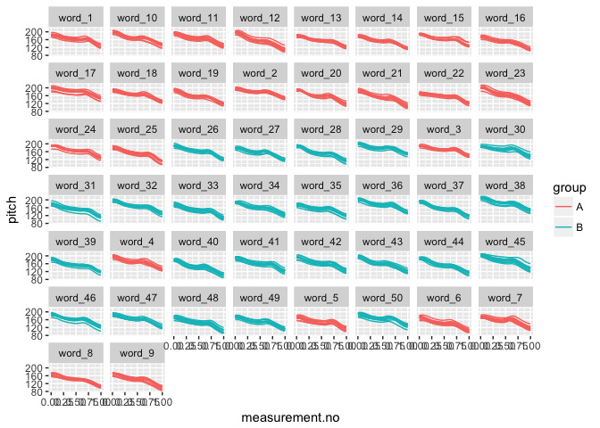
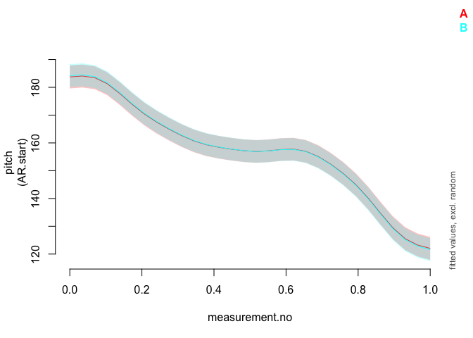
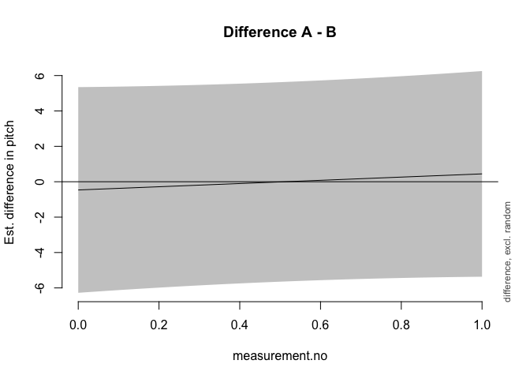

Introduction
------------

This document is a supplement to "Evaluating generalised additive mixed modelling strategies for dynamic speech analysis," relating specifically to the contents of the bottom panel of Table 6 in Section 3.4. It presents code that illustrates (i) how the simulated data were generated and (ii) the models whose performance is summarised Table 6.

Preliminaries
-------------

The code below loads the relevant libraries.

``` r
library(ggplot2)
library(mgcv)
library(itsadug)
library(truncnorm)
```

Data generation
---------------

The code in this section can be used to create data for either type I or type II simulations. Set the value of *type* to 1 for type I simulations and to 2 for type II simulations.

``` r
type = 1
```

The data for this set of simulations consist of simulated pitch trajectories loosely modelled after triconstituent compounds in English. In this simulation, there are 50 different compound types (abbreviated as "word" in the code to ensure comparability with the code for f2 trajectories), each of which is represented by 10 trajectories. For type I simulations, each compound type is randomly assigned to one of two groups (A and B), but there is no underlying difference between the groups. For type II simulations, the curves underlying group B trajectories are slightly modified (cf. Section 2.1 in the paper and also the Appendix).

The following code sets the parameters that determine the main characteristics of the data set.

``` r
# setting time dimension (these are the points along which the trajectories are generated)
xs_dense = seq(0,1,0.025)

# indices for extracting every second measurement; this is used for downsampling
xs_thin_ind = c(rep(c(T,F), (length(xs_dense)-1)/2), T)

### population parameters: individual compounds (abbreviated as words for comparability 
#### with f2 data set) come from this distribution

# starting pitch & slope
start_mean = 170
slope_mean = -30

start_sd.word = 8 # population level sd
slope_sd.word = 6 # population level sd

start_sd.traj = 6 # trajectory level sd
slope_sd.traj = 5 # trajectory level sd

# boundaries between N1, N2 and N3
boundary.1_min.word = (1/3) - 0.08
boundary.1_max.word = (1/3) + 0.08

boundary.2_min.word = (2/3) - 0.08
boundary.2_max.word = (2/3) + 0.08

boundary.1_sd.traj = 0.035 # trajectory level sd
boundary.2_sd.traj = 0.035 # trajectory level sd
truncate_boundary_distr_at = 0.1 # trajectories vary around word-level boundary targets as ~ truncnorm with a = -0.1, b = 0.1

# pitch accent #1

H.star_vertical_mean = 15 # roughly the equivalent of ~ 1.5-2 semitones
H.star_vertical_sd.word = 5 # population level sd
H.star_vertical_sd.traj = 3 # trajectory level sd

H.star_horizontal_min = 0 # as a proportion of the duration of W1
H.star_horizontal_max = 0.25

H.star_bw = 0.12 # as a proportion of *overall* duration

# pitch accent #2

H.star.2_vertical_mean = 3.5 # a very small increase, rougly .5 semitones
H.star.2_vertical_sd.word = 5 # population level sd
H.star.2_vertical_sd.traj = 3 # trajectory level sd

H.star.2_horizontal_min = 0 # as a proportion of the duration of W1
H.star.2_horizontal_max = 0.25

H.star.2_bw = 0.12 # as a proportion of *overall* duration

# boundary tone

H.minus_vertical_mean = 8 # about half of H.star
H.minus_vertical_sd.word = 2.4 # population level sd
H.minus_vertical_sd.traj = 1.4 # trajectory level sd

H.minus_bw = 0.08

# final boundary tone

L.percent_vertical = -20
L.percent_bw = 0.12

# number of words & number of trajectories per word

n_trajectories_per_word <- 10
n_words <- 50
```

The code below assembles the dense version of the data set.

``` r
# creating matrix that will store the trajectories
ys_m <- matrix(0, nrow=length(xs_dense), ncol=n_words*n_trajectories_per_word)
for (i in 1:n_words) {
  # sampling word-level targets
  start.word <- rnorm(1, start_mean, start_sd.word)
  slope.word <- rnorm(1, slope_mean, slope_sd.word)
  boundary.1.word <- runif(1, boundary.1_min.word, boundary.1_max.word)
  boundary.2.word <- runif(1, boundary.2_min.word, boundary.2_max.word)
  
  H.star_vertical.word <- rnorm(1, H.star_vertical_mean, H.star_vertical_sd.word)
  H.star.2_vertical.word <- rnorm(1, H.star.2_vertical_mean, H.star.2_vertical_sd.word)
  H.minus_vertical.word <- rnorm(1, H.minus_vertical_mean, H.minus_vertical_sd.word)
  
  for (j in 1:n_trajectories_per_word) {
    # sampling trajectory-level targets
    start <- rnorm(1, start.word, start_sd.traj)
    slope <- rnorm(1, slope.word, slope_sd.traj)
    boundary.1 <- rtruncnorm(1, 
                             a=boundary.1.word-truncate_boundary_distr_at, 
                             b=boundary.1.word+truncate_boundary_distr_at,
                             mean=boundary.1.word,
                             sd=boundary.1_sd.traj)
    boundary.2 <- rtruncnorm(1, 
                             a=boundary.2.word-truncate_boundary_distr_at, 
                             b=boundary.2.word+truncate_boundary_distr_at,
                             mean=boundary.2.word,
                             sd=boundary.2_sd.traj)
    # vertical targets for tones
    H.star_vertical <- rnorm(1, H.star_vertical.word, H.star_vertical_sd.traj)
    H.star.2_vertical <- rnorm(1, H.star.2_vertical.word, H.star.2_vertical_sd.traj)
    H.minus_vertical <- rnorm(1, H.minus_vertical.word, H.minus_vertical_sd.traj)
    # horizontal targets vary randomly widense trajs (no word-level dependencies):
    H.star_horizontal <- runif(1, H.star_horizontal_min, H.star_horizontal_max)
    H.star.2_horizontal <- runif(1, H.star.2_horizontal_min, H.star.2_horizontal_max)
    
    ys_m[,(i-1)*n_trajectories_per_word + j] <- start + xs_dense*slope +  # declination
      exp(-((xs_dense - (boundary.1*H.star_horizontal))**2)/(2*H.star_bw**2)) * H.star_vertical + # 1st pitch accent
      exp(-((xs_dense - boundary.2)**2)/(2*H.minus_bw**2)) * H.minus_vertical + # boundary tone
      exp(-((xs_dense - 1)**2)/(2*L.percent_bw**2)) * L.percent_vertical # final boundary tone
    # for type II simulations:
    if (i > (n_words/2) & type==2) {
      ys_m[,(i-1)*n_trajectories_per_word + j] <- ys_m[,(i-1)*n_trajectories_per_word + j] + 
        exp(-((xs_dense - (boundary.1+(boundary.2-boundary.1)*H.star.2_horizontal))**2)/(2*H.star.2_bw**2)) * H.star.2_vertical# 2nd pitch accent
    }
    
  }
}

dat_dense <- data.frame(traj=paste("traj_", rep(1:(n_words*n_trajectories_per_word), each=length(xs_dense)), sep=""),
                        word=paste("word_", rep(1:n_words, each=length(xs_dense)*n_trajectories_per_word), sep=""),
                        group=rep(c("A","B"), each=length(xs_dense)*(n_words*n_trajectories_per_word / 2)),
                        measurement.no=xs_dense, 
                        pitch=c(ys_m),
                        stringsAsFactors = F
)

# setting up different types of grouping factors
dat_dense$group.factor <- as.factor(dat_dense$group)
dat_dense$group.ordered <- as.ordered(dat_dense$group)
contrasts(dat_dense$group.ordered) <- "contr.treatment"
dat_dense$group.bin <- as.numeric(dat_dense$group.factor) - 1

# ids ought to be factors  
dat_dense$traj <- as.factor(dat_dense$traj)
dat_dense$word <- as.factor(dat_dense$word)

# add dat$start for AR.start (for autoregressive error models)

dat_dense$start <- dat_dense$measurement.no == 0
```

Downsampling to thin version of the data set.

``` r
dat_thin <- dat_dense[rep(xs_thin_ind, n_words*n_trajectories_per_word),]
```

Here is what the data set looks like. (Note that the difference between group A vs B trajectories in type II simulations is very subtle.)

``` r
ggplot(dat_dense, aes(x=measurement.no, y=pitch, group=traj, col=group)) +
  geom_line() +
  facet_wrap(~word)
```



Methods of significance testing
-------------------------------

All the types of significance tests from Table XXX are shown below in the same order as in the table. Note that all models contain AR1 components to deal with dependencies within trajectories. For simplicity, the rho value used for these AR1 components is taken from a single model fitted without any random structures. This model is estimated below.

``` r
# thin
rho_mod_dense <- bam(pitch ~ group.ordered + 
                     s(measurement.no, bs = "tp", k = 15) + 
                     s(measurement.no, by = group.ordered, bs = "tp", k = 15), 
                   data = dat_dense, method = "fREML", discrete = T, nthreads = 1)

rho_dense <- start_value_rho(rho_mod_dense)
```

### 1. Looking at model summary

``` r
modsum <- bam(pitch ~ group.ordered + 
                      s(measurement.no, bs = "tp", k = 15) + 
                      s(measurement.no, by = group.ordered, bs = "tp", k = 15) +
                      s(measurement.no, word, bs = "fs", m = 1, xt = "tp", k = 12), 
                    data = dat_dense, 
                    AR.start = dat_dense$start, rho = rho_dense, 
                    method = "fREML", discrete = T, nthreads = 1)
```

    ## Warning in gam.side(sm, X, tol = .Machine$double.eps^0.5): model has
    ## repeated 1-d smooths of same variable.

``` r
summary(modsum)
```

    ## 
    ## Family: gaussian 
    ## Link function: identity 
    ## 
    ## Formula:
    ## pitch ~ group.ordered + s(measurement.no, bs = "tp", k = 15) + 
    ##     s(measurement.no, by = group.ordered, bs = "tp", k = 15) + 
    ##     s(measurement.no, word, bs = "fs", m = 1, xt = "tp", k = 12)
    ## 
    ## Parametric coefficients:
    ##                 Estimate Std. Error t value Pr(>|t|)    
    ## (Intercept)    1.571e+02  2.048e+00  76.705   <2e-16 ***
    ## group.orderedB 9.943e-03  2.876e+00   0.003    0.997    
    ## ---
    ## Signif. codes:  0 '***' 0.001 '**' 0.01 '*' 0.05 '.' 0.1 ' ' 1
    ## 
    ## Approximate significance of smooth terms:
    ##                                     edf  Ref.df       F p-value    
    ## s(measurement.no)                 13.91  13.923 464.000  <2e-16 ***
    ## s(measurement.no):group.orderedB   1.00   1.001   0.396   0.529    
    ## s(measurement.no,word)           575.30 600.000  44.537  <2e-16 ***
    ## ---
    ## Signif. codes:  0 '***' 0.001 '**' 0.01 '*' 0.05 '.' 0.1 ' ' 1
    ## 
    ## R-sq.(adj) =  0.907   Deviance explained =   91%
    ## fREML =  16575  Scale est. = 7.852     n = 20500

### 2. Looking at model summary + Bonferroni correction

For the Bonferroni correction, the alpha-level of the parametric and smooth terms is lowered to 0.025. This does not require fitting a separate model.

### 3. Likelihood Ratio Test using models fitted with ML

Please note that these models may take quite a while to fit (5-10 minutes).

``` r
lrt_ML_full <- bam(pitch ~ group.ordered + 
                      s(measurement.no, bs = "tp", k = 15) + 
                      s(measurement.no, by = group.ordered, bs = "tp", k = 15) +
                      s(measurement.no, word, bs = "fs", m = 1, xt = "tp", k = 12), 
                    data = dat_dense, 
                    AR.start = dat_dense$start, rho = rho_dense, 
                    method = "ML")
```

    ## Warning in gam.side(sm, X, tol = .Machine$double.eps^0.5): model has
    ## repeated 1-d smooths of same variable.

``` r
lrt_ML_nested <- bam(pitch ~ # group.ordered + 
                      s(measurement.no, bs = "tp", k = 15) + 
                      # s(measurement.no, by = group.ordered, bs = "tp", k = 15) +
                      s(measurement.no, word, bs = "fs", m = 1, xt = "tp", k = 12), 
                    data = dat_dense, 
                    AR.start = dat_dense$start, rho = rho_dense, 
                    method = "ML")
```

    ## Warning in gam.side(sm, X, tol = .Machine$double.eps^0.5): model has
    ## repeated 1-d smooths of same variable.

``` r
compareML(lrt_ML_full, lrt_ML_nested)
```

    ## lrt_ML_full: pitch ~ group.ordered + s(measurement.no, bs = "tp", k = 15) + 
    ##     s(measurement.no, by = group.ordered, bs = "tp", k = 15) + 
    ##     s(measurement.no, word, bs = "fs", m = 1, xt = "tp", k = 12)
    ## 
    ## lrt_ML_nested: pitch ~ s(measurement.no, bs = "tp", k = 15) + s(measurement.no, 
    ##     word, bs = "fs", m = 1, xt = "tp", k = 12)
    ## 
    ## Chi-square test of ML scores
    ## -----
    ##           Model    Score Edf Difference    Df p.value Sig.
    ## 1 lrt_ML_nested 16578.80   5                              
    ## 2   lrt_ML_full 16578.61   8      0.190 3.000   0.944     
    ## 
    ## AIC difference: 2.04, model lrt_ML_nested has lower AIC.

    ## Warning in compareML(lrt_ML_full, lrt_ML_nested): AIC might not be
    ## reliable, as an AR1 model is included (rho1 = 0.984540, rho2 = 0.984540).

    ## Warning in compareML(lrt_ML_full, lrt_ML_nested): Only small difference in ML...

### 4. Likelihood Ratio Test using models fitted with fREML

As noted in the main text of the paper, the results of this model comparison are meaningless.

``` r
lrt_fREML_full <- bam(pitch ~ group.ordered + 
                      s(measurement.no, bs = "tp", k = 15) + 
                      s(measurement.no, by = group.ordered, bs = "tp", k = 15) +
                      s(measurement.no, word, bs = "fs", m = 1, xt = "tp", k = 12), 
                    data = dat_dense, 
                    AR.start = dat_dense$start, rho = rho_dense, 
                    method = "fREML", discrete=T, nthreads=1)
```

    ## Warning in gam.side(sm, X, tol = .Machine$double.eps^0.5): model has
    ## repeated 1-d smooths of same variable.

``` r
lrt_fREML_nested <- bam(pitch ~ # group.ordered + 
                      s(measurement.no, bs = "tp", k = 15) + 
                      # s(measurement.no, by = group.ordered, bs = "tp", k = 15) +
                      s(measurement.no, word, bs = "fs", m = 1, xt = "tp", k = 12), 
                    data = dat_dense, 
                    AR.start = dat_dense$start, rho = rho_dense, 
                    method = "fREML", discrete=T, nthreads=1)
```

    ## Warning in gam.side(sm, X, tol = .Machine$double.eps^0.5): model has
    ## repeated 1-d smooths of same variable.

``` r
compareML(lrt_fREML_full, lrt_fREML_nested)
```

    ## lrt_fREML_full: pitch ~ group.ordered + s(measurement.no, bs = "tp", k = 15) + 
    ##     s(measurement.no, by = group.ordered, bs = "tp", k = 15) + 
    ##     s(measurement.no, word, bs = "fs", m = 1, xt = "tp", k = 12)
    ## 
    ## lrt_fREML_nested: pitch ~ s(measurement.no, bs = "tp", k = 15) + s(measurement.no, 
    ##     word, bs = "fs", m = 1, xt = "tp", k = 12)
    ## 
    ## Chi-square test of fREML scores
    ## -----
    ##              Model    Score Edf Difference    Df p.value Sig.
    ## 1 lrt_fREML_nested 16577.64   5                              
    ## 2   lrt_fREML_full 16575.46   8      2.184 3.000   0.224     
    ## 
    ## AIC difference: 0.18, model lrt_fREML_nested has lower AIC.

    ## Warning in compareML(lrt_fREML_full, lrt_fREML_nested): AIC might not be
    ## reliable, as an AR1 model is included (rho1 = 0.984540, rho2 = 0.984540).

    ## Warning in compareML(lrt_fREML_full, lrt_fREML_nested): Only small difference in fREML...

### 5. Binary smooth

``` r
binsmooth <- bam(pitch ~ s(measurement.no, bs = "tp", k = 15) + 
                      s(measurement.no, by = group.bin, bs = "tp", k = 15) +
                      s(measurement.no, word, bs = "fs", m = 1, xt = "tp", k = 12), 
                    data = dat_dense, 
                    AR.start = dat_dense$start, rho = rho_dense, 
                    method = "fREML", discrete=T, nthreads=1)
```

    ## Warning in gam.side(sm, X, tol = .Machine$double.eps^0.5): model has
    ## repeated 1-d smooths of same variable.

``` r
summary(binsmooth)
```

    ## 
    ## Family: gaussian 
    ## Link function: identity 
    ## 
    ## Formula:
    ## pitch ~ s(measurement.no, bs = "tp", k = 15) + s(measurement.no, 
    ##     by = group.bin, bs = "tp", k = 15) + s(measurement.no, word, 
    ##     bs = "fs", m = 1, xt = "tp", k = 12)
    ## 
    ## Parametric coefficients:
    ##             Estimate Std. Error t value Pr(>|t|)    
    ## (Intercept)  157.102      2.048    76.7   <2e-16 ***
    ## ---
    ## Signif. codes:  0 '***' 0.001 '**' 0.01 '*' 0.05 '.' 0.1 ' ' 1
    ## 
    ## Approximate significance of smooth terms:
    ##                                edf Ref.df       F p-value    
    ## s(measurement.no)            13.91  13.92 464.012  <2e-16 ***
    ## s(measurement.no):group.bin   2.00   2.00   0.198    0.82    
    ## s(measurement.no,word)      575.30 599.00  44.612  <2e-16 ***
    ## ---
    ## Signif. codes:  0 '***' 0.001 '**' 0.01 '*' 0.05 '.' 0.1 ' ' 1
    ## 
    ## R-sq.(adj) =  0.907   Deviance explained =   91%
    ## fREML =  16575  Scale est. = 7.852     n = 20500

### 6. Likelihood Ratio Test with fREML trick

For this model, fixed effects are estimated as random effects, which makes model comparison based on models fitted with (f)REML valid in principle.

``` r
lrt_fREML_trick_full <- bam(pitch ~ s(group.ordered, bs="re") + 
                      s(measurement.no, bs = "tp", k = 15) + 
                      s(measurement.no, by = group.ordered, bs = "tp", k = 15) +
                      s(measurement.no, word, bs = "fs", m = 1, xt = "tp", k = 12), 
                    data = dat_dense, 
                    AR.start = dat_dense$start, rho = rho_dense, 
                    method = "fREML", discrete=T, nthreads=1,
                    select=T)
```

    ## Warning in gam.side(sm, X, tol = .Machine$double.eps^0.5): model has
    ## repeated 1-d smooths of same variable.

``` r
lrt_fREML_trick_nested <- bam(pitch ~ # s(group.ordered, bs="re") + 
                      s(measurement.no, bs = "tp", k = 15) + 
                      # s(measurement.no, by = group.ordered, bs = "tp", k = 15) +
                      s(measurement.no, word, bs = "fs", m = 1, xt = "tp", k = 12), 
                    data = dat_dense, 
                    AR.start = dat_dense$start, rho = rho_dense, 
                    method = "fREML", discrete=T, nthreads=1,
                    select=T)
```

    ## Warning in gam.side(sm, X, tol = .Machine$double.eps^0.5): model has
    ## repeated 1-d smooths of same variable.

``` r
compareML(lrt_fREML_trick_full, lrt_fREML_trick_nested)
```

    ## lrt_fREML_trick_full: pitch ~ s(group.ordered, bs = "re") + s(measurement.no, bs = "tp", 
    ##     k = 15) + s(measurement.no, by = group.ordered, bs = "tp", 
    ##     k = 15) + s(measurement.no, word, bs = "fs", m = 1, xt = "tp", 
    ##     k = 12)
    ## 
    ## lrt_fREML_trick_nested: pitch ~ s(measurement.no, bs = "tp", k = 15) + s(measurement.no, 
    ##     word, bs = "fs", m = 1, xt = "tp", k = 12)
    ## 
    ## Model lrt_fREML_trick_nested preferred: lower fREML score (0.001), and lower df (3.000).
    ## -----
    ##                    Model    Score Edf Difference    Df
    ## 1   lrt_fREML_trick_full 16579.93   8                 
    ## 2 lrt_fREML_trick_nested 16579.93   5     -0.001 3.000
    ## 
    ## AIC difference: 0.00, model lrt_fREML_trick_nested has lower AIC.

    ## Warning in compareML(lrt_fREML_trick_full, lrt_fREML_trick_nested): AIC
    ## might not be reliable, as an AR1 model is included (rho1 = 0.984540, rho2 =
    ## 0.984540).

    ## Warning in compareML(lrt_fREML_trick_full, lrt_fREML_trick_nested): Only small difference in fREML...

### 7. Visual tests

This is not a detailed implementation of the percentage-cut-off-based reasoning examined in the paper, simply some example code that can be used to generate (i) prediction plots with confidence intervals for the two groups and (ii) plots of the estimated difference between the groups.

``` r
plot_smooth(modsum, view="measurement.no", plot_all="group.ordered", rm.ranef=T)
```

    ## Summary:
    ##  * group.ordered : factor; set to the value(s): A, B. 
    ##  * measurement.no : numeric predictor; with 30 values ranging from 0.000000 to 1.000000. 
    ##  * word : factor; set to the value(s): word_1. (Might be canceled as random effect, check below.) 
    ##  * NOTE : The following random effects columns are canceled: s(measurement.no,word)
    ## 



``` r
plot_diff(modsum, view="measurement.no", comp=list(group.ordered=c("A","B")), rm.ranef=T)
```

    ## Summary:
    ##  * measurement.no : numeric predictor; with 100 values ranging from 0.000000 to 1.000000. 
    ##  * word : factor; set to the value(s): word_1. (Might be canceled as random effect, check below.) 
    ##  * NOTE : The following random effects columns are canceled: s(measurement.no,word)
    ## 



    ## 
    ## Difference is not significant.
